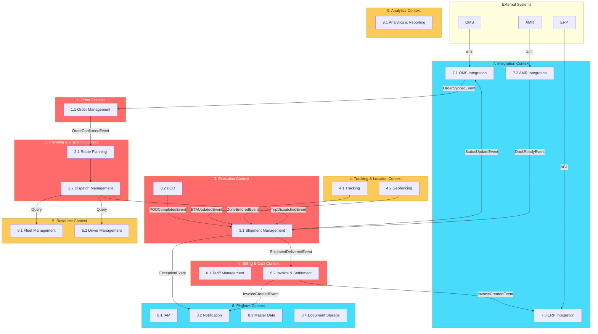

# TMS Architecture: Domain Features & Capabilities

**Document Version:** 3.0
**Architecture:** DDD + Clean Architecture + Modular Monolith
**สถานะ:** ✅ Reviewed & Improved

## 📦 1. Order Context

### 1.1 Order Management Domain `Core`

*เจ้าของวงจรชีวิตคำสั่งขนส่ง (Transport Order) ตั้งแต่สร้างจนถึงปิดงาน*

| # | Feature | รายละเอียด |
|---|---|---|
| 1 | **Order Creation & Ingestion** | สร้างออเดอร์ — Manual (Web Portal), API (OMS/AMR Integration Event), Bulk Import (CSV/Excel) |
| 2 | **Order Validation Engine** | ตรวจสอบข้อมูล — น้ำหนัก, ปริมาตร CBM, DG Class, วันที่ Pickup/Drop-off ไม่ขัดแย้ง, ลูกค้ามีอยู่จริง |
| 3 | **SLA & Time Window** | กำหนดกรอบเวลา Pickup/Drop-off Window, Priority Level (Normal, Express, Same-day) |
| 4 | **Order State Machine** | `Draft → Confirmed → Planned → In-Transit → Completed / Cancelled` |
| 5 | **Order Address Resolution** | ระบุ Pickup/Drop-off Address ต่อ Order — ค้นหาจาก Address Book (Master Data) หรือกรอกใหม่พร้อม Geocoding |
| 6 | **Order Amendment** | แก้ไขออเดอร์หลัง Confirm — เปลี่ยนจำนวน, ที่อยู่, Time Window (ก่อน Dispatch เท่านั้น) |
| 7 | **Order Cancellation** | ยกเลิกออเดอร์ — ตรวจสอบว่ายังไม่ถูก Dispatch, ส่ง Event แจ้ง Planning ถ้ามี Trip ค้าง |

**Aggregate Root:** `TransportOrder`
**Key Events:** `OrderConfirmedEvent`, `OrderAmendedEvent`, `OrderCancelledEvent`

---

## 🗺️ 2. Planning & Dispatch Context

### 2.1 Route Planning Domain `Core`

*คำนวณความคุ้มค่าและจัดเส้นทาง*

| # | Feature | รายละเอียด |
|---|---|---|
| 1 | **Load Consolidation** | รวมออเดอร์หลายเจ้าเป็น 1 Trip — ตามปลายทาง, ประเภทสินค้า, Time Window ที่ซ้อนทับกันได้ |
| 2 | **Route Optimization** | แนะนำลำดับ Stop (Multi-drop Routing) — ประหยัดระยะทาง/เวลา ผ่าน Map API |
| 3 | **Capacity Check** | ป้องกัน Overweight/Over-volume — คำนวณ Weight & Volume Utilization % ก่อนยืนยัน Trip |
| 4 | **Trip Creation** | สร้าง Trip + กำหนด Stop Sequence (Pickup → Drop-off 1 → Drop-off 2 → Return Base) |
| 5 | **Distance & Duration Estimation** | คำนวณระยะทาง + เวลาคาดการณ์ระหว่าง Stop สำหรับ Planning Phase |

### 2.2 Dispatch Management Domain `Core`

*จับคู่ทรัพยากรและสั่งการ*

| # | Feature | รายละเอียด |
|---|---|---|
| 1 | **Resource Assignment** | จับคู่ Trip ↔ รถ + คนขับ — ดึง Availability จาก Resource Context ผ่าน Query |
| 2 | **Auto-suggest Assignment** | แนะนำรถ/คนขับที่เหมาะสม — ตามประเภทรถ, ใบอนุญาต, ตำแหน่งปัจจุบัน, HOS |
| 3 | **Trip Dispatching** | ปล่อยงาน → สร้าง Shipment ใน Execution + ส่ง Manifest ไปแอปคนขับ |
| 4 | **Trip State Machine** | `Created → Assigned → Dispatched → In-Progress → Completed / Cancelled` |
| 5 | **Re-assignment & Swap** | เปลี่ยนรถ/คนขับกลางทาง — กรณีรถเสีย, คนขับไม่สะดวก |
| 6 | **Dispatch Board** | หน้าจอ Planner — Gantt Chart / Timeline / Map View ภาพรวมเที่ยววิ่งทั้งวัน |

**Aggregate Root:** `Trip`
**Key Events:** `TripDispatchedEvent`, `TripCancelledEvent`, `TripCompletedEvent`

---

## 🚛 3. Execution Context

### 3.1 Shipment Management Domain `Core`

*ควบคุมสถานะกายภาพของพัสดุ/สินค้าบนเที่ยววิ่ง*

| # | Feature | รายละเอียด |
|---|---|---|
| 1 | **Shipment State Machine** | `Pending → Picked-up → In-Transit → Arrived → Delivered / Partially-Delivered / Returned` |
| 2 | **Stop Execution Workflow** | ลำดับงานที่แต่ละจุดจอด: Check-in → Load/Unload → Scan → Confirm → Check-out |
| 3 | **Exception Handling** | จัดการปัญหาหน้างาน — สินค้าเสียหาย, ลูกค้าปฏิเสธ, ที่อยู่ผิด, สินค้าไม่ครบ + บันทึก Reason Code |
| 4 | **Barcode / QR Scanning** | สแกนยืนยัน Pickup/Drop-off ระดับ Item — ป้องกันส่งผิดคน, นับจำนวนอัตโนมัติ |
| 5 | **Partial Delivery** | ส่งบางส่วน — บันทึกจำนวนจริง vs คงค้าง, สร้าง Remaining Shipment อัตโนมัติ |
| 6 | **Return / Reject Flow** | ตีของกลับ — บันทึก Reason Code, สร้าง Return Shipment, แจ้ง Planner + ลูกค้า |
| 7 | **Customer Tracking Page** | หน้าเว็บ/URL ให้ลูกค้าดูสถานะ Shipment แบบ Self-service (คล้าย Grab/Kerry) |

### 3.2 Proof of Delivery (POD) Domain `Supporting`

*เก็บหลักฐานการส่งมอบ*

| # | Feature | รายละเอียด |
|---|---|---|
| 1 | **e-Signature Capture** | ลูกค้าเซ็นชื่อรับสินค้าผ่านหน้าจอมือถือคนขับ |
| 2 | **Photo Evidence** | ถ่ายรูปสภาพสินค้า, หน้าบ้าน, ป้ายทะเบียน — บีบอัดอัตโนมัติ + upload ไป Document Storage |
| 3 | **Timestamp & Geotagging** | ฝังเวลา + GPS ลงในรูปและเอกสาร POD ป้องกันทุจริต |
| 4 | **POD Generation** | สร้าง POD (PDF) อัตโนมัติ — รวมลายเซ็น + รูป + ข้อมูล Shipment |
| 5 | **POD Approval** | Back-office ตรวจสอบ + อนุมัติ POD → Trigger ShipmentDeliveredEvent |

**Aggregate Root:** `Shipment`
**Key Events:** `ShipmentPickedUpEvent`, `ShipmentDeliveredEvent`, `ShipmentExceptionEvent`, `PODCompletedEvent`

---

## 📡 4. Tracking & Location Context

### 4.1 Tracking Domain `Supporting`

*รับและประมวลผลข้อมูลตำแหน่งยานพาหนะแบบ Real-time*

| # | Feature | รายละเอียด |
|---|---|---|
| 1 | **GPS Ingestion Pipeline** | รับพิกัดจาก GPS Tracker / มือถือ ทุก 5-30 วินาที, เก็บลง Time-series store |
| 2 | **ETA Calculation** | คำนวณ ETA แบบ Dynamic — อัปเดตตามสภาพจราจร + ระยะทางที่เหลือ |
| 3 | **Live Map View** | แผนที่ Real-time แสดงรถทั้ง Fleet — Filter ตามสถานะ, คนขับ, เส้นทาง |
| 4 | **Route Playback** | ย้อนดูเส้นทางวิ่งในอดีต — จุดจอด, ความเร็ว, ระยะเวลาหยุดพัก |
| 5 | **Driving Behavior Monitor** | ตรวจจับ — ขับเร็วเกิน, เบรกกะทันหัน, จอดนิ่งนาน (Idle > X นาที) |

### 4.2 Geofencing Domain `Supporting`

*สร้างขอบเขตพิกัดเพื่อ Trigger Event อัตโนมัติ*

| # | Feature | รายละเอียด |
|---|---|---|
| 1 | **Zone Management** | สร้าง/แก้ไข/ลบ Zone — รองรับ Circle (รัศมี) และ Polygon |
| 2 | **Entry / Exit Trigger** | ส่ง Event อัตโนมัติเมื่อรถ Enter / Exit Zone ที่กำหนด |
| 3 | **Dwell Time Monitoring** | วัดเวลาที่อยู่ในโซน — ตรวจจับ Loading/Unloading นานเกินกำหนด |
| 4 | **Restricted Zone Alert** | แจ้งเตือนเมื่อเข้าเขตห้าม (เช่น เขตชั้นใน กทม. ช่วงห้ามรถบรรทุก) |
| 5 | **Auto Check-in/out** | Check-in/out อัตโนมัติเมื่อรถถึง/ออกจากจุดหมาย — ลดการกดมือ |

**Aggregate Root:** `VehiclePosition`, `GeoZone`
**Key Events:** `VehicleEnteredZoneEvent`, `VehicleExitedZoneEvent`, `ETAUpdatedEvent`

---

## 🔧 5. Resource Context

### 5.1 Fleet Management Domain `Supporting`

*จัดการทรัพย์สินยานพาหนะ*

| # | Feature | รายละเอียด |
|---|---|---|
| 1 | **Vehicle Registry** | ข้อมูลรถ — ประเภท, ทะเบียน, Spec (Payload/Volume/อุณหภูมิ), อุปกรณ์พิเศษ |
| 2 | **Vehicle Type Configuration** | กำหนด Spec ต่อประเภทรถ — เป็น Template สำหรับสร้างรถใหม่ |
| 3 | **Vehicle Status** | `Available → Assigned → In-Use → In-Repair → Decommissioned` |
| 4 | **Maintenance Schedule** | แจ้งเตือนซ่อมบำรุงตามระยะ กม. / รอบเดือน — เชื่อม Odometer |
| 5 | **Insurance & Tax Expiry** | แจ้งเตือน พ.ร.บ., ภาษี, ประกัน ล่วงหน้า 30/60/90 วัน |
| 6 | **Fuel Tracking** | บันทึกการเติมน้ำมัน, คำนวณอัตราสิ้นเปลือง (กม./ลิตร) |
| 7 | **Subcontractor Vehicle** | รถร่วม (3rd-party) — แยก Flag, บันทึกเจ้าของ, เงื่อนไขค่าจ้าง |

### 5.2 Driver Management Domain `Supporting`

*จัดการข้อมูลพนักงานขับรถ*

| # | Feature | รายละเอียด |
|---|---|---|
| 1 | **Driver Profile** | ประวัติ, สำเนาใบขับขี่, ประเภทใบอนุญาต (ท.1/ท.2/ท.3/ท.4) |
| 2 | **Driver Status** | `Available → On-Duty → Off-Duty → On-Leave → Suspended` |
| 3 | **Hours of Service (HOS)** | บันทึกชั่วโมงทำงาน — ขับต่อเนื่อง > 4 ชม. ต้องพัก, ป้องกันละเมิดกฎหมาย |
| 4 | **License Expiry Block** | แจ้งเตือน + บล็อก Assignment เมื่อใบขับขี่หมดอายุ |
| 5 | **Performance Score** | คะแนนการขับขี่ — ตรงเวลา, ความปลอดภัย, ข้อร้องเรียน, อุบัติเหตุ |
| 6 | **Assignment Rules** | กฎจับคู่ — ใบ ท.2 ขับได้แค่ 6 ล้อ, ต้อง ADR License ถ้าขน DG |

**Aggregate Root:** `Vehicle`, `Driver`
**Key Events:** `VehicleStatusChangedEvent`, `DriverStatusChangedEvent`

---

## 💰 6. Billing & Cost Context

### 6.1 Tariff Management Domain `Core`

*จัดการสูตรคำนวณค่าระวาง — เปลี่ยนบ่อย, Configuration-heavy*

| # | Feature | รายละเอียด |
|---|---|---|
| 1 | **Tariff Engine** | คำนวณค่าระวาง — หลายสูตร: ตาม กม., ตามน้ำหนัก, เหมาโซน, ขั้นบันได (Tier) |
| 2 | **Tariff Configuration** | UI ตั้งค่าอัตราราคา — แยกตามลูกค้า, ประเภทสินค้า, เส้นทาง, Peak/Off-peak |
| 3 | **Surcharge Rules** | ค่าธรรมเนียมเพิ่ม — Detention (รอคิวเกิน), Re-delivery, สินค้าอันตราย, นอกเวลา |
| 4 | **Tariff Versioning** | เก็บประวัติราคาทุกเวอร์ชัน — ย้อนดูได้ว่าคิดราคาตามสูตรไหน ณ วันที่ส่ง |

### 6.2 Invoice & Settlement Domain `Core`

*ออกบิล (AR) และจ่ายเงิน (AP) — Transaction-heavy*

| # | Feature | รายละเอียด |
|---|---|---|
| 1 | **AR Invoicing** | ออกบิลลูกค้า — สรุปรายเที่ยว/รายเดือน, แนบ POD, รองรับ Billing Cycle |
| 2 | **AP Settlement** | คำนวณเบี้ยเลี้ยงคนขับ, ค่าจ้างซับคอนแทรค, ค่าน้ำมันเบิกจ่าย |
| 3 | **Cost Calculation** | ต้นทุนต่อเที่ยว — น้ำมัน + ทางด่วน + เบี้ยเลี้ยง + ค่าเสื่อม |
| 4 | **Credit / Debit Note** | ปรับยอดหลังออกบิล — ลดหนี้ (สินค้าเสียหาย), เพิ่มหนี้ (ค่าปรับ) |
| 5 | **Payment Tracking** | ติดตามสถานะการจ่ายเงิน — Pending, Paid, Overdue |
| 6 | **Revenue vs Cost Report** | Profit/Loss ต่อเที่ยว, ลูกค้า, เส้นทาง |

**Aggregate Root:** `TariffContract`, `Invoice`
**Key Events:** `InvoiceCreatedEvent`, `PaymentReceivedEvent`

---

## 🔌 7. Integration Context

### 7.1 OMS Integration Domain `Generic`

*รับ-ส่งข้อมูลกับ Order Management System ของลูกค้า*

| # | Feature | รายละเอียด |
|---|---|---|
| 1 | **ACL (Anti-Corruption Layer)** | แปลง JSON/XML จาก OMS → TMS Order Model |
| 2 | **Inbound Order Sync** | รับออเดอร์ — Webhook / Scheduled Polling / File Upload |
| 3 | **Outbound Status Push** | ดัน Status (Picked-up, Delivered, Exception) กลับ OMS |
| 4 | **Field Mapping Config** | UI ตั้งค่า Mapping OMS ↔ TMS โดยไม่แก้โค้ด |
| 5 | **Error & Retry** | Exponential Backoff + Dead Letter Queue |

### 7.2 AMR Integration Domain `Generic`

*รับ-ส่งข้อมูลกับ Automated Mobile Robot ในคลังสินค้า*

| # | Feature | รายละเอียด |
|---|---|---|
| 1 | **ACL** | แปลง AMR Protocol → TMS Event Model |
| 2 | **Dock Coordination** | สัญญาณสินค้าพร้อมที่ Dock ไหน |
| 3 | **Inventory Handoff** | ยืนยันโอนถ่ายสินค้า AMR → รถขนส่ง |
| 4 | **AMR Status View** | แสดงสถานะ AMR ที่เกี่ยวกับ Shipment |

### 7.3 ERP Integration Domain `Generic`

*ส่งข้อมูลทางการเงินไป ERP (SAP, Oracle, etc.)*

| # | Feature | รายละเอียด |
|---|---|---|
| 1 | **ACL** | แปลง TMS Invoice/Cost → ERP Format |
| 2 | **Invoice Export** | ส่งข้อมูลบิล AR ไป ERP Accounts Receivable |
| 3 | **Cost Export** | ส่งข้อมูลต้นทุน/AP ไป ERP Accounts Payable |
| 4 | **Reconciliation Sync** | รับสถานะการจ่ายเงินจาก ERP กลับมาอัปเดต TMS |

---

## 🏗️ 8. Platform Context

### 8.1 IAM Domain `Generic`

*จัดการตัวตนและสิทธิ์ — ใช้ 3rd-party (Keycloak/Auth0)*

| # | Feature | รายละเอียด |
|---|---|---|
| 1 | **Authentication / SSO** | Username/Password, OTP, SSO Corporate Directory |
| 2 | **RBAC** | Roles: Admin, Planner, Dispatcher, Driver, Customer, Finance |
| 3 | **Permission Matrix** | Action-level: `order:create`, `trip:dispatch`, `report:view` |
| 4 | **Multi-tenancy** | แยกข้อมูลตาม Tenant (หลายบริษัทในระบบเดียว) |
| 5 | **API Key Management** | ออก API Key สำหรับ External System |
| 6 | **Audit Log** | Who/What/When ทุก Action สำคัญ |

### 8.2 Notification Domain `Generic`

*ศูนย์กลางแจ้งเตือนทุกช่องทาง*

| # | Feature | รายละเอียด |
|---|---|---|
| 1 | **Omnichannel Messaging** | SMS, Email, Push Notification, Line OA |
| 2 | **Template Management** | Placeholder: `{CustomerName}`, `{TrackingNo}`, `{ETA}` |
| 3 | **Rules Engine** | Event ไหน → แจ้งใคร → ช่องทางไหน |
| 4 | **Delivery & Retry** | ติดตาม Sent/Failed + Retry อัตโนมัติ |
| 5 | **User Preferences** | ผู้ใช้เลือกช่องทางที่ต้องการรับ |

### 8.3 Master Data Domain `Generic`

*ฐานข้อมูลกลาง — เปลี่ยนน้อย, ใช้อ้างอิงทั้งองค์กร*

| # | Feature | รายละเอียด |
|---|---|---|
| 1 | **Customer Master** | ชื่อบริษัท, ที่อยู่, ผู้ติดต่อ, เงื่อนไขชำระเงิน |
| 2 | **Address Book** | คลังที่อยู่กลาง — Geocoded, จัดกลุ่ม Zone/Region (ใช้อ้างอิงจาก Order) |
| 3 | **Spatial Reference** | จังหวัด, อำเภอ, ตำบล, รหัสไปรษณีย์ |
| 4 | **Reason Code Dictionary** | รหัสเหตุผลมาตรฐาน — ตีกลับ, ยกเลิก, Exception |
| 5 | **Holiday & Calendar** | วันหยุดนักขัตฤกษ์ / บริษัท — ใช้คำนวณ SLA / ETA |

### 8.4 Document Storage Domain `Generic`

*จัดเก็บไฟล์เอกสารกลาง*

| # | Feature | รายละเอียด |
|---|---|---|
| 1 | **File Upload / Download** | อัปโหลดไฟล์ (รูป, PDF, Excel) เข้า Object Storage (S3/Azure Blob) |
| 2 | **Access Control** | กำหนดสิทธิ์เข้าถึงไฟล์ตาม Role / Tenant |
| 3 | **Retention Policy** | กำหนดอายุไฟล์ — ลบอัตโนมัติหลัง X เดือน |

---

## 📊 9. Analytics Context

### 9.1 Analytics & Reporting Domain `Supporting`

*วิเคราะห์ข้อมูลและรายงาน — Read-only, ดึงข้อมูลจากทุก Context*

| # | Feature | รายละเอียด |
|---|---|---|
| 1 | **Operational Dashboard** | Real-time — รถวิ่งกี่คัน, ส่งสำเร็จ, งานค้าง, Exception |
| 2 | **KPI Metrics** | OTD %, Vehicle Utilization %, Cost per Delivery, Avg Lead Time |
| 3 | **Custom Report Builder** | Drag & Drop — Filter วันที่, ลูกค้า, เส้นทาง, คนขับ |
| 4 | **Scheduled Reports** | ส่งรายงานอัตโนมัติ — Daily Summary, Monthly Invoice |
| 5 | **Data Export** | Excel / CSV / PDF |
| 6 | **Trend Analysis** | แนวโน้ม — ออเดอร์รายเดือน, ต้นทุนรายไตรมาส |
| 7 | **SLA Compliance** | ส่งตรงเวลากี่ %, เกิน Time Window กี่งาน |
| 8 | **Alert & Threshold** | ตั้ง Threshold — แจ้ง Notification เมื่อ KPI ต่ำกว่าเกณฑ์ |

---

## 🔗 Context Map

---

## 🔄 Event Catalog (ข้าม Context)

| Event | Publisher | Subscriber(s) | Trigger |
|---|---|---|---|
| `OrderConfirmedEvent` | Order | Planning | ออเดอร์ได้รับการยืนยัน |
| `OrderAmendedEvent` | Order | Planning | แก้ไขออเดอร์ (ถ้ามี Trip ค้าง) |
| `OrderCancelledEvent` | Order | Planning | ยกเลิกออเดอร์ |
| `TripDispatchedEvent` | Planning | Execution, Notification | ปล่อยงานเที่ยววิ่ง |
| `TripCancelledEvent` | Planning | Execution | ยกเลิก Trip |
| `ShipmentPickedUpEvent` | Execution | Tracking, Integration (OMS) | รับสินค้าจากต้นทาง |
| `ShipmentDeliveredEvent` | Execution | Billing, Integration (OMS) | ส่งสำเร็จ |
| `ShipmentExceptionEvent` | Execution | Notification, Analytics | ปัญหาหน้างาน |
| `PODCompletedEvent` | Execution (POD) | Execution (Shipment) | เก็บหลักฐานเรียบร้อย |
| `VehicleEnteredZoneEvent` | Tracking (Geo) | Execution | รถถึงจุดหมาย |
| `VehicleExitedZoneEvent` | Tracking (Geo) | Tracking | รถออกจากจุดหมาย |
| `ETAUpdatedEvent` | Tracking | Execution, Notification | ETA เปลี่ยน |
| `InvoiceCreatedEvent` | Billing | Notification, Integration (ERP) | บิลถูกสร้าง |
| `VehicleStatusChangedEvent` | Resource | Planning | สถานะรถเปลี่ยน |
| `DriverStatusChangedEvent` | Resource | Planning | สถานะคนขับเปลี่ยน |

---

## 📊 สรุปจำนวน Features

| Context | Domain | ประเภท | Features |
|---|---|---|---|
| 1. Order | Order Management | 🔴 Core | 7 |
| 2. Planning & Dispatch | Route Planning | 🔴 Core | 5 |
| 2. Planning & Dispatch | Dispatch Management | 🔴 Core | 6 |
| 3. Execution | Shipment Management | 🔴 Core | 7 |
| 3. Execution | Proof of Delivery | 🟡 Supporting | 5 |
| 4. Tracking & Location | Tracking | 🟡 Supporting | 5 |
| 4. Tracking & Location | Geofencing | 🟡 Supporting | 5 |
| 5. Resource | Fleet Management | 🟡 Supporting | 7 |
| 5. Resource | Driver Management | 🟡 Supporting | 6 |
| 6. Billing & Cost | Tariff Management | 🔴 Core | 4 |
| 6. Billing & Cost | Invoice & Settlement | 🔴 Core | 6 |
| 7. Integration | OMS Integration | 🟢 Generic | 5 |
| 7. Integration | AMR Integration | 🟢 Generic | 4 |
| 7. Integration | ERP Integration | 🟢 Generic | 4 |
| 8. Platform | IAM | 🟢 Generic | 6 |
| 8. Platform | Notification | 🟢 Generic | 5 |
| 8. Platform | Master Data | 🟢 Generic | 5 |
| 8. Platform | Document Storage | 🟢 Generic | 3 |
| 9. Analytics | Analytics & Reporting | 🟡 Supporting | 8 |
| | **รวม 9 Contexts** | **19 Domains** | **101 Features** |

---

## 🎯 Development Priority Roadmap

| Phase | Domains | เหตุผล |
|---|---|---|
| **Phase 1 — MVP** | Order Management, Dispatch Management, Shipment Management, Fleet, Driver, Master Data, IAM | Core workflow ขั้นต่ำ: สร้าง Order → จัดรถ → ส่งของ |
| **Phase 2 — Optimization** | Route Planning, Tracking, Geofencing, POD, Notification | เพิ่ม Real-time visibility + หลักฐานการส่ง |
| **Phase 3 — Revenue** | Tariff Management, Invoice & Settlement, Analytics | เริ่มคิดเงิน + วัด Performance |
| **Phase 4 — Integration** | OMS, AMR, ERP Integration, Document Storage | เชื่อมระบบภายนอก + ลดงาน Manual |
