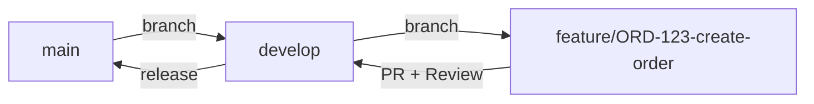

# Doc 6: Development Setup Guide

วิธีตั้งค่าเครื่อง Developer เพื่อรัน TMS แบบ Step-by-step

---

## 1. Prerequisites

| ซอฟต์แวร์ | Version | วิธีติดตั้ง |
|---|---|---|
| **.NET SDK** | 8.0+ | [dotnet.microsoft.com](https://dotnet.microsoft.com/download) |
| **PostgreSQL** | 15+ | [postgresql.org](https://www.postgresql.org/download/) หรือ Docker |
| **Redis** | 7+ | Docker: `docker run -d -p 6379:6379 redis:7-alpine` |
| **RabbitMQ** | 3.12+ | Docker: `docker run -d -p 5672:5672 -p 15672:15672 rabbitmq:3-management` |
| **Node.js** | 20 LTS | สำหรับ Frontend (React) |
| **IDE** | VS 2022 / Rider / VS Code | VS Code ต้องติดตั้ง C# Dev Kit extension |
| **Docker** | 24+ | สำหรับรัน Infrastructure dependencies |
| **Git** | 2.40+ | Version control |

---

## 2. Quick Start (Docker Compose)

### 2.1 Clone Repository

```bash
git clone https://github.com/{org}/tms.git
cd tms
```

### 2.2 Start Infrastructure ด้วย Docker Compose

```yaml
# docker-compose.infrastructure.yml
services:
  postgres:
    image: postgres:15-alpine
    ports: ["5432:5432"]
    environment:
      POSTGRES_DB: tms_dev
      POSTGRES_USER: tms_admin
      POSTGRES_PASSWORD: tms_dev_password
    volumes:
      - postgres_data:/var/lib/postgresql/data

  redis:
    image: redis:7-alpine
    ports: ["6379:6379"]

  rabbitmq:
    image: rabbitmq:3-management-alpine
    ports: ["5672:5672", "15672:15672"]
    environment:
      RABBITMQ_DEFAULT_USER: tms
      RABBITMQ_DEFAULT_PASS: tms_dev

volumes:
  postgres_data:
```

```bash
docker compose -f docker-compose.infrastructure.yml up -d
```

### 2.3 Apply Database Migrations

```bash
# จาก root ของ solution
dotnet ef database update \
  --project src/Modules/Tms.Orders/Tms.Orders.Infrastructure \
  --startup-project src/Tms.WebApi \
  --context OrdersDbContext

dotnet ef database update \
  --project src/Modules/Tms.Planning/Tms.Planning.Infrastructure \
  --startup-project src/Tms.WebApi \
  --context PlanningDbContext

# ทำซ้ำสำหรับทุก Module...
# หรือใช้ script:
./scripts/migrate-all.ps1
```

### 2.4 Run Application

```bash
# Backend API
cd src/Tms.WebApi
dotnet run

# → Swagger UI: https://localhost:5001/swagger
# → Health Check: https://localhost:5001/health
```

```bash
# Frontend (แยก terminal)
cd src/Tms.WebApp
npm install
npm run dev

# → http://localhost:3000
```

---

## 3. Configuration

### appsettings.Development.json

```json
{
  "ConnectionStrings": {
    "TmsDb": "Host=localhost;Port=5432;Database=tms_dev;Username=tms_admin;Password=tms_dev_password",
    "Redis": "localhost:6379"
  },
  "RabbitMQ": {
    "Host": "localhost",
    "Port": 5672,
    "Username": "tms",
    "Password": "tms_dev"
  },
  "Jwt": {
    "Authority": "http://localhost:8080/realms/tms",
    "Audience": "tms-api"
  },
  "Storage": {
    "Provider": "Local",
    "LocalPath": "./uploads"
  }
}
```

---

## 4. Useful Commands

| คำสั่ง | หน้าที่ |
|---|---|
| `dotnet build` | Build ทั้ง Solution |
| `dotnet test` | รัน Unit Tests ทั้งหมด |
| `dotnet test --filter Category=Integration` | รัน Integration Tests |
| `dotnet ef migrations add {Name} --project {Module.Infra} --startup-project {WebApi}` | สร้าง Migration ใหม่ |
| `dotnet format` | Format โค้ดตาม .editorconfig |

---

## 5. Troubleshooting

| ปัญหา | วิธีแก้ |
|---|---|
| `Connection refused (5432)` | PostgreSQL ยังไม่ start → `docker compose up -d postgres` |
| `Role "tms_admin" does not exist` | สร้าง user → `CREATE ROLE tms_admin LOGIN PASSWORD 'tms_dev_password';` |
| `EF Migration failed` | ตรวจสอบ Connection String + Schema ซ้ำ → ลบ Migration แล้วสร้างใหม่ |
| `RabbitMQ connection timeout` | ตรวจสอบ port 5672 → `docker compose up -d rabbitmq` |
| `JWT validation failed` | ตรวจ Keycloak running + Authority URL ถูกต้อง |

---

## 6. Git Workflow



| Branch | ใช้สำหรับ |
|---|---|
| `main` | Production — deploy อัตโนมัติ |
| `develop` | Integration branch — merge feature เข้าที่นี่ |
| `feature/{ticket}-{desc}` | Feature development |
| `bugfix/{ticket}-{desc}` | Bug fix |
| `hotfix/{ticket}-{desc}` | Prod emergency fix → merge เข้า main + develop |

**Commit Message:** `{type}({scope}): {description}`

```
feat(orders): add order amendment feature
fix(tracking): correct ETA calculation for multi-stop
docs(billing): update tariff engine API spec
refactor(execution): extract POD validation logic
```
