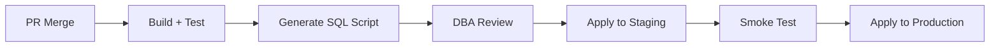

# Doc 7: Database Migration Strategy

**ORM:** Entity Framework Core 8+
**Database:** PostgreSQL 15+
**Pattern:** Schema-per-Module — 1 DbContext ต่อ 1 Module

---

## 1. Schema Mapping

| Module | DbContext | Schema | Migration Table |
|---|---|---|---|
| Orders | `OrdersDbContext` | `ord` | `ord.__EFMigrationsHistory` |
| Planning | `PlanningDbContext` | `pln` | `pln.__EFMigrationsHistory` |
| Execution | `ExecutionDbContext` | `exe` | `exe.__EFMigrationsHistory` |
| Tracking | `TrackingDbContext` | `trk` | `trk.__EFMigrationsHistory` |
| Resources | `ResourcesDbContext` | `res` | `res.__EFMigrationsHistory` |
| Billing | `BillingDbContext` | `bil` | `bil.__EFMigrationsHistory` |
| Integration | `IntegrationDbContext` | `itg` | `itg.__EFMigrationsHistory` |
| Platform | `PlatformDbContext` | `plf` | `plf.__EFMigrationsHistory` |
| Analytics | `AnalyticsDbContext` | `anl` | `anl.__EFMigrationsHistory` |

---

## 2. DbContext Configuration

```csharp
public class OrdersDbContext : DbContext
{
    protected override void OnModelCreating(ModelBuilder builder)
    {
        // ✅ กำหนด Schema สำหรับทุก Table ใน Module นี้
        builder.HasDefaultSchema("ord");
        
        // ✅ Apply configurations จาก assembly
        builder.ApplyConfigurationsFromAssembly(
            typeof(OrdersDbContext).Assembly);
    }
}
```

```csharp
// Entity Configuration
public class TransportOrderConfiguration 
    : IEntityTypeConfiguration<TransportOrder>
{
    public void Configure(EntityTypeBuilder<TransportOrder> builder)
    {
        builder.ToTable("TransportOrders");  // → ord.TransportOrders
        builder.HasKey(x => x.Id);
        builder.Property(x => x.OrderNumber)
            .IsRequired().HasMaxLength(50);
        builder.HasIndex(x => x.OrderNumber).IsUnique();
        builder.OwnsOne(x => x.PickupAddress);
    }
}
```

---

## 3. Migration Commands

### สร้าง Migration ใหม่

```bash
dotnet ef migrations add {MigrationName} \
  --project src/Modules/Tms.Orders/Tms.Orders.Infrastructure \
  --startup-project src/Tms.WebApi \
  --context OrdersDbContext \
  --output-dir Migrations
```

### Apply Migration

```bash
dotnet ef database update \
  --project src/Modules/Tms.Orders/Tms.Orders.Infrastructure \
  --startup-project src/Tms.WebApi \
  --context OrdersDbContext
```

### Rollback (ถอย Migration)

```bash
# ถอยไป Migration ก่อนหน้า
dotnet ef database update {PreviousMigrationName} \
  --project src/Modules/Tms.Orders/Tms.Orders.Infrastructure \
  --startup-project src/Tms.WebApi \
  --context OrdersDbContext

# ลบ Migration ล่าสุดที่ยังไม่ Apply
dotnet ef migrations remove \
  --project src/Modules/Tms.Orders/Tms.Orders.Infrastructure \
  --startup-project src/Tms.WebApi \
  --context OrdersDbContext
```

### Script สำหรับ Apply ทุก Module

```powershell
# scripts/migrate-all.ps1
$modules = @(
    @{ Project = "Tms.Orders.Infrastructure";    Context = "OrdersDbContext" },
    @{ Project = "Tms.Planning.Infrastructure";  Context = "PlanningDbContext" },
    @{ Project = "Tms.Execution.Infrastructure"; Context = "ExecutionDbContext" },
    @{ Project = "Tms.Tracking.Infrastructure";  Context = "TrackingDbContext" },
    @{ Project = "Tms.Resources.Infrastructure"; Context = "ResourcesDbContext" },
    @{ Project = "Tms.Billing.Infrastructure";   Context = "BillingDbContext" },
    @{ Project = "Tms.Integration.Infrastructure"; Context = "IntegrationDbContext" },
    @{ Project = "Tms.Platform.Infrastructure";  Context = "PlatformDbContext" },
    @{ Project = "Tms.Analytics.Infrastructure"; Context = "AnalyticsDbContext" }
)

foreach ($m in $modules) {
    Write-Host "Migrating $($m.Context)..." -ForegroundColor Cyan
    dotnet ef database update `
        --project "src/Modules/$($m.Project)" `
        --startup-project "src/Tms.WebApi" `
        --context $m.Context
}
```

---

## 4. Migration Naming Convention

```
{YYYYMMDD}_{Number}_{Description}

ตัวอย่าง:
20260328_001_InitialOrderSchema
20260401_002_AddOrderAmendmentFields
20260415_003_AddIndexOnOrderStatus
```

---

## 5. Production Deployment Rules

> [!CAUTION]
> กฎเหล็กสำหรับ Production Migration

| กฎ | รายละเอียด |
|---|---|
| **ห้าม Drop Column/Table ทันที** | ต้องทำ 2 ขั้นตอน: (1) Deploy โค้ดที่ไม่ใช้ column แล้ว (2) Migration ลบ column |
| **ห้าม Rename Column** | เพิ่ม column ใหม่ → Copy data → ลบ column เก่า (3 Migration) |
| **ต้อง Generate SQL Script ก่อน** | `dotnet ef migrations script --idempotent` → DBA Review → Apply |
| **ต้อง Backup ก่อน Apply** | `pg_dump` ก่อนทุกครั้ง |
| **ต้อง Test กับ Staging ก่อน** | Apply Migration กับ Staging DB ก่อน Production |

### CI/CD Pipeline



---

## 6. Data Seeding

ข้อมูลเริ่มต้น (Seed Data) จัดการผ่าน Migration:

```csharp
// ใน Migration file
protected override void Up(MigrationBuilder migrationBuilder)
{
    // Seed Reason Codes (Master Data)
    migrationBuilder.InsertData(
        schema: "plf",
        table: "ReasonCodes",
        columns: new[] { "Id", "Code", "Description", "Category" },
        values: new object[,]
        {
            { Guid.NewGuid(), "RJ01", "ลูกค้าปฏิเสธรับ", "Reject" },
            { Guid.NewGuid(), "RJ02", "สินค้าเสียหาย", "Reject" },
            { Guid.NewGuid(), "CN01", "ลูกค้ายกเลิก", "Cancel" },
        });
}
```

| ประเภท Seed | วิธีจัดการ |
|---|---|
| **Reference Data** (Reason Codes, Provinces) | Migration — ใส่ใน `InsertData` |
| **Test Data** (Sample Orders, Drivers) | แยกไฟล์ `seed-dev.sql` — รันเฉพาะ Dev |
| **Admin User** | Keycloak Realm Import — ไม่ Seed ใน DB |
