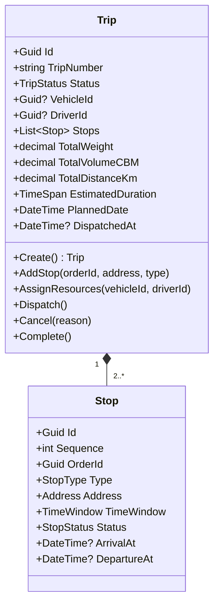
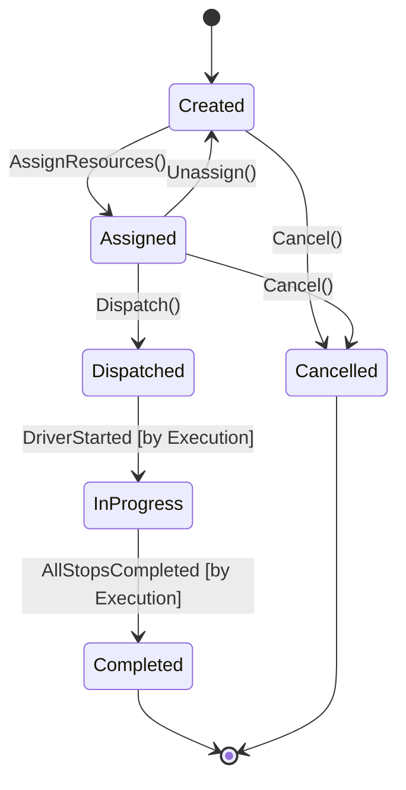

# Dispatch Management Domain — Per-Domain Document

**Context:** Planning & Dispatch | **Schema:** `pln` | **Classification:** 🔴 Core

---

## 2A. Domain Model

### Aggregate Root: `Trip`



### Enums

```csharp
public enum TripStatus
{
    Created,      // สร้าง Trip แล้ว ยังไม่จัดรถ
    Assigned,     // จัดรถ+คนขับแล้ว ยังไม่ปล่อยงาน
    Dispatched,   // ปล่อยงานแล้ว → คนขับเห็นใน App
    InProgress,   // คนขับเริ่มวิ่ง
    Completed,    // วิ่งจบทุก Stop
    Cancelled
}

public enum StopType { Pickup, Dropoff, Return }
public enum StopStatus { Pending, Arrived, Completed, Skipped }
```

### Business Rules / Invariants

| # | กฎ | Exception |
|---|---|---|
| 1 | Trip ต้องมี Stops ≥ 2 (อย่างน้อย 1 Pickup + 1 Dropoff) | `TripMustHaveStopsException` |
| 2 | TotalWeight ≤ Vehicle.MaxPayload (ตรวจตอน Assign) | `VehicleOverloadException` |
| 3 | TotalVolumeCBM ≤ Vehicle.MaxVolume | `VehicleOverVolumeException` |
| 4 | Dispatch ได้เฉพาะ Status = Assigned | `InvalidTripStateException` |
| 5 | Driver ต้องมี License ตรงกับ VehicleType | `DriverLicenseMismatchException` |
| 6 | Driver HOS ต้องเพียงพอสำหรับ EstimatedDuration | `DriverHOSExceededException` |
| 7 | Vehicle.Status ต้อง = Available | `VehicleNotAvailableException` |

### State Diagram



---

## 2B. API Specification

### Endpoints

| # | Method | URL | Summary | Auth |
|---|---|---|---|---|
| 1 | `POST` | `/api/trips` | สร้าง Trip (Manual หรือจาก Consolidation) | Admin, Planner |
| 2 | `GET` | `/api/trips` | รายการ Trip (Filter: Date, Status) | Admin, Planner, Dispatcher |
| 3 | `GET` | `/api/trips/{id}` | Trip Detail + Stops | Admin, Planner, Dispatcher |
| 4 | `POST` | `/api/trips/{id}/stops` | เพิ่ม Stop เข้า Trip | Admin, Planner |
| 5 | `PUT` | `/api/trips/{id}/assign` | จัดรถ + คนขับ | Admin, Planner, Dispatcher |
| 6 | `PUT` | `/api/trips/{id}/dispatch` | ปล่อยงาน | Admin, Planner, Dispatcher |
| 7 | `PUT` | `/api/trips/{id}/cancel` | ยกเลิก Trip | Admin, Planner |
| 8 | `PUT` | `/api/trips/{id}/reassign` | เปลี่ยนรถ/คนขับ | Admin, Planner, Dispatcher |
| 9 | `GET` | `/api/trips/board?date=2026-03-29` | Dispatch Board (Timeline) | Admin, Planner, Dispatcher |

### Request / Response DTOs

**PUT /api/trips/{id}/assign**
```json
// Request
{
  "vehicleId": "uuid",
  "driverId": "uuid"
}

// Response: 200 OK
{
  "id": "uuid",
  "tripNumber": "TRP-20260329-001",
  "status": "Assigned",
  "vehicle": { "id": "uuid", "plateNumber": "1กก-1234", "type": "6ล้อ" },
  "driver": { "id": "uuid", "name": "สมชาย", "licenseType": "ท.2" }
}
```

**PUT /api/trips/{id}/dispatch**
```json
// Response: 200 OK
{
  "id": "uuid",
  "status": "Dispatched",
  "dispatchedAt": "2026-03-29T07:00:00Z",
  "stops": [
    { "sequence": 1, "type": "Pickup", "address": "คลังสินค้า A", "window": "08:00-10:00" },
    { "sequence": 2, "type": "Dropoff", "address": "บริษัท XYZ", "window": "14:00-17:00" }
  ]
}
```

**GET /api/trips/board?date=2026-03-29**
```json
// Response: 200 OK — สำหรับ Gantt Chart / Timeline
{
  "date": "2026-03-29",
  "trips": [
    {
      "id": "uuid",
      "tripNumber": "TRP-20260329-001",
      "status": "Dispatched",
      "vehicle": "1กก-1234",
      "driver": "สมชาย",
      "startTime": "07:00",
      "endTime": "18:00",
      "stops": [
        { "seq": 1, "name": "คลังA", "eta": "08:00", "type": "Pickup" },
        { "seq": 2, "name": "XYZ Co.", "eta": "14:30", "type": "Dropoff" }
      ]
    }
  ],
  "summary": { "total": 15, "dispatched": 10, "pending": 5 }
}
```

---

## 2C. Database Schema

```sql
-- Schema: pln
CREATE SCHEMA IF NOT EXISTS pln;

-- ===== Trips =====
CREATE TABLE pln."Trips" (
    "Id"                UUID PRIMARY KEY DEFAULT gen_random_uuid(),
    "TripNumber"        VARCHAR(50) NOT NULL,
    "Status"            VARCHAR(20) NOT NULL DEFAULT 'Created',
    "VehicleId"         UUID,
    "DriverId"          UUID,
    "PlannedDate"       DATE NOT NULL,
    "TotalWeight"       DECIMAL(12,2) NOT NULL DEFAULT 0,
    "TotalVolumeCBM"    DECIMAL(12,4) NOT NULL DEFAULT 0,
    "TotalDistanceKm"   DECIMAL(10,2),
    "EstimatedDurationMin" INT,
    "CancelReason"      VARCHAR(500),
    "DispatchedAt"      TIMESTAMPTZ,
    "CompletedAt"       TIMESTAMPTZ,
    "CreatedAt"         TIMESTAMPTZ NOT NULL DEFAULT now(),
    "CreatedBy"         UUID,
    "TenantId"          UUID NOT NULL,
    
    CONSTRAINT "UQ_TripNumber" UNIQUE ("TripNumber")
);

CREATE INDEX "IX_Trips_Status" ON pln."Trips" ("Status");
CREATE INDEX "IX_Trips_PlannedDate" ON pln."Trips" ("PlannedDate");
CREATE INDEX "IX_Trips_VehicleId" ON pln."Trips" ("VehicleId");
CREATE INDEX "IX_Trips_DriverId" ON pln."Trips" ("DriverId");
CREATE INDEX "IX_Trips_TenantId" ON pln."Trips" ("TenantId");

-- ===== Stops =====
CREATE TABLE pln."Stops" (
    "Id"                UUID PRIMARY KEY DEFAULT gen_random_uuid(),
    "TripId"            UUID NOT NULL REFERENCES pln."Trips"("Id"),
    "Sequence"          INT NOT NULL,
    "OrderId"           UUID NOT NULL,
    "Type"              VARCHAR(20) NOT NULL,
    "Status"            VARCHAR(20) NOT NULL DEFAULT 'Pending',
    -- Address
    "Address_Name"      VARCHAR(200),
    "Address_Street"    VARCHAR(500),
    "Address_Province"  VARCHAR(100),
    "Address_Latitude"  DOUBLE PRECISION,
    "Address_Longitude" DOUBLE PRECISION,
    -- Time
    "WindowFrom"        TIMESTAMPTZ,
    "WindowTo"          TIMESTAMPTZ,
    "ArrivalAt"         TIMESTAMPTZ,
    "DepartureAt"       TIMESTAMPTZ,
    
    CONSTRAINT "UQ_Trip_Sequence" UNIQUE ("TripId", "Sequence")
);

CREATE INDEX "IX_Stops_TripId" ON pln."Stops" ("TripId");
CREATE INDEX "IX_Stops_OrderId" ON pln."Stops" ("OrderId");
```

---

## 2D. Event Specification

### Integration Events

**TripDispatchedIntegrationEvent**
```json
{
  "eventType": "TripDispatchedIntegrationEvent",
  "payload": {
    "tripId": "uuid",
    "tripNumber": "TRP-20260329-001",
    "vehicleId": "uuid",
    "driverId": "uuid",
    "plannedDate": "2026-03-29",
    "stops": [
      {
        "sequence": 1,
        "orderId": "uuid",
        "type": "Pickup",
        "address": { "lat": 13.66, "lng": 100.47 },
        "window": { "from": "08:00", "to": "10:00" }
      }
    ]
  }
}
```
→ **Subscribers:** Execution (สร้าง Shipment), Notification (แจ้ง Driver), Resource (เปลี่ยน Vehicle/Driver status → In-Use)

**TripCancelledIntegrationEvent**
```json
{
  "payload": {
    "tripId": "uuid",
    "reason": "ลูกค้ายกเลิก",
    "affectedOrderIds": ["uuid1", "uuid2"]
  }
}
```
→ **Subscribers:** Execution (ยกเลิก Shipment), Resource (คืน Vehicle/Driver → Available)

### Inbound Events (รับจาก Context อื่น)

| Event | Source | Action |
|---|---|---|
| `OrderConfirmedIntegrationEvent` | Order | แสดง Order ใน Dispatch Board พร้อมจัด Trip |
| `OrderCancelledIntegrationEvent` | Order | ถ้ามี Trip ค้าง → แจ้ง Planner / auto-remove Stop |
| `VehicleStatusChangedEvent` | Resource | อัปเดต Availability ใน Assignment UI |
| `DriverStatusChangedEvent` | Resource | อัปเดต Availability ใน Assignment UI |

---

## 2E. Use Cases

### UC-PLN-01: Create Trip & Consolidate

**Actor:** Planner
**Main Flow:**
1. Planner เลือก Orders ที่ Confirmed จาก Dispatch Board
2. System ตรวจสอบ Orders เข้ากลุ่มได้ (ปลายทางใกล้, ประเภทรถเข้ากัน)
3. System สร้าง Trip + Generate Stops (Sequence = ลำดับที่เหมาะสม)
4. System คำนวณ TotalWeight, TotalVolume, EstimatedDistance
5. Trip status = `Created`

### UC-PLN-02: Assign Resources

**Actor:** Planner / Dispatcher
**Main Flow:**
1. Planner เลือก Trip → กด Assign
2. System แสดงรายการรถ/คนขับที่ Available + เหมาะสม
3. Planner เลือกรถ + คนขับ
4. System validate: Payload ≤ MaxPayload, License match, HOS sufficient
5. Trip status → `Assigned`

**Alternative:** Auto-suggest → System จัดอันดับรถ/คนขับตามความเหมาะสม

### UC-PLN-03: Dispatch Trip

**Actor:** Planner / Dispatcher
**Main Flow:**
1. Planner เลือก Trip (Assigned) → กด Dispatch
2. System เปลี่ยน Status → `Dispatched`
3. System publish `TripDispatchedIntegrationEvent`
4. Execution สร้าง Shipment + Notification ส่ง Push ให้คนขับ
5. คนขับเห็นงานในแอป

### UC-PLN-04: Re-assign Resources

**Actor:** Dispatcher
**Main Flow:**
1. Dispatcher ตรวจพบว่ารถเสีย/คนขับไม่สะดวก
2. เลือก Trip → กด Re-assign → เลือกรถ/คนขับใหม่
3. System validate ทรัพยากรใหม่
4. System คืน Vehicle/Driver เดิม → Available
5. System แจ้ง Driver ใหม่ผ่าน Push Notification
