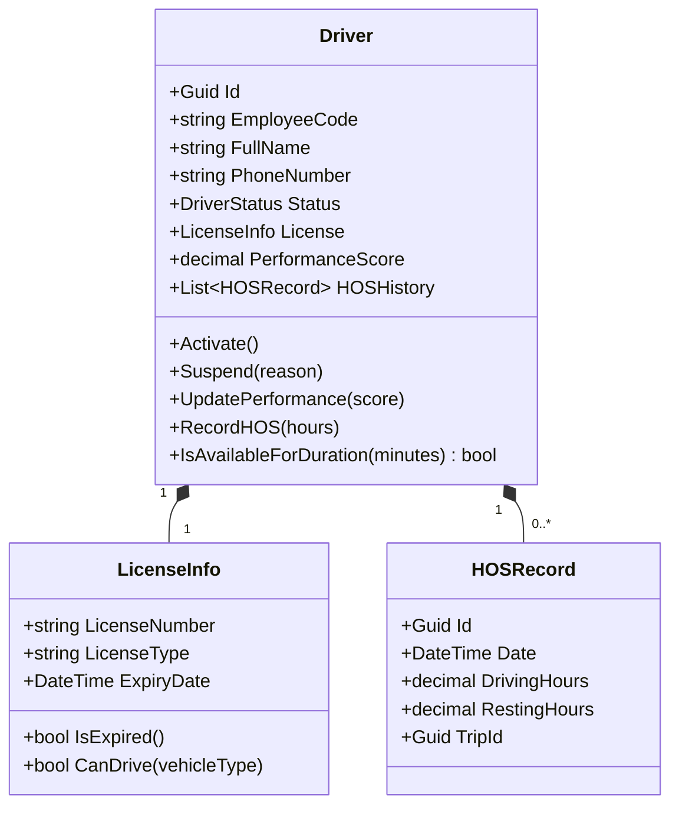

# Driver Management Domain — Per-Domain Document

**Context:** Resource | **Schema:** `res` | **Classification:** 🟡 Supporting

---

## 2A. Domain Model

### Aggregate Root: `Driver`



### Enums

```csharp
public enum DriverStatus
{
    Available,  // พร้อมรับงาน
    OnDuty,     // กำลังวิ่งงาน
    OffDuty,    // ไม่ได้ทำงาน
    OnLeave,    // ลา
    Suspended   // ถูกพักงาน
}
```

### Business Rules

| # | กฎ | Exception |
|---|---|---|
| 1 | EmployeeCode ต้อง Unique | `DuplicateEmployeeCodeException` |
| 2 | License.ExpiryDate < วันนี้ → Block Assignment | `DriverLicenseExpiredException` |
| 3 | LicenseType ท.2 ขับ 6 ล้อ, ท.3 ขับ 10 ล้อ+, ท.4 ขับหัวลาก | `LicenseMismatchException` |
| 4 | DrivingHours ต่อเนื่อง > 4 ชม. → ต้องพัก 30 นาที | `HOSViolationException` |
| 5 | DrivingHours รวมต่อวัน > 10 ชม. → Block | `DailyHOSExceededException` |

### License-Vehicle Mapping

| ใบอนุญาต | ขับได้ |
|---|---|
| ท.1 | รถ 4 ล้อ เท่านั้น |
| ท.2 | รถ 4 ล้อ, 6 ล้อ |
| ท.3 | รถ 4 ล้อ, 6 ล้อ, 10 ล้อ |
| ท.4 | ทุกประเภท รวมหัวลาก |

---

## 2B. API Specification

| # | Method | URL | Summary | Auth |
|---|---|---|---|---|
| 1 | `POST` | `/api/drivers` | ลงทะเบียนคนขับ | Admin |
| 2 | `GET` | `/api/drivers` | รายการคนขับ (Filter) | Admin, Planner, Dispatcher |
| 3 | `GET` | `/api/drivers/{id}` | คนขับ Detail | Admin, Driver(own) |
| 4 | `PUT` | `/api/drivers/{id}` | แก้ไขข้อมูล | Admin |
| 5 | `PUT` | `/api/drivers/{id}/status` | เปลี่ยนสถานะ | Admin |
| 6 | `GET` | `/api/drivers/available` | คนขับพร้อมงาน | Planner, Dispatcher |
| 7 | `GET` | `/api/drivers/{id}/hos` | ประวัติ HOS | Admin, Dispatcher |
| 8 | `GET` | `/api/drivers/expiry-alerts` | ใบขับขี่ใกล้หมด | Admin |

### Key DTOs

**POST /api/drivers**
```json
{
  "employeeCode": "DRV-001",
  "fullName": "สมชาย แก้วขาว",
  "phoneNumber": "081-234-5678",
  "license": {
    "licenseNumber": "12345678",
    "licenseType": "ท.2",
    "expiryDate": "2028-06-30"
  }
}
```

**GET /api/drivers/available?date=2026-03-29&requiredLicense=ท.2**
```json
{
  "items": [
    {
      "id": "uuid",
      "employeeCode": "DRV-001",
      "fullName": "สมชาย แก้วขาว",
      "licenseType": "ท.2",
      "todayDrivingHours": 2.5,
      "remainingHours": 7.5,
      "performanceScore": 4.5
    }
  ]
}
```

---

## 2C. Database Schema

```sql
-- ===== Drivers =====
CREATE TABLE res."Drivers" (
    "Id"                UUID PRIMARY KEY DEFAULT gen_random_uuid(),
    "EmployeeCode"      VARCHAR(20) NOT NULL,
    "FullName"          VARCHAR(200) NOT NULL,
    "PhoneNumber"       VARCHAR(20),
    "Status"            VARCHAR(20) NOT NULL DEFAULT 'Available',
    "PerformanceScore"  DECIMAL(3,1) DEFAULT 5.0,
    -- License (Owned Value Object)
    "License_Number"    VARCHAR(20),
    "License_Type"      VARCHAR(10) NOT NULL,
    "License_ExpiryDate" DATE NOT NULL,
    -- Audit
    "SuspendReason"     VARCHAR(500),
    "CreatedAt"         TIMESTAMPTZ NOT NULL DEFAULT now(),
    "TenantId"          UUID NOT NULL,
    
    CONSTRAINT "UQ_EmployeeCode" UNIQUE ("EmployeeCode")
);

CREATE INDEX "IX_Drivers_Status" ON res."Drivers" ("Status");
CREATE INDEX "IX_Drivers_LicenseType" ON res."Drivers" ("License_Type");
CREATE INDEX "IX_Drivers_TenantId" ON res."Drivers" ("TenantId");

-- ===== Hours of Service =====
CREATE TABLE res."HOSRecords" (
    "Id"                UUID PRIMARY KEY DEFAULT gen_random_uuid(),
    "DriverId"          UUID NOT NULL REFERENCES res."Drivers"("Id"),
    "Date"              DATE NOT NULL,
    "DrivingHours"      DECIMAL(4,1) NOT NULL,
    "RestingHours"      DECIMAL(4,1) NOT NULL DEFAULT 0,
    "TripId"            UUID,
    "CreatedAt"         TIMESTAMPTZ NOT NULL DEFAULT now(),
    
    CONSTRAINT "UQ_HOS_Driver_Date_Trip" UNIQUE ("DriverId", "Date", "TripId")
);

CREATE INDEX "IX_HOS_DriverId" ON res."HOSRecords" ("DriverId");
CREATE INDEX "IX_HOS_Date" ON res."HOSRecords" ("Date");
```

---

## 2D. Event Specification

### Integration Events Published

**DriverStatusChangedIntegrationEvent**
```json
{
  "payload": {
    "driverId": "uuid",
    "employeeCode": "DRV-001",
    "previousStatus": "Available",
    "newStatus": "OnDuty",
    "changedAt": "2026-03-29T07:00:00Z"
  }
}
```
→ **Subscriber:** Planning (อัปเดต Driver Availability)

### Inbound Events

| Event | Source | Action |
|---|---|---|
| `TripDispatchedIntegrationEvent` | Planning | Driver Status → `OnDuty` |
| `TripCompletedIntegrationEvent` | Planning | Driver Status → `Available`, Record HOS |
| `TripCancelledIntegrationEvent` | Planning | Driver Status → `Available` |

---

## 2E. Use Cases

### UC-DRV-01: Register Driver

**Actor:** Admin
**Main Flow:**
1. Admin กรอกข้อมูล (ชื่อ, EmployeeCode, ใบขับขี่)
2. System ตรวจ EmployeeCode ไม่ซ้ำ
3. System บันทึก, Status = `Available`

### UC-DRV-02: Check HOS Before Assignment

**Actor:** System (เมื่อ Planner กด Assign)
**Main Flow:**
1. Planning Query: `GET /api/drivers/{id}/hos?date=today`
2. System คำนวณ DrivingHours วันนี้ + EstimatedDuration ของ Trip ใหม่
3. ถ้า Total > 10 ชม. → Block + แจ้ง "Driver exceeded daily HOS"
4. ถ้า Consecutive > 4 ชม. → Warning + ต้องพักอย่างน้อย 30 นาที

### UC-DRV-03: License Expiry Block

**Actor:** System (Scheduled Job ทุกวัน 00:00)
**Main Flow:**
1. Query คนขับที่ License.ExpiryDate ≤ วันนี้ + 30 วัน
2. ≤ 30 วัน → แจ้งเตือน Admin
3. หมดอายุแล้ว → ไม่แสดงใน Available list, Block Assignment
