# Fleet Management Domain — Per-Domain Document

**Context:** Resource | **Schema:** `res` | **Classification:** 🟡 Supporting

---

## 2A. Domain Model

### Aggregate Root: `Vehicle`

```mermaid
classDiagram
    class Vehicle {
        +Guid Id
        +string PlateNumber
        +Guid VehicleTypeId
        +VehicleStatus Status
        +VehicleOwnership Ownership
        +string SubcontractorName
        +decimal CurrentOdometerKm
        +DateTime RegistrationExpiry
        +List~MaintenanceRecord~ MaintenanceHistory
        +List~InsuranceRecord~ InsuranceRecords
        +ChangeStatus(newStatus)
        +UpdateOdometer(km)
        +AddMaintenance(record)
    }

    class VehicleType {
        +Guid Id
        +string Name
        +string Category
        +decimal MaxPayloadKg
        +decimal MaxVolumeCBM
        +string RequiredLicenseType
        +bool HasRefrigeration
    }

    class MaintenanceRecord {
        +Guid Id
        +string Type
        +DateTime ScheduledDate
        +DateTime? CompletedDate
        +decimal OdometerAtService
        +decimal Cost
        +string Notes
    }

    class InsuranceRecord {
        +Guid Id
        +string Type
        +string PolicyNumber
        +DateTime StartDate
        +DateTime ExpiryDate
        +string Provider
    }

    Vehicle "1" --> "1" VehicleType
    Vehicle "1" *-- "0..*" MaintenanceRecord
    Vehicle "1" *-- "0..*" InsuranceRecord
```



### Enums

```csharp
public enum VehicleStatus
{
    Available,       // พร้อมวิ่ง
    Assigned,        // ถูกจ่ายงานแล้ว (มี Trip)
    InUse,           // กำลังวิ่งงาน
    InRepair,        // ซ่อมบำรุง
    Decommissioned   // ปลดระวาง
}

public enum VehicleOwnership { Own, Subcontract }
```

### Business Rules

| # | กฎ | Exception |
|---|---|---|
| 1 | PlateNumber ต้อง Unique | `DuplicatePlateException` |
| 2 | เปลี่ยน Status → Available ได้เมื่อ ไม่มี Trip ค้าง | `VehicleHasPendingTripException` |
| 3 | RegistrationExpiry < วันนี้ → ห้าม Assign | `VehicleRegistrationExpiredException` |
| 4 | Maintenance overdue → Warning (ไม่ block แต่แจ้งเตือน) | — |

---

## 2B. API Specification

| # | Method | URL | Summary | Auth |
|---|---|---|---|---|
| 1 | `POST` | `/api/vehicles` | ลงทะเบียนรถ | Admin |
| 2 | `GET` | `/api/vehicles` | รายการรถ (Filter: Status, Type) | Admin, Planner, Dispatcher |
| 3 | `GET` | `/api/vehicles/{id}` | ข้อมูลรถ Detail | Admin, Planner |
| 4 | `PUT` | `/api/vehicles/{id}` | แก้ไขข้อมูลรถ | Admin |
| 5 | `PUT` | `/api/vehicles/{id}/status` | เปลี่ยนสถานะ | Admin |
| 6 | `GET` | `/api/vehicles/available` | รถที่พร้อมใช้ (สำหรับ Assignment) | Planner, Dispatcher |
| 7 | `POST` | `/api/vehicles/{id}/maintenance` | บันทึกซ่อมบำรุง | Admin |
| 8 | `GET` | `/api/vehicles/expiry-alerts` | รถที่ใกล้หมดอายุ | Admin |

### Key DTOs

**POST /api/vehicles**
```json
// Request
{
  "plateNumber": "1กก-1234",
  "vehicleTypeId": "uuid",
  "ownership": "Own",
  "registrationExpiry": "2027-12-31",
  "currentOdometerKm": 50000
}

// Response: 201
{ "id": "uuid", "plateNumber": "1กก-1234", "status": "Available" }
```

**GET /api/vehicles/available?date=2026-03-29&minPayloadKg=500**
```json
{
  "items": [
    {
      "id": "uuid",
      "plateNumber": "1กก-1234",
      "type": "6ล้อตู้ทึบ",
      "maxPayloadKg": 5000,
      "maxVolumeCBM": 20,
      "ownership": "Own",
      "lastLocation": { "lat": 13.75, "lng": 100.50 }
    }
  ]
}
```

---

## 2C. Database Schema

```sql
-- ===== Vehicle Types =====
CREATE TABLE res."VehicleTypes" (
    "Id"                UUID PRIMARY KEY DEFAULT gen_random_uuid(),
    "Name"              VARCHAR(100) NOT NULL,
    "Category"          VARCHAR(50) NOT NULL,
    "MaxPayloadKg"      DECIMAL(10,2) NOT NULL,
    "MaxVolumeCBM"      DECIMAL(10,2) NOT NULL,
    "RequiredLicenseType" VARCHAR(10),
    "HasRefrigeration"  BOOLEAN NOT NULL DEFAULT false,
    "TenantId"          UUID NOT NULL
);

-- ===== Vehicles =====
CREATE TABLE res."Vehicles" (
    "Id"                UUID PRIMARY KEY DEFAULT gen_random_uuid(),
    "PlateNumber"       VARCHAR(20) NOT NULL,
    "VehicleTypeId"     UUID NOT NULL REFERENCES res."VehicleTypes"("Id"),
    "Status"            VARCHAR(20) NOT NULL DEFAULT 'Available',
    "Ownership"         VARCHAR(20) NOT NULL DEFAULT 'Own',
    "SubcontractorName" VARCHAR(200),
    "CurrentOdometerKm" DECIMAL(12,2) DEFAULT 0,
    "RegistrationExpiry" DATE,
    "CreatedAt"         TIMESTAMPTZ NOT NULL DEFAULT now(),
    "TenantId"          UUID NOT NULL,
    
    CONSTRAINT "UQ_PlateNumber" UNIQUE ("PlateNumber")
);

CREATE INDEX "IX_Vehicles_Status" ON res."Vehicles" ("Status");
CREATE INDEX "IX_Vehicles_VehicleTypeId" ON res."Vehicles" ("VehicleTypeId");
CREATE INDEX "IX_Vehicles_TenantId" ON res."Vehicles" ("TenantId");

-- ===== Maintenance Records =====
CREATE TABLE res."MaintenanceRecords" (
    "Id"                UUID PRIMARY KEY DEFAULT gen_random_uuid(),
    "VehicleId"         UUID NOT NULL REFERENCES res."Vehicles"("Id"),
    "Type"              VARCHAR(50) NOT NULL,
    "ScheduledDate"     DATE NOT NULL,
    "CompletedDate"     DATE,
    "OdometerAtService" DECIMAL(12,2),
    "Cost"              DECIMAL(10,2),
    "Notes"             VARCHAR(1000)
);

CREATE INDEX "IX_Maintenance_VehicleId" ON res."MaintenanceRecords" ("VehicleId");

-- ===== Insurance Records =====
CREATE TABLE res."InsuranceRecords" (
    "Id"                UUID PRIMARY KEY DEFAULT gen_random_uuid(),
    "VehicleId"         UUID NOT NULL REFERENCES res."Vehicles"("Id"),
    "Type"              VARCHAR(50) NOT NULL,
    "PolicyNumber"      VARCHAR(100),
    "StartDate"         DATE NOT NULL,
    "ExpiryDate"        DATE NOT NULL,
    "Provider"          VARCHAR(200)
);

CREATE INDEX "IX_Insurance_VehicleId" ON res."InsuranceRecords" ("VehicleId");
CREATE INDEX "IX_Insurance_Expiry" ON res."InsuranceRecords" ("ExpiryDate");
```

---

## 2D. Event Specification

### Integration Events Published

**VehicleStatusChangedIntegrationEvent**
```json
{
  "payload": {
    "vehicleId": "uuid",
    "plateNumber": "1กก-1234",
    "previousStatus": "Available",
    "newStatus": "InRepair",
    "changedAt": "2026-03-29T09:00:00Z"
  }
}
```
→ **Subscriber:** Planning (อัปเดต Availability สำหรับ Assignment UI)

### Inbound Events

| Event | Source | Action |
|---|---|---|
| `TripDispatchedIntegrationEvent` | Planning | Vehicle Status → `Assigned` → `InUse` |
| `TripCompletedIntegrationEvent` | Planning | Vehicle Status → `Available` |
| `TripCancelledIntegrationEvent` | Planning | Vehicle Status → `Available` |

---

## 2E. Use Cases

### UC-RES-01: Register Vehicle

**Actor:** Admin
**Main Flow:**
1. Admin กรอกข้อมูลรถ (ทะเบียน, ประเภท, Ownership)
2. System ตรวจ PlateNumber ไม่ซ้ำ
3. System บันทึก Vehicle, Status = `Available`

### UC-RES-02: Check Expiry Alerts

**Actor:** Admin (หรือ Scheduled Job)
**Main Flow:**
1. ทุกวัน 08:00 → System query รถที่ Registration/Insurance จะหมดใน 30 วัน
2. ส่ง Notification แจ้ง Admin
3. ถ้าหมดอายุแล้ว → Block assignment (Planner จะไม่เห็นรถนี้ใน Available list)

### UC-RES-03: Schedule Maintenance

**Actor:** Admin
**Main Flow:**
1. Admin สร้าง Maintenance Record (ประเภท, วันที่, Odometer)
2. Vehicle Status → `InRepair`
3. publish `VehicleStatusChangedEvent` → Planning รับทราบ
4. เมื่อซ่อมเสร็จ → Admin กด Complete → Status → `Available`
