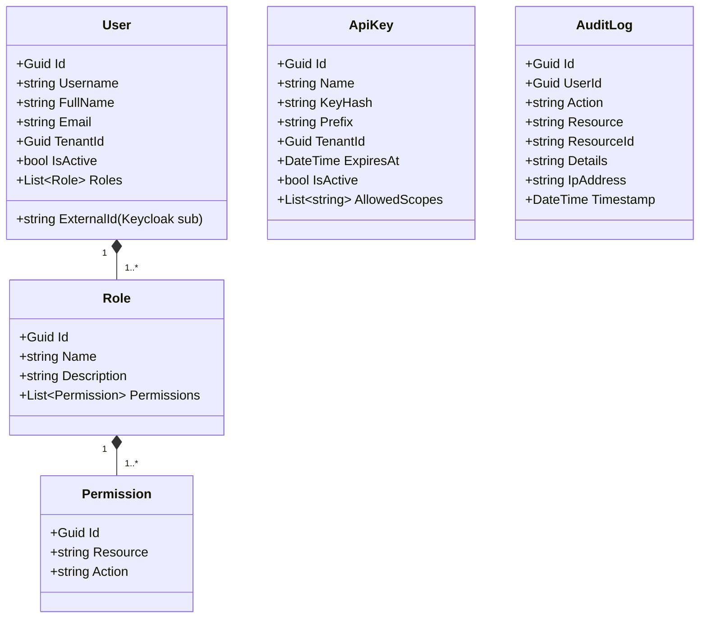

# IAM Domain — Per-Domain Document

**Context:** Platform | **Schema:** `plf` | **Classification:** 🟢 Generic
**Note:** Authentication จัดการโดย Keycloak/Auth0 — TMS จัดการเฉพาะ RBAC mapping, API Keys, Audit Logs

---

## 2A. Domain Model

### Entities



### Default Roles & Permissions

| Role | Permissions (ตัวอย่าง) |
|---|---|
| **Admin** | `*:*` (Full Access) |
| **Planner** | `order:read`, `order:create`, `trip:*`, `resource:read`, `tracking:read` |
| **Dispatcher** | `order:read`, `trip:dispatch`, `shipment:update`, `tracking:read` |
| **Driver** | `shipment:read:own`, `shipment:update:own`, `pod:create` |
| **Customer** | `order:read:own`, `order:create`, `shipment:read:own` |
| **Finance** | `billing:*`, `order:read`, `report:*` |

---

## 2B. API Specification

### User Management

| # | Method | URL | Summary | Auth |
|---|---|---|---|---|
| 1 | `GET` | `/api/iam/users` | รายการ User | Admin |
| 2 | `GET` | `/api/iam/users/{id}` | User Detail + Roles | Admin |
| 3 | `PUT` | `/api/iam/users/{id}/roles` | กำหนด Role ให้ User | Admin |
| 4 | `PUT` | `/api/iam/users/{id}/deactivate` | ปิดใช้งาน User | Admin |

### Role Management

| # | Method | URL | Summary | Auth |
|---|---|---|---|---|
| 5 | `GET` | `/api/iam/roles` | รายการ Role | Admin |
| 6 | `POST` | `/api/iam/roles` | สร้าง Custom Role | Admin |
| 7 | `PUT` | `/api/iam/roles/{id}/permissions` | กำหนด Permissions | Admin |

### API Key Management

| # | Method | URL | Summary | Auth |
|---|---|---|---|---|
| 8 | `POST` | `/api/iam/api-keys` | สร้าง API Key (OMS/AMR) | Admin |
| 9 | `GET` | `/api/iam/api-keys` | รายการ API Keys | Admin |

### Audit Logs

| # | Method | URL | Summary | Auth |
|---|---|---|---|---|
| 10 | `GET` | `/api/iam/audit-logs` | ดู Audit Logs (Filter) | Admin |

### Key DTOs

**PUT /api/iam/users/{id}/roles**
```json
// Request
{ "roleIds": ["uuid-planner", "uuid-dispatcher"] }

// Response: 200 OK
{
  "userId": "uuid",
  "username": "somchai",
  "roles": [
    { "id": "uuid", "name": "Planner" },
    { "id": "uuid", "name": "Dispatcher" }
  ]
}
```

**POST /api/iam/api-keys**
```json
// Request
{
  "name": "OMS Integration Key",
  "expiresAt": "2027-12-31",
  "allowedScopes": ["order:create", "shipment:read"]
}

// Response: 201 (⚠️ Key แสดงครั้งเดียว ห้ามแสดงซ้ำ)
{
  "id": "uuid",
  "name": "OMS Integration Key",
  "key": "tms_pk_a1b2c3d4e5f6...",
  "prefix": "tms_pk_a1b2",
  "expiresAt": "2027-12-31"
}
```

**GET /api/iam/audit-logs?userId=uuid&resource=order&from=2026-03-01&to=2026-03-29**
```json
{
  "items": [
    {
      "id": "uuid",
      "userId": "uuid",
      "username": "somchai",
      "action": "Create",
      "resource": "Order",
      "resourceId": "ORD-20260329-0001",
      "details": "Created order with 3 items, total 1500kg",
      "ipAddress": "192.168.1.100",
      "timestamp": "2026-03-29T08:15:00Z"
    }
  ]
}
```

---

## 2C. Database Schema

```sql
-- ===== Users (TMS local profile, linked to Keycloak) =====
CREATE TABLE plf."Users" (
    "Id"                UUID PRIMARY KEY DEFAULT gen_random_uuid(),
    "ExternalId"        VARCHAR(200) NOT NULL,
    "Username"          VARCHAR(100) NOT NULL,
    "FullName"          VARCHAR(200),
    "Email"             VARCHAR(200),
    "IsActive"          BOOLEAN NOT NULL DEFAULT true,
    "LastLoginAt"       TIMESTAMPTZ,
    "CreatedAt"         TIMESTAMPTZ NOT NULL DEFAULT now(),
    "TenantId"          UUID NOT NULL,
    
    CONSTRAINT "UQ_ExternalId" UNIQUE ("ExternalId"),
    CONSTRAINT "UQ_Username_Tenant" UNIQUE ("Username", "TenantId")
);

-- ===== Roles =====
CREATE TABLE plf."Roles" (
    "Id"                UUID PRIMARY KEY DEFAULT gen_random_uuid(),
    "Name"              VARCHAR(50) NOT NULL,
    "Description"       VARCHAR(200),
    "IsSystem"          BOOLEAN NOT NULL DEFAULT false,
    "TenantId"          UUID NOT NULL,
    
    CONSTRAINT "UQ_RoleName_Tenant" UNIQUE ("Name", "TenantId")
);

-- ===== Permissions =====
CREATE TABLE plf."Permissions" (
    "Id"                UUID PRIMARY KEY DEFAULT gen_random_uuid(),
    "Resource"          VARCHAR(50) NOT NULL,
    "Action"            VARCHAR(50) NOT NULL,
    
    CONSTRAINT "UQ_Resource_Action" UNIQUE ("Resource", "Action")
);

-- ===== Junction Tables =====
CREATE TABLE plf."UserRoles" (
    "UserId"            UUID NOT NULL REFERENCES plf."Users"("Id"),
    "RoleId"            UUID NOT NULL REFERENCES plf."Roles"("Id"),
    PRIMARY KEY ("UserId", "RoleId")
);

CREATE TABLE plf."RolePermissions" (
    "RoleId"            UUID NOT NULL REFERENCES plf."Roles"("Id"),
    "PermissionId"      UUID NOT NULL REFERENCES plf."Permissions"("Id"),
    PRIMARY KEY ("RoleId", "PermissionId")
);

-- ===== API Keys =====
CREATE TABLE plf."ApiKeys" (
    "Id"                UUID PRIMARY KEY DEFAULT gen_random_uuid(),
    "Name"              VARCHAR(200) NOT NULL,
    "KeyHash"           VARCHAR(500) NOT NULL,
    "Prefix"            VARCHAR(20) NOT NULL,
    "ExpiresAt"         TIMESTAMPTZ NOT NULL,
    "IsActive"          BOOLEAN NOT NULL DEFAULT true,
    "AllowedScopes"     TEXT[],
    "CreatedAt"         TIMESTAMPTZ NOT NULL DEFAULT now(),
    "TenantId"          UUID NOT NULL
);

-- ===== Audit Logs =====
CREATE TABLE plf."AuditLogs" (
    "Id"                UUID PRIMARY KEY DEFAULT gen_random_uuid(),
    "UserId"            UUID,
    "Username"          VARCHAR(100),
    "Action"            VARCHAR(50) NOT NULL,
    "Resource"          VARCHAR(50) NOT NULL,
    "ResourceId"        VARCHAR(100),
    "Details"           TEXT,
    "IpAddress"         VARCHAR(45),
    "Timestamp"         TIMESTAMPTZ NOT NULL DEFAULT now(),
    "TenantId"          UUID NOT NULL
);

CREATE INDEX "IX_AuditLogs_UserId" ON plf."AuditLogs" ("UserId");
CREATE INDEX "IX_AuditLogs_Resource" ON plf."AuditLogs" ("Resource");
CREATE INDEX "IX_AuditLogs_Timestamp" ON plf."AuditLogs" ("Timestamp" DESC);
CREATE INDEX "IX_AuditLogs_TenantId" ON plf."AuditLogs" ("TenantId");
```

---

## 2D. Event Specification

### Domain Events

| Event | Trigger | ใช้ทำอะไร |
|---|---|---|
| `UserRolesChangedEvent` | Admin เปลี่ยน Role | บันทึก Audit Log |
| `ApiKeyCreatedEvent` | Admin สร้าง API Key | บันทึก Audit Log |
| `UserDeactivatedEvent` | Admin ปิด User | Invalidate sessions |

### Audit Log Recording (Cross-cutting)

Audit Log ถูกสร้างอัตโนมัติผ่าน **MediatR Pipeline Behavior**:

```csharp
public class AuditLogBehavior<TRequest, TResponse>
    : IPipelineBehavior<TRequest, TResponse>
    where TRequest : IAuditableCommand
{
    public async Task<TResponse> Handle(TRequest request, ...)
    {
        var result = await next();
        await _auditRepository.LogAsync(new AuditLog
        {
            UserId = _currentUser.Id,
            Action = request.GetType().Name,
            Resource = request.ResourceName,
            ResourceId = request.ResourceId,
            Details = JsonSerializer.Serialize(request)
        });
        return result;
    }
}
```

---

## 2E. Use Cases

### UC-IAM-01: Authentication Flow

**Actor:** User (ทุก Role)
**Main Flow:**
1. User เข้า Login Page → Redirect ไป Keycloak
2. Keycloak authenticate (Password/OTP/SSO)
3. Keycloak ส่ง JWT Token กลับ (มี `sub`, `roles`, `tenant_id`)
4. Frontend ใช้ Token เรียก TMS API
5. API Gateway validate JWT → ส่งต่อไป WebApi
6. WebApi ตรวจ Permission ใน Token → Allow/Deny

### UC-IAM-02: Assign Roles

**Actor:** Admin
**Main Flow:**
1. Admin เข้า User Management → เลือก User
2. เลือก Roles ที่ต้องการ → Save
3. System อัปเดต UserRoles table
4. User ต้อง Login ใหม่เพื่อรับ Token ชุดใหม่

### UC-IAM-03: Create API Key

**Actor:** Admin
**Main Flow:**
1. Admin เข้า API Key Management → Create New
2. กำหนดชื่อ, วันหมดอายุ, Scopes
3. System generate random key → Hash ก่อนเก็บ → แสดง plain key **ครั้งเดียว**
4. Admin copy key ไปใส่ OMS/AMR config
5. External system ใช้ key ใน Header: `X-Api-Key: tms_pk_...`

### UC-IAM-04: View Audit Logs

**Actor:** Admin
**Main Flow:**
1. Admin เข้า Audit Log → Filter ตาม User, Resource, Date Range
2. System query AuditLogs table → Return paged results
3. Admin ดูว่าใครทำอะไร เมื่อไหร่ กับ Resource ไหน
