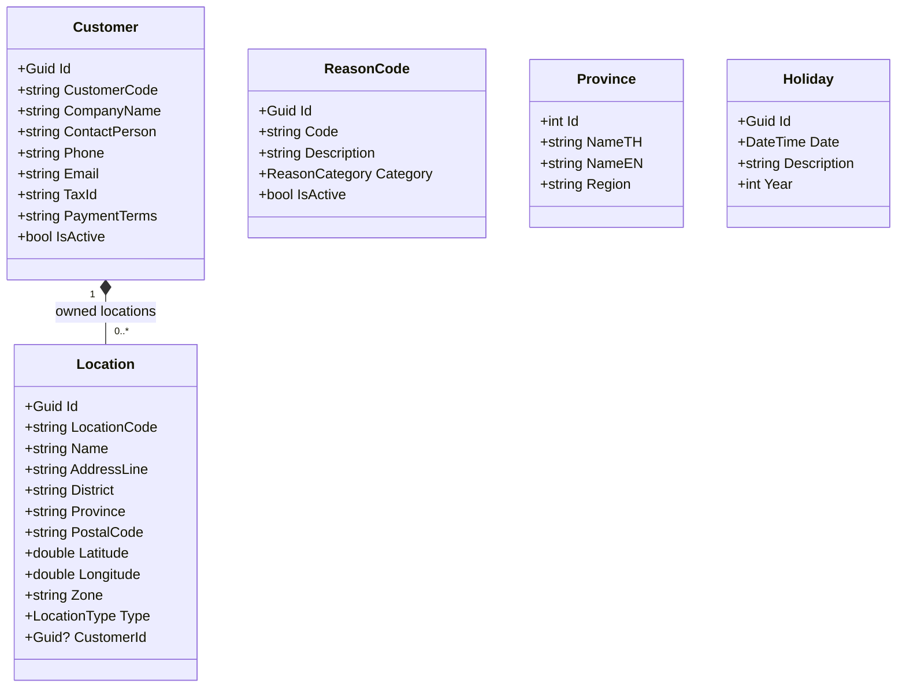

# Master Data Domain — Per-Domain Document

**Context:** Platform | **Schema:** `plf` | **Classification:** 🟢 Generic

---

## 2A. Domain Model

*Master Data ไม่ใช่ Rich Domain — ใช้ CRUD + Simple Validation เป็นหลัก*

### Entities



### Enums

```csharp
public enum LocationType { Warehouse, CustomerSite, Hub, DropPoint }
public enum ReasonCategory { Reject, Cancel, Exception, Return }
```

### Business Rules

| # | กฎ |
|---|---|
| 1 | CustomerCode, LocationCode ต้อง Unique per Tenant |
| 2 | Location ต้องมี Latitude/Longitude (Geocoded) |
| 3 | ReasonCode ต้อง Unique per Category |
| 4 | ลบ Customer ไม่ได้ถ้ามี Order อ้างอิง → Soft Delete (IsActive = false) |

---

## 2B. API Specification

### Customer APIs

| # | Method | URL | Summary | Auth |
|---|---|---|---|---|
| 1 | `POST` | `/api/master/customers` | สร้างลูกค้า | Admin |
| 2 | `GET` | `/api/master/customers` | รายการลูกค้า | Admin, Planner, Finance |
| 3 | `GET` | `/api/master/customers/{id}` | Detail | Admin |
| 4 | `PUT` | `/api/master/customers/{id}` | แก้ไข | Admin |

### Location APIs

| # | Method | URL | Summary | Auth |
|---|---|---|---|---|
| 5 | `POST` | `/api/master/locations` | สร้าง Location | Admin |
| 6 | `GET` | `/api/master/locations` | รายการ (Filter: Zone, Type, Customer) | Admin, Planner |
| 7 | `GET` | `/api/master/locations/search?q=คลัง` | ค้นหา Location (Autocomplete) | Admin, Planner, Customer |
| 8 | `PUT` | `/api/master/locations/{id}` | แก้ไข | Admin |

### Reference Data APIs

| # | Method | URL | Summary | Auth |
|---|---|---|---|---|
| 9 | `GET` | `/api/master/reason-codes?category=Reject` | Reason Codes | All |
| 10 | `GET` | `/api/master/provinces` | จังหวัด | All |
| 11 | `GET` | `/api/master/holidays?year=2026` | วันหยุด | All |
| 12 | `POST` | `/api/master/reason-codes` | สร้าง Reason Code | Admin |

### Key DTOs

**POST /api/master/customers**
```json
{
  "customerCode": "CUST-001",
  "companyName": "บริษัท ABC จำกัด",
  "contactPerson": "คุณสมศรี",
  "phone": "02-123-4567",
  "email": "somsi@abc.co.th",
  "taxId": "0123456789012",
  "paymentTerms": "Net 30"
}
```

**GET /api/master/locations/search?q=คลัง&type=Warehouse**
```json
{
  "items": [
    {
      "id": "uuid",
      "locationCode": "WH-BKK-01",
      "name": "คลังสินค้ากรุงเทพ 1",
      "province": "กรุงเทพ",
      "zone": "Central",
      "latitude": 13.75,
      "longitude": 100.50
    }
  ]
}
```

---

## 2C. Database Schema

```sql
CREATE SCHEMA IF NOT EXISTS plf;

-- ===== Customers =====
CREATE TABLE plf."Customers" (
    "Id"                UUID PRIMARY KEY DEFAULT gen_random_uuid(),
    "CustomerCode"      VARCHAR(50) NOT NULL,
    "CompanyName"       VARCHAR(300) NOT NULL,
    "ContactPerson"     VARCHAR(200),
    "Phone"             VARCHAR(20),
    "Email"             VARCHAR(200),
    "TaxId"             VARCHAR(20),
    "PaymentTerms"      VARCHAR(50),
    "IsActive"          BOOLEAN NOT NULL DEFAULT true,
    "CreatedAt"         TIMESTAMPTZ NOT NULL DEFAULT now(),
    "TenantId"          UUID NOT NULL,
    
    CONSTRAINT "UQ_CustomerCode_Tenant" UNIQUE ("CustomerCode", "TenantId")
);

-- ===== Locations =====
CREATE TABLE plf."Locations" (
    "Id"                UUID PRIMARY KEY DEFAULT gen_random_uuid(),
    "LocationCode"      VARCHAR(50) NOT NULL,
    "Name"              VARCHAR(300) NOT NULL,
    "AddressLine"       VARCHAR(500),
    "District"          VARCHAR(100),
    "Province"          VARCHAR(100),
    "PostalCode"        VARCHAR(10),
    "Latitude"          DOUBLE PRECISION NOT NULL,
    "Longitude"         DOUBLE PRECISION NOT NULL,
    "Zone"              VARCHAR(50),
    "Type"              VARCHAR(20) NOT NULL,
    "CustomerId"        UUID REFERENCES plf."Customers"("Id"),
    "IsActive"          BOOLEAN NOT NULL DEFAULT true,
    "TenantId"          UUID NOT NULL,
    
    CONSTRAINT "UQ_LocationCode_Tenant" UNIQUE ("LocationCode", "TenantId")
);

CREATE INDEX "IX_Locations_Type" ON plf."Locations" ("Type");
CREATE INDEX "IX_Locations_Zone" ON plf."Locations" ("Zone");
CREATE INDEX "IX_Locations_CustomerId" ON plf."Locations" ("CustomerId");
CREATE INDEX "IX_Locations_Name_GIN" ON plf."Locations" USING gin (to_tsvector('thai', "Name"));

-- ===== Reason Codes =====
CREATE TABLE plf."ReasonCodes" (
    "Id"                UUID PRIMARY KEY DEFAULT gen_random_uuid(),
    "Code"              VARCHAR(20) NOT NULL,
    "Description"       VARCHAR(200) NOT NULL,
    "Category"          VARCHAR(20) NOT NULL,
    "IsActive"          BOOLEAN NOT NULL DEFAULT true,
    "TenantId"          UUID NOT NULL,
    
    CONSTRAINT "UQ_ReasonCode_Cat_Tenant" UNIQUE ("Code", "Category", "TenantId")
);

-- ===== Provinces (Seed Data) =====
CREATE TABLE plf."Provinces" (
    "Id"                SERIAL PRIMARY KEY,
    "NameTH"            VARCHAR(100) NOT NULL,
    "NameEN"            VARCHAR(100),
    "Region"            VARCHAR(50)
);

-- ===== Holidays =====
CREATE TABLE plf."Holidays" (
    "Id"                UUID PRIMARY KEY DEFAULT gen_random_uuid(),
    "Date"              DATE NOT NULL,
    "Description"       VARCHAR(200) NOT NULL,
    "Year"              INT NOT NULL,
    "TenantId"          UUID NOT NULL,
    
    CONSTRAINT "UQ_Holiday_Date_Tenant" UNIQUE ("Date", "TenantId")
);
```

---

## 2D. Event Specification

*Master Data เป็น Generic Domain — ผลิต Event น้อย, ถูก Query เป็นหลัก*

### Integration Events (ถ้าจำเป็น)

**CustomerDeactivatedIntegrationEvent**
```json
{
  "payload": {
    "customerId": "uuid",
    "customerCode": "CUST-001"
  }
}
```
→ **Subscriber:** Order Context (Block สร้าง Order ใหม่สำหรับ Customer นี้)

### Inbound Events

ไม่มี — Master Data เป็น **Upstream** (ถูก Query จาก Context อื่น ไม่รับ Event)

---

## 2E. Use Cases

### UC-MD-01: Manage Customers

**Actor:** Admin
**Main Flow:**
1. Admin สร้าง/แก้ไข Customer ผ่าน Web Portal
2. System validate: CustomerCode unique, required fields
3. บันทึกข้อมูล

### UC-MD-02: Manage Locations (Address Book)

**Actor:** Admin / Planner
**Main Flow:**
1. สร้าง Location → กรอกที่อยู่ → System Geocoding (Lat/Lng)
2. จัดกลุ่ม Zone/Region
3. Order Context ใช้ Location เป็น Autocomplete ตอนสร้าง Order

### UC-MD-03: Search Locations (Autocomplete)

**Actor:** Planner / Customer (ตอนสร้าง Order)
**Main Flow:**
1. User พิมพ์ชื่อสถานที่ → `/api/master/locations/search?q=คลัง`
2. System ค้นหาด้วย Full-text Search (Thai)
3. Return รายการ Location + Lat/Lng
4. User เลือก → ข้อมูล Address ถูก copy ไปยัง Order
