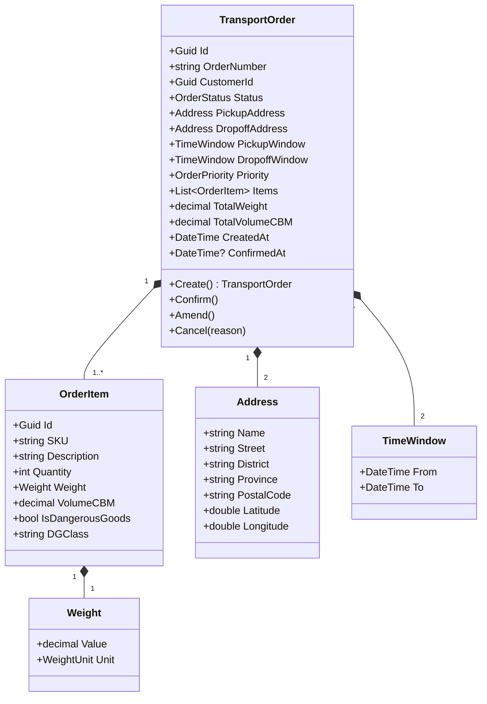
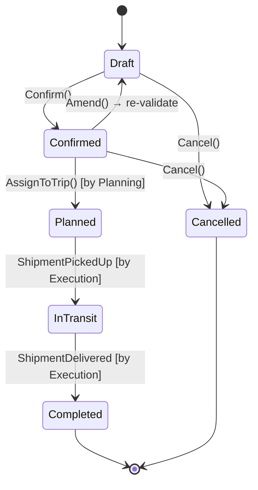

# Order Management Domain — Per-Domain Document

**Context:** Order | **Schema:** `ord` | **Classification:** 🔴 Core

---

## 2A. Domain Model

### Aggregate Root: `TransportOrder`



### Enums

```csharp
public enum OrderStatus
{
    Draft,        // ร่าง
    Confirmed,    // ยืนยันแล้ว → พร้อมจัดคิว
    Planned,      // ถูกจัดเข้า Trip แล้ว
    InTransit,    // กำลังขนส่ง
    Completed,    // ส่งสำเร็จทุก Item
    Cancelled     // ยกเลิก
}

public enum OrderPriority { Normal, Express, SameDay }
public enum WeightUnit { Kg, Ton }
```

### Business Rules / Invariants

| # | กฎ | Exception |
|---|---|---|
| 1 | Order ต้องมี Items ≥ 1 รายการ | `OrderMustHaveItemsException` |
| 2 | TotalWeight ต้อง > 0 | `InvalidWeightException` |
| 3 | DropoffWindow.From ต้อง > PickupWindow.From | `InvalidTimeWindowException` |
| 4 | Confirm ได้เฉพาะ Status = Draft | `InvalidOrderStateException` |
| 5 | Cancel ได้เฉพาะ Status ∈ {Draft, Confirmed} | `InvalidOrderStateException` |
| 6 | Amend ได้เฉพาะ Status ∈ {Draft, Confirmed} | `InvalidOrderStateException` |
| 7 | ถ้ามี DangerousGoods ต้องระบุ DGClass | `MissingDGClassException` |

### State Diagram



---

## 2B. API Specification

### Endpoints

| # | Method | URL | Summary | Auth Roles |
|---|---|---|---|---|
| 1 | `POST` | `/api/orders` | สร้าง Order ใหม่ | Admin, Planner, Customer |
| 2 | `GET` | `/api/orders` | ดูรายการ Order (Paged, Filter) | Admin, Planner, Dispatcher, Finance |
| 3 | `GET` | `/api/orders/{id}` | ดู Order Detail | Admin, Planner, Dispatcher, Customer(own) |
| 4 | `PUT` | `/api/orders/{id}/confirm` | ยืนยัน Order | Admin, Planner |
| 5 | `PUT` | `/api/orders/{id}/amend` | แก้ไข Order | Admin, Planner, Customer(own) |
| 6 | `PUT` | `/api/orders/{id}/cancel` | ยกเลิก Order | Admin, Planner, Customer(own) |
| 7 | `POST` | `/api/orders/import` | Bulk Import (CSV/Excel) | Admin, Planner |

### Request / Response DTOs

**POST /api/orders**
```json
// Request
{
  "customerId": "uuid",
  "priority": "Normal",
  "pickupAddress": {
    "name": "คลังสินค้า A",
    "street": "123 ถ.พระราม 2",
    "district": "บางขุนเทียน",
    "province": "กรุงเทพ",
    "postalCode": "10150",
    "latitude": 13.6600,
    "longitude": 100.4700
  },
  "dropoffAddress": { ... },
  "pickupWindow": { "from": "2026-03-29T08:00", "to": "2026-03-29T10:00" },
  "dropoffWindow": { "from": "2026-03-29T14:00", "to": "2026-03-29T17:00" },
  "items": [
    {
      "sku": "SKU-001",
      "description": "กล่องอิเล็กทรอนิกส์",
      "quantity": 50,
      "weightKg": 500.00,
      "volumeCBM": 2.5,
      "isDangerousGoods": false
    }
  ]
}

// Response: 201 Created
{
  "id": "uuid",
  "orderNumber": "ORD-20260329-0001",
  "status": "Draft",
  "totalWeight": 500.00,
  "totalVolumeCBM": 2.5,
  "createdAt": "2026-03-29T08:00:00Z"
}
```

**GET /api/orders?page=1&pageSize=20&status=Confirmed**
```json
// Response: 200 OK
{
  "items": [
    {
      "id": "uuid",
      "orderNumber": "ORD-20260329-0001",
      "customerName": "บริษัท ABC",
      "status": "Confirmed",
      "priority": "Normal",
      "pickupProvince": "กรุงเทพ",
      "dropoffProvince": "ชลบุรี",
      "totalWeight": 500.00,
      "pickupWindow": { "from": "...", "to": "..." },
      "createdAt": "2026-03-29T08:00:00Z"
    }
  ],
  "page": 1,
  "pageSize": 20,
  "totalCount": 156,
  "totalPages": 8
}
```

### Error Responses

| Status | เมื่อ | Body |
|---|---|---|
| 400 | Validation Error | `{ "errors": { "items": "Order must have at least 1 item" } }` |
| 404 | Order/Customer ไม่พบ | `{ "title": "Not Found", "detail": "..." }` |
| 409 | Duplicate OrderNumber | `{ "title": "Conflict" }` |
| 422 | Business Rule Violation | `{ "title": "Invalid State", "detail": "Only draft orders..." }` |

---

## 2C. Database Schema

```sql
-- Schema: ord
CREATE SCHEMA IF NOT EXISTS ord;

-- ===== Transport Orders =====
CREATE TABLE ord."TransportOrders" (
    "Id"                UUID PRIMARY KEY DEFAULT gen_random_uuid(),
    "OrderNumber"       VARCHAR(50) NOT NULL,
    "CustomerId"        UUID NOT NULL,
    "Status"            VARCHAR(20) NOT NULL DEFAULT 'Draft',
    "Priority"          VARCHAR(20) NOT NULL DEFAULT 'Normal',
    -- Pickup Address (Owned)
    "PickupAddress_Name"       VARCHAR(200),
    "PickupAddress_Street"     VARCHAR(500),
    "PickupAddress_District"   VARCHAR(100),
    "PickupAddress_Province"   VARCHAR(100),
    "PickupAddress_PostalCode" VARCHAR(10),
    "PickupAddress_Latitude"   DOUBLE PRECISION,
    "PickupAddress_Longitude"  DOUBLE PRECISION,
    -- Dropoff Address (Owned)
    "DropoffAddress_Name"       VARCHAR(200),
    "DropoffAddress_Street"     VARCHAR(500),
    "DropoffAddress_District"   VARCHAR(100),
    "DropoffAddress_Province"   VARCHAR(100),
    "DropoffAddress_PostalCode" VARCHAR(10),
    "DropoffAddress_Latitude"   DOUBLE PRECISION,
    "DropoffAddress_Longitude"  DOUBLE PRECISION,
    -- Time Windows
    "PickupWindowFrom"  TIMESTAMPTZ,
    "PickupWindowTo"    TIMESTAMPTZ,
    "DropoffWindowFrom" TIMESTAMPTZ,
    "DropoffWindowTo"   TIMESTAMPTZ,
    -- Totals
    "TotalWeight"       DECIMAL(12,2) NOT NULL DEFAULT 0,
    "TotalVolumeCBM"    DECIMAL(12,4) NOT NULL DEFAULT 0,
    -- Audit
    "CancelReason"      VARCHAR(500),
    "CreatedAt"         TIMESTAMPTZ NOT NULL DEFAULT now(),
    "CreatedBy"         UUID,
    "ConfirmedAt"       TIMESTAMPTZ,
    "UpdatedAt"         TIMESTAMPTZ,
    "TenantId"          UUID NOT NULL,
    
    CONSTRAINT "UQ_OrderNumber" UNIQUE ("OrderNumber")
);

CREATE INDEX "IX_TransportOrders_Status" ON ord."TransportOrders" ("Status");
CREATE INDEX "IX_TransportOrders_CustomerId" ON ord."TransportOrders" ("CustomerId");
CREATE INDEX "IX_TransportOrders_TenantId" ON ord."TransportOrders" ("TenantId");
CREATE INDEX "IX_TransportOrders_CreatedAt" ON ord."TransportOrders" ("CreatedAt" DESC);

-- ===== Order Items =====
CREATE TABLE ord."OrderItems" (
    "Id"                UUID PRIMARY KEY DEFAULT gen_random_uuid(),
    "OrderId"           UUID NOT NULL REFERENCES ord."TransportOrders"("Id"),
    "SKU"               VARCHAR(100),
    "Description"       VARCHAR(500) NOT NULL,
    "Quantity"          INT NOT NULL DEFAULT 1,
    "WeightKg"          DECIMAL(10,2) NOT NULL DEFAULT 0,
    "VolumeCBM"         DECIMAL(10,4) NOT NULL DEFAULT 0,
    "IsDangerousGoods"  BOOLEAN NOT NULL DEFAULT false,
    "DGClass"           VARCHAR(20)
);

CREATE INDEX "IX_OrderItems_OrderId" ON ord."OrderItems" ("OrderId");
```

---

## 2D. Event Specification

### Domain Events (ภายใน Module)

| Event | Trigger | ใช้ทำอะไร |
|---|---|---|
| `OrderCreatedDomainEvent` | สร้าง Order | Generate OrderNumber |
| `OrderStatusChangedDomainEvent` | เปลี่ยน Status | Audit Log |

### Integration Events (ข้าม Module)

**OrderConfirmedIntegrationEvent**
```json
{
  "eventId": "uuid",
  "eventType": "OrderConfirmedIntegrationEvent",
  "timestamp": "2026-03-29T08:00:00Z",
  "payload": {
    "orderId": "uuid",
    "orderNumber": "ORD-20260329-0001",
    "customerId": "uuid",
    "priority": "Normal",
    "totalWeight": 500.00,
    "totalVolumeCBM": 2.5,
    "pickupAddress": { "latitude": 13.66, "longitude": 100.47, "province": "กรุงเทพ" },
    "dropoffAddress": { "latitude": 13.36, "longitude": 100.98, "province": "ชลบุรี" },
    "pickupWindow": { "from": "2026-03-29T08:00", "to": "2026-03-29T10:00" },
    "dropoffWindow": { "from": "2026-03-29T14:00", "to": "2026-03-29T17:00" },
    "itemCount": 1,
    "hasDangerousGoods": false
  }
}
```
→ **Subscriber:** Planning Context (จัดคิวรถ)

**OrderCancelledIntegrationEvent**
```json
{
  "eventId": "uuid",
  "eventType": "OrderCancelledIntegrationEvent",
  "timestamp": "...",
  "payload": {
    "orderId": "uuid",
    "orderNumber": "ORD-20260329-0001",
    "reason": "ลูกค้ายกเลิก"
  }
}
```
→ **Subscriber:** Planning Context (ยกเลิก Trip ที่ค้าง)

**OrderAmendedIntegrationEvent**
```json
{
  "eventId": "uuid",
  "eventType": "OrderAmendedIntegrationEvent",
  "timestamp": "...",
  "payload": {
    "orderId": "uuid",
    "changes": ["address", "timeWindow", "items"]
  }
}
```
→ **Subscriber:** Planning Context (อัปเดต Trip ถ้ามี)

---

## 2E. Use Cases

### UC-ORD-01: Create Transport Order

| | |
|---|---|
| **Actor** | Planner / Customer / OMS Integration |
| **Preconditions** | Customer ต้องมีอยู่ใน Master Data |

**Main Flow:**
1. Actor กรอกข้อมูล Pickup/Dropoff Address, Time Window, Items
2. System validate ข้อมูล (weight > 0, DG Class, time window logic)
3. System generate OrderNumber (format: `ORD-{YYYYMMDD}-{SEQ}`)
4. System บันทึก Order status = `Draft`
5. Return Order ID + OrderNumber

**Alternative Flows:**
- **1a.** Bulk Import → อ่าน CSV/Excel → สร้างทีละ row → รายงานผลสำเร็จ/ล้มเหลว
- **2a.** Validation fail → Return 400 + error details
- **2b.** DG items โดยไม่ระบุ DGClass → Return 400

---

### UC-ORD-02: Confirm Order

| | |
|---|---|
| **Actor** | Planner / Admin |
| **Preconditions** | Order.Status = Draft |

**Main Flow:**
1. Actor เลือก Order → กด Confirm
2. System ตรวจสอบ Status = Draft
3. System เปลี่ยน Status → `Confirmed`, บันทึก ConfirmedAt
4. System publish `OrderConfirmedIntegrationEvent`
5. Planning Context รับ Event → แสดงใน Dispatch Board

**Alternative Flows:**
- **2a.** Status ≠ Draft → Return 422 "Only draft orders can be confirmed"

---

### UC-ORD-03: Amend Order

| | |
|---|---|
| **Actor** | Planner / Customer(own) |
| **Preconditions** | Order.Status ∈ {Draft, Confirmed} |

**Main Flow:**
1. Actor แก้ไข Address / Time Window / Items
2. System validate ข้อมูลใหม่
3. ถ้า Status = Confirmed → เปลี่ยนกลับเป็น Draft (ต้อง Confirm ใหม่)
4. System publish `OrderAmendedIntegrationEvent`
5. ถ้ามี Trip ค้าง → Planning ได้รับ Event แจ้ง Planner ตรวจสอบ

---

### UC-ORD-04: Cancel Order

| | |
|---|---|
| **Actor** | Planner / Customer(own) / Admin |
| **Preconditions** | Order.Status ∈ {Draft, Confirmed} |

**Main Flow:**
1. Actor เลือก Order → กด Cancel → ระบุเหตุผล
2. System ตรวจ Status ∈ {Draft, Confirmed}
3. System เปลี่ยน Status → `Cancelled`, บันทึก CancelReason
4. System publish `OrderCancelledIntegrationEvent`

**Alternative Flows:**
- **2a.** Status = Planned/InTransit → Return 422 "Cannot cancel order in transit"
