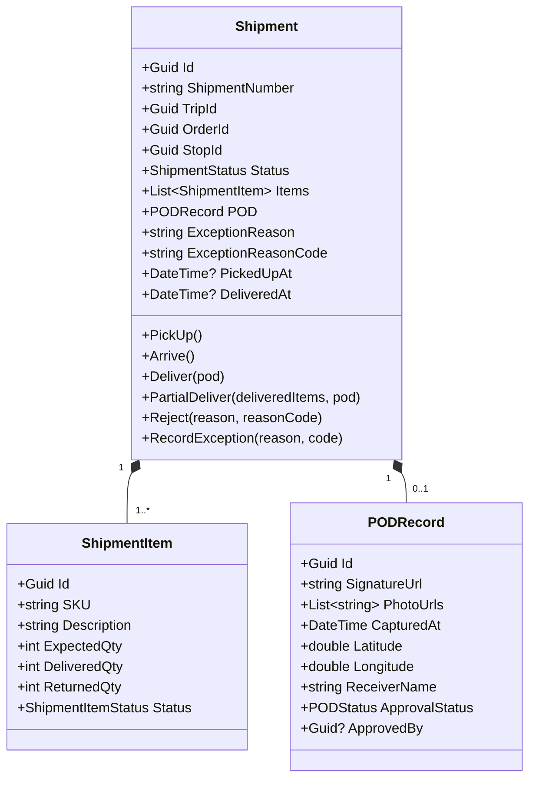
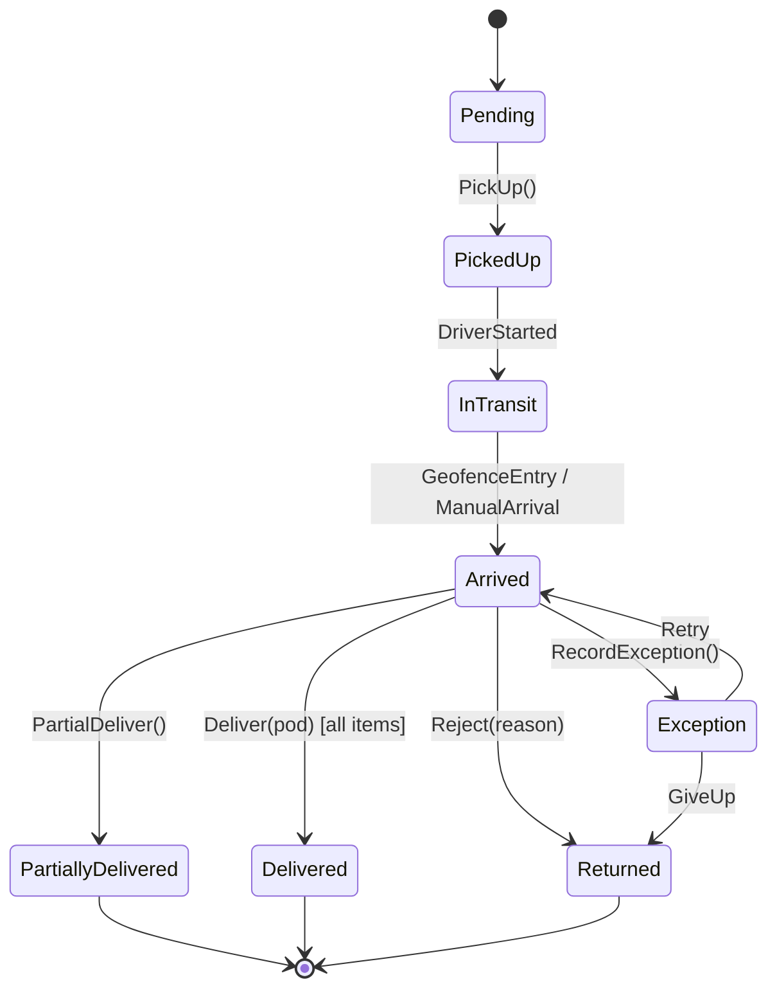

# Shipment Management Domain — Per-Domain Document

**Context:** Execution | **Schema:** `exe` | **Classification:** 🔴 Core

---

## 2A. Domain Model

### Aggregate Root: `Shipment`



### Enums

```csharp
public enum ShipmentStatus
{
    Pending,            // สร้างแล้ว รอรับสินค้า
    PickedUp,           // รับสินค้าขึ้นรถแล้ว
    InTransit,          // กำลังขนส่ง
    Arrived,            // ถึงจุดหมายแล้ว
    Delivered,          // ส่งสำเร็จทุก Item
    PartiallyDelivered, // ส่งได้บางส่วน
    Returned,           // ตีกลับทั้งหมด
    Exception           // มีปัญหา
}

public enum ShipmentItemStatus { Pending, Delivered, Returned }
public enum PODStatus { Pending, Approved, Rejected }
```

### Business Rules

| # | กฎ | Exception |
|---|---|---|
| 1 | PickUp ได้เฉพาะ Status = Pending | `InvalidShipmentStateException` |
| 2 | Deliver ต้องมี POD (Signature/Photo) | `PODRequiredException` |
| 3 | Deliver ต้อง DeliveredQty > 0 อย่างน้อย 1 Item | `NoItemsDeliveredException` |
| 4 | PartialDeliver: DeliveredQty < ExpectedQty บาง Item | Auto-create Return Shipment |
| 5 | Exception reason ต้องอ้าง ReasonCode จาก Master Data | `InvalidReasonCodeException` |

### State Diagram



---

## 2B. API Specification

### Endpoints

| # | Method | URL | Summary | Auth |
|---|---|---|---|---|
| 1 | `GET` | `/api/shipments` | รายการ Shipment (Filter) | Admin, Planner, Dispatcher, Finance |
| 2 | `GET` | `/api/shipments/{id}` | Shipment Detail | Admin, Dispatcher, Driver(own) |
| 3 | `GET` | `/api/shipments/driver/today` | งานวันนี้ของคนขับ | Driver(own) |
| 4 | `PUT` | `/api/shipments/{id}/pickup` | ยืนยัน Pickup (สแกน) | Driver |
| 5 | `PUT` | `/api/shipments/{id}/arrive` | ยืนยันถึงจุดหมาย | Driver, System(Geofence) |
| 6 | `PUT` | `/api/shipments/{id}/deliver` | ยืนยัน Deliver + POD | Driver |
| 7 | `PUT` | `/api/shipments/{id}/partial-deliver` | ส่งบางส่วน + POD | Driver |
| 8 | `PUT` | `/api/shipments/{id}/reject` | ตีกลับ + เหตุผล | Driver |
| 9 | `PUT` | `/api/shipments/{id}/exception` | รายงานปัญหา | Driver, Dispatcher |
| 10 | `PUT` | `/api/shipments/{id}/pod/approve` | อนุมัติ POD | Admin, Dispatcher |

### Key DTOs

**PUT /api/shipments/{id}/deliver**
```json
// Request
{
  "items": [
    { "shipmentItemId": "uuid", "deliveredQty": 50 }
  ],
  "pod": {
    "receiverName": "คุณสมหญิง",
    "signatureFileId": "uuid",
    "photoFileIds": ["uuid1", "uuid2"]
  }
}

// Response: 200 OK
{
  "id": "uuid",
  "status": "Delivered",
  "deliveredAt": "2026-03-29T15:30:00Z",
  "pod": {
    "signatureUrl": "https://storage.../sig.png",
    "photoUrls": ["https://storage.../p1.jpg"],
    "approvalStatus": "Pending"
  }
}
```

**GET /api/shipments/driver/today**
```json
// Response: 200 OK
{
  "driverName": "สมชาย",
  "tripNumber": "TRP-20260329-001",
  "vehicle": "1กก-1234",
  "shipments": [
    {
      "id": "uuid",
      "shipmentNumber": "SHP-001",
      "status": "Pending",
      "type": "Pickup",
      "address": "คลังสินค้า A",
      "window": "08:00-10:00",
      "itemCount": 3,
      "totalWeight": 500
    }
  ]
}
```

---

## 2C. Database Schema

```sql
CREATE SCHEMA IF NOT EXISTS exe;

-- ===== Shipments =====
CREATE TABLE exe."Shipments" (
    "Id"                UUID PRIMARY KEY DEFAULT gen_random_uuid(),
    "ShipmentNumber"    VARCHAR(50) NOT NULL,
    "TripId"            UUID NOT NULL,
    "OrderId"           UUID NOT NULL,
    "StopId"            UUID NOT NULL,
    "Status"            VARCHAR(30) NOT NULL DEFAULT 'Pending',
    -- Address snapshot
    "Address_Name"      VARCHAR(200),
    "Address_Street"    VARCHAR(500),
    "Address_Province"  VARCHAR(100),
    "Address_Latitude"  DOUBLE PRECISION,
    "Address_Longitude" DOUBLE PRECISION,
    -- Exception
    "ExceptionReason"      VARCHAR(500),
    "ExceptionReasonCode"  VARCHAR(20),
    -- Timestamps
    "PickedUpAt"        TIMESTAMPTZ,
    "ArrivedAt"         TIMESTAMPTZ,
    "DeliveredAt"       TIMESTAMPTZ,
    "CreatedAt"         TIMESTAMPTZ NOT NULL DEFAULT now(),
    "TenantId"          UUID NOT NULL,
    
    CONSTRAINT "UQ_ShipmentNumber" UNIQUE ("ShipmentNumber")
);

CREATE INDEX "IX_Shipments_TripId" ON exe."Shipments" ("TripId");
CREATE INDEX "IX_Shipments_OrderId" ON exe."Shipments" ("OrderId");
CREATE INDEX "IX_Shipments_Status" ON exe."Shipments" ("Status");
CREATE INDEX "IX_Shipments_TenantId" ON exe."Shipments" ("TenantId");

-- ===== Shipment Items =====
CREATE TABLE exe."ShipmentItems" (
    "Id"                UUID PRIMARY KEY DEFAULT gen_random_uuid(),
    "ShipmentId"        UUID NOT NULL REFERENCES exe."Shipments"("Id"),
    "SKU"               VARCHAR(100),
    "Description"       VARCHAR(500),
    "ExpectedQty"       INT NOT NULL,
    "DeliveredQty"      INT NOT NULL DEFAULT 0,
    "ReturnedQty"       INT NOT NULL DEFAULT 0,
    "Status"            VARCHAR(20) NOT NULL DEFAULT 'Pending'
);

CREATE INDEX "IX_ShipmentItems_ShipmentId" ON exe."ShipmentItems" ("ShipmentId");

-- ===== POD Records =====
CREATE TABLE exe."PODRecords" (
    "Id"                UUID PRIMARY KEY DEFAULT gen_random_uuid(),
    "ShipmentId"        UUID NOT NULL REFERENCES exe."Shipments"("Id"),
    "ReceiverName"      VARCHAR(200),
    "SignatureUrl"      VARCHAR(1000),
    "CapturedAt"        TIMESTAMPTZ NOT NULL,
    "Latitude"          DOUBLE PRECISION,
    "Longitude"         DOUBLE PRECISION,
    "ApprovalStatus"    VARCHAR(20) NOT NULL DEFAULT 'Pending',
    "ApprovedBy"        UUID,
    "ApprovedAt"        TIMESTAMPTZ,

    CONSTRAINT "UQ_POD_Shipment" UNIQUE ("ShipmentId")
);

CREATE TABLE exe."PODPhotos" (
    "Id"                UUID PRIMARY KEY DEFAULT gen_random_uuid(),
    "PODRecordId"       UUID NOT NULL REFERENCES exe."PODRecords"("Id"),
    "PhotoUrl"          VARCHAR(1000) NOT NULL,
    "UploadedAt"        TIMESTAMPTZ NOT NULL DEFAULT now()
);
```

---

## 2D. Event Specification

### Integration Events Published

**ShipmentDeliveredIntegrationEvent**
```json
{
  "payload": {
    "shipmentId": "uuid",
    "orderId": "uuid",
    "tripId": "uuid",
    "status": "Delivered",
    "deliveredAt": "2026-03-29T15:30:00Z",
    "items": [
      { "sku": "SKU-001", "expectedQty": 50, "deliveredQty": 50 }
    ],
    "hasPOD": true
  }
}
```
→ **Subscribers:** Billing (คำนวณค่าขนส่ง), Integration/OMS (แจ้ง Status), Order (อัปเดต Status)

**ShipmentExceptionIntegrationEvent**
```json
{
  "payload": {
    "shipmentId": "uuid",
    "orderId": "uuid",
    "exceptionType": "CustomerRejected",
    "reasonCode": "RJ01",
    "reason": "ลูกค้าปฏิเสธรับสินค้า"
  }
}
```
→ **Subscribers:** Notification (แจ้ง Planner + ลูกค้า), Analytics

### Inbound Events

| Event | Source | Action |
|---|---|---|
| `TripDispatchedIntegrationEvent` | Planning | สร้าง Shipments จาก Trip Stops |
| `TripCancelledIntegrationEvent` | Planning | ยกเลิก Shipments ที่ Pending |
| `VehicleEnteredZoneEvent` | Tracking | Auto Arrive (เปลี่ยน Status → Arrived) |
| `PODCompletedEvent` | (internal) | ตรวจสอบ + อัปเดต Shipment Status |

---

## 2E. Use Cases

### UC-EXE-01: Execute Stop (Driver Workflow)

**Actor:** Driver (Mobile App)
**Main Flow:**
1. Driver เปิด App → เห็นรายการ Stop วันนี้เรียงตาม Sequence
2. Driver ถึงจุดรับของ → ระบบ Auto Check-in (Geofence) หรือกด Manual Arrive
3. Driver สแกน Barcode/QR Items → ยืนยัน Pickup
4. Shipment status → `PickedUp` → `InTransit`
5. Driver ถึงจุดส่ง → Auto Check-in
6. Driver ลงสินค้า → สแกนยืนยัน → เก็บ POD (ลายเซ็น + รูป)
7. Shipment status → `Delivered`
8. ระบบ publish `ShipmentDeliveredEvent`

### UC-EXE-02: Handle Exception

**Actor:** Driver / Dispatcher
**Main Flow:**
1. Driver พบปัญหา (ลูกค้าไม่อยู่, ที่อยู่ผิด, สินค้าเสียหาย)
2. Driver กดรายงาน → เลือก ReasonCode → ใส่ Note + ถ่ายรูป
3. Shipment status → `Exception`
4. System publish `ShipmentExceptionEvent` → Notification แจ้ง Dispatcher
5. Dispatcher ตัดสินใจ: Retry (กลับไปส่งใหม่) หรือ Return (ตีกลับ)

### UC-EXE-03: Partial Delivery

**Actor:** Driver
**Main Flow:**
1. Driver ถึงจุดส่ง → ลูกค้ารับได้แค่บางส่วน
2. Driver ใส่ DeliveredQty ต่อ Item (เช่น 30/50 กล่อง)
3. Driver เก็บ POD สำหรับของที่ส่ง
4. Shipment status → `PartiallyDelivered`
5. System สร้าง pending record สำหรับ Remaining Items (20 กล่อง)

### UC-EXE-04: Approve POD

**Actor:** Dispatcher / Admin (Back-office)
**Main Flow:**
1. Dispatcher เข้าหน้า POD Review → เห็นรายการ POD ที่ Pending
2. กดดูรูป + ลายเซ็น + ตำแหน่ง GPS + เวลา
3. กด Approve → POD.ApprovalStatus → `Approved`
4. Billing Context สามารถออกบิลได้
