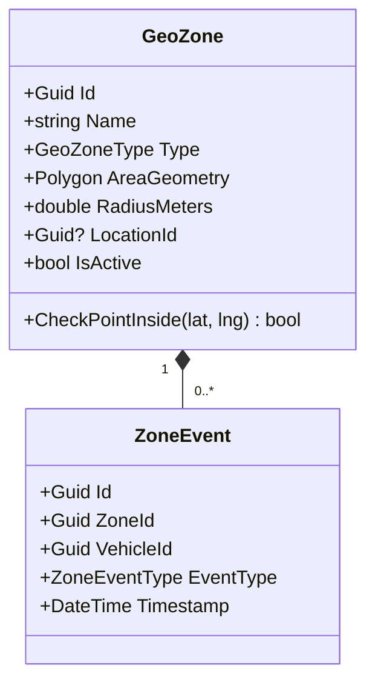

# Geofencing Domain — Per-Domain Document

**Context:** Tracking & Location | **Schema:** `trk` | **Classification:** 🟡 Supporting

---

## 2A. Domain Model

### Aggregate Root: `GeoZone`



### Enums
```csharp
public enum GeoZoneType { Circle, Polygon }
public enum ZoneEventType { Enter, Exit }
```

### Business Rules
| # | กฎ |
|---|---|
| 1 | เมื่อรัศมี GPS ตัดเข้า GeoZone (Enter) ระบบจะต้องตรวจจับและบันทึกเหตุการณ์ทันที |
| 2 | หาก Zone ลิงก์กับ `LocationId` ของลูกค้ารายใด ถือว่าเป็นจุดเข้ามอบส่งสินค้า (Arrived) |

---

## 2B. API Specification

| # | Method | URL | Summary | Auth |
|---|---|---|---|---|
| 1 | `POST` | `/api/tracking/zones` | วาดและสร้างเขตการระบุพิกัด | Admin, Planner |
| 2 | `GET` | `/api/tracking/zones` | รายการเขตบนแผนที่ | Admin, Planner |
| 3 | `PUT` | `/api/tracking/zones/{id}` | แก้ไขขอบเขตพิกัด | Admin, Planner |

---

## 2C. Database Schema

```sql
-- Schema: trk (นำ PostGIS เข้ามาใช้ช่วยประมวลผล เร็วกว่าคำนวณบน C# App)

-- ===== Geo Zones =====
CREATE TABLE trk."GeoZones" (
    "Id"                UUID PRIMARY KEY DEFAULT gen_random_uuid(),
    "Name"              VARCHAR(200) NOT NULL,
    "Type"              VARCHAR(20) NOT NULL,
    "LocationId"        UUID,  -- FK ไปยัง Master Data ถ้ามี
    "LatitudePoint"     DOUBLE PRECISION,
    "LongitudePoint"    DOUBLE PRECISION,
    "RadiusMeters"      DOUBLE PRECISION,
    "PolygonCoordinates" JSONB, -- [ [lng, lat], [lng, lat] ]
    "IsActive"          BOOLEAN NOT NULL DEFAULT true,
    "TenantId"          UUID NOT NULL
);

-- ===== Zone Events =====
CREATE TABLE trk."ZoneEvents" (
    "Id"                UUID PRIMARY KEY DEFAULT gen_random_uuid(),
    "ZoneId"            UUID NOT NULL REFERENCES trk."GeoZones"("Id"),
    "VehicleId"         UUID NOT NULL,
    "EventType"         VARCHAR(10) NOT NULL,
    "Timestamp"         TIMESTAMPTZ NOT NULL,
    "TenantId"          UUID NOT NULL
);

CREATE INDEX "IX_ZoneEvents_VehicleId" ON trk."ZoneEvents" ("VehicleId", "Timestamp" DESC);
```

---

## 2D. Event Specification

### Integration Events Published

**VehicleEnteredZoneIntegrationEvent**
```json
{
  "payload": {
    "vehicleId": "uuid",
    "zoneId": "uuid",
    "locationId": "uuid",
    "timestamp": "2026-03-29T10:15:00Z"
  }
}
```
→ **Subscriber:** Execution (อัปเดตสถานะ Shipment "Arrived" อัตโนมัติเมื่อเข้าคลังลูกค้า หรือ "InTransit" หากออกจาก Zone ขาออก)

---

## 2E. Use Cases

### UC-TRK-03: Auto Check-In Workflow

**Actor:** IoT / System
**Main Flow:**
1. ระบบรับสัญญาณ GPS จำนวนมากใน `VehiclePositions` API
2. Background worker จะนำพิกัดรถล่าสุดมาเทียบ (Math intersection) กับเขต `GeoZones` ทั้งหมด
3. พิกัดตัดเข้ามาในรัศมี Zone → ระบบบันทึก `ZoneEvent` (Enter)
4. ส่ง `VehicleEnteredZoneEvent` ออกไป
5. Execution Context ตรวจสอบว่ารถคันนี้ กำลังมาส่งของที่ `LocationId` นี้พอดี จึงแปลผลว่า `Arrived` อัตโนมัติ Driver ไม่ต้องกดปุ่ม
