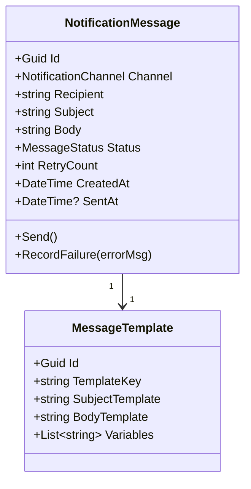

# Notification Domain — Per-Domain Document

**Context:** Platform | **Schema:** `plf` | **Classification:** 🟢 Generic

---

## 2A. Domain Model

### Entities



### Enums
```csharp
public enum NotificationChannel { Email, SMS, PushNotification, LineOA }
public enum MessageStatus { Pending, Sent, Failed }
```

---

## 2B. API Specification

| # | Method | URL | Summary | Auth |
|---|---|---|---|---|
| 1 | `POST` | `/api/platform/notifications/send` | สั่งส่งข้อความแบบตรงไปตรงมา | Internal System |
| 2 | `GET` | `/api/platform/notifications/templates` | จัดการ Template | Admin |
| 3 | `POST` | `/api/platform/notifications/test` | เทสการส่ง | Admin |
| 4 | `GET` | `/api/platform/notifications/history` | ดู Log การส่งแจ้งเตือน | Admin |

### Key DTOs

**POST /api/platform/notifications/send**
```json
// Request (Internal System)
{
  "channel": "SMS",
  "recipient": "0812345678",
  "templateKey": "SHIPMENT_ETA_NOTIFY",
  "variables": {
    "orderNumber": "ORD-1234",
    "etaTime": "14:30"
  }
}
```

---

## 2C. Database Schema

```sql
CREATE TABLE plf."MessageTemplates" (
    "Id"                UUID PRIMARY KEY DEFAULT gen_random_uuid(),
    "TemplateKey"       VARCHAR(50) NOT NULL,
    "SubjectTemplate"   VARCHAR(200),
    "BodyTemplate"      TEXT NOT NULL,
    "TenantId"          UUID NOT NULL,
    CONSTRAINT "UQ_TemplateKey_Tenant" UNIQUE ("TemplateKey", "TenantId")
);

CREATE TABLE plf."NotificationMessages" (
    "Id"                UUID PRIMARY KEY DEFAULT gen_random_uuid(),
    "Channel"           VARCHAR(20) NOT NULL,
    "Recipient"         VARCHAR(200) NOT NULL,
    "Subject"           VARCHAR(200),
    "Body"              TEXT NOT NULL,
    "Status"            VARCHAR(20) NOT NULL DEFAULT 'Pending',
    "RetryCount"        INT NOT NULL DEFAULT 0,
    "ErrorMessage"      TEXT,
    "CreatedAt"         TIMESTAMPTZ NOT NULL DEFAULT now(),
    "SentAt"            TIMESTAMPTZ,
    "TenantId"          UUID NOT NULL
);

CREATE INDEX "IX_Notifications_Status" ON plf."NotificationMessages" ("Status");
```

---

## 2D. Event Specification

### Inbound Events (Listening to the Ecosystem)

Notification Module เป็น Consumer หลักของระบบ ทำตัวเป็นหูตาเพื่อส่ง Message เมื่อเกิด Event ต่างๆ:

| รับ Event อะไร | ส่งผล |
|---|---|
| `TripDispatchedIntegrationEvent` (จาก Dispatch) | Push แจ้งเตือนไปมือถือคนขับว่า "คุณมีงานใหม่เข้ามา" |
| `VehicleETAUpdatedIntegrationEvent` (จาก Tracking) | ส่ง SMS หรืออีเมลหาลูกค้า "พัสดุจะถึงท่านเวลา xx:xx น." |
| `ShipmentExceptionIntegrationEvent` (จาก Shipment) | ส่ง Email ฉุกเฉินแจ้ง Planner ออฟฟิศ |
| `ShipmentDeliveredIntegrationEvent` (จาก Shipment) | ส่ง E-Receipt กลับอีเมลลูกค้า |

---

## 2E. Use Cases

### UC-PLF-05: Template Based Notification dispatch

**Actor:** Background Worker (RabbitMQ Listener)
**Main Flow:**
1. Event หรืองานส่งข้อความถูกเรียกขึ้นมา
2. ระบบหยิบข้อมูล Request ค้นหา `TemplateKey` ໃນฐานข้อมูลและทำ String substitution.
   - Text Template: `ออเดอร์ {{orderNumber}} จะมาส่งถึงท่านเวลา {{etaTime}}น.`
   - Variable: `{"orderNumber": "ORD-123", "etaTime": "14:00"}`
3. Body ที่สมบูรณ์ถูกแพ็กและนำส่งออกผ่าน 3rd Party Api เช่น SendGrid (อีเมล์) หรือ Twilio / ThaiBulkSMS (SMS).
4. หากล้มเหลว ระบบเก็บบันทึก (RecordFailure) และนำกลับมาส่งซ้ำ (Retry Policy) 3 รอบ หากไม่ผ่านบันทึกเป็น Failed
