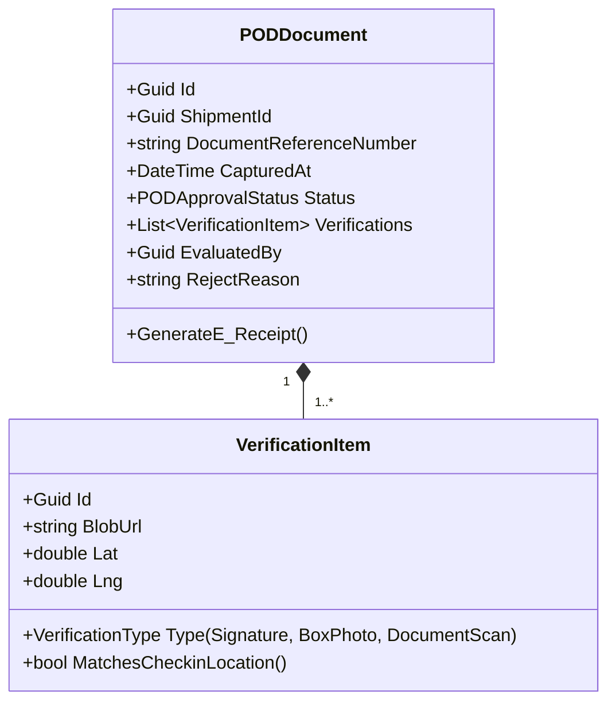

# Proof of Delivery (POD) Domain — Per-Domain Document

**Context:** Execution | **Schema:** `exe` | **Classification:** 🟡 Supporting

---

## 2A. Domain Model

*(ขยายความลึกลงไปจากที่สร้างไว้ใน Shipment Management ของ Phase 1)*

### Entities



### Business Rules

| # | กฎ | Exception |
|---|---|---|
| 1 | POD หนึ่งใบจะต้องมีลายเซ็นผู้รับ หรือ รูปถ่ายกล่องสินค้า อย่างน้อย 1 อย่าง | `IncompletePODException` |
| 2 | หากระยะของ Lat/Lng ตอนเซ็นรับไกลเกิน 500 เมตรจากพิกัดอ้างอิง สถานะ POD จะต้องรอ Dispatcher อนุมัติแบบมือคุม (Pending Approval) | `PODRequiresManualApprovalException` |

---

## 2B. API Specification

| # | Method | URL | Summary | Auth |
|---|---|---|---|---|
| 1 | `POST` | `/api/execution/pod/{shipmentId}/attachments` | Upload รูปและลายเซ็น (Base64/Multipart) | Driver |
| 2 | `PUT` | `/api/execution/pod/{shipmentId}/submit` | สรุปการส่ง POD เข้าตีสถานะ Delivery | Driver |
| 3 | `POST` | `/api/execution/pod/{shipmentId}/generate-pdf` | สร้างเอกสารใบรับของอิเล็กทรอนิกส์ PDF | Admin, Customer |
| 4 | `GET` | `/api/execution/pod/{shipmentId}/evaluate` | ให้หลังบ้านรีวิวอนุมัติ POD | Dispatcher |

---

## 2C. Database Schema

*(เพิ่มตารางต่อยอดจาก `exe.PODRecords` ที่ออกแบบไว้ใน Phase 1)*

```sql
CREATE TABLE exe."PODDocuments" (
    "Id"                UUID PRIMARY KEY DEFAULT gen_random_uuid(),
    "ShipmentId"        UUID NOT NULL REFERENCES exe."Shipments"("Id"),
    "DocumentReference" VARCHAR(50) NOT NULL,
    "CapturedAt"        TIMESTAMPTZ NOT NULL,
    "Status"            VARCHAR(20) NOT NULL DEFAULT 'Pending',
    "GeotagDistanceDifferenceMeters" DECIMAL(10,2),
    "EvaluatedBy"       UUID,
    "EvaluatedAt"       TIMESTAMPTZ,
    "TenantId"          UUID NOT NULL
);

CREATE TABLE exe."VerificationItems" (
    "Id"                UUID PRIMARY KEY DEFAULT gen_random_uuid(),
    "PODDocumentId"     UUID NOT NULL REFERENCES exe."PODDocuments"("Id"),
    "Type"              VARCHAR(20) NOT NULL,
    "BlobUrl"           VARCHAR(1000) NOT NULL,
    "Latitude"          DOUBLE PRECISION,
    "Longitude"         DOUBLE PRECISION
);
```

---

## 2E. Use Cases

### UC-EXE-05: Capture and Validate POD

**Actor:** Driver / System
**Main Flow:**
1. Driver มอบของเสร็จ ให้ลูกค้ารับสินค้าและเซ็นชื่อบนจอโทรศัพท์มือถือ (App)
2. ถ่ายรูปสินค้าที่ตั้งเอาไว้ 2 รูป
3. แอปจะฝังค่าพิกัดพ่วงไปกับรูปและส่งมายัง API
4. System คำนวณความห่างของตำแหน่งถ่ายรูป เทียบกับพิกัดร้านค้าลูกค้า
5. ระยะห่าง 20 เมตร (ตามเกณฑ์) ระบบจะอนุมัติให้อัตโนมัติ (Auto Approve)
6. สถานะ Shipment โดนตีเป็น `Delivered` แจ้งบิลลิ่งได้เลย
7. ระบบสร้างไฟล์ E-Receipt แบบ PDF พร้อมลายเซ็นและรูปถ่าย แปะไปให้ลูกค้าผ่านฟังก์ชัน Notification สรุปงานอัตโนมัติ
