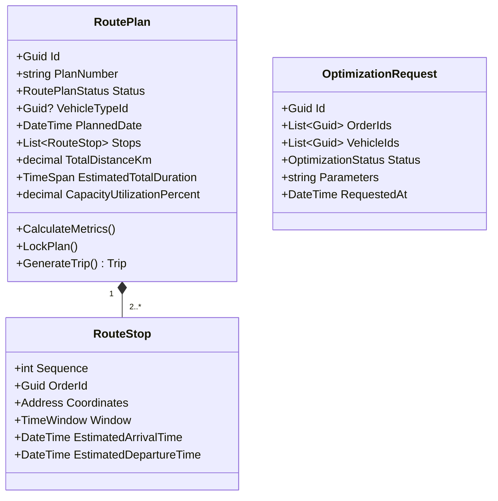

# Route Planning Domain — Per-Domain Document

**Context:** Planning & Dispatch | **Schema:** `pln` | **Classification:** 🔴 Core

---

## 2A. Domain Model

### Aggregate Root: `RoutePlan`



### Enums

```csharp
public enum RoutePlanStatus
{
    Draft,        // รอ Planner ปรับแต่ง
    Locked,       // ยืนยันแล้ว พร้อมสร้างเป็น Trip
    Discarded     // ยกเลิกแผนนี้
}
public enum OptimizationStatus { Pending, Processing, Completed, Failed }
```

### Business Rules

| # | กฎ | Exception |
|---|---|---|
| 1 | การ Optimize น้ำหนักรวม/ปริมาตรต้อง ≤ Capacity | `CapacityExceededException` |
| 2 | TimeWindow กำหนดเวลา Pickup/Dropoff ต้องไม่ violate ETA | `TimeWindowViolationException` |
| 3 | Plan ที่ Locked แล้วจะถูกนำไปสร้าง Trip ใน Dispatch Domain อัตโนมัติ | `PlanAlreadyLockedException` |

---

## 2B. API Specification

| # | Method | URL | Summary | Auth |
|---|---|---|---|---|
| 1 | `POST` | `/api/planning/optimize` | ส่งคำขอจัดคิว/เรียงลำดับเส้นทางอัตโนมัติ | Planner, Admin |
| 2 | `GET` | `/api/planning/optimize/{id}` | ดูสถานะการ Optimize | Planner, Admin |
| 3 | `GET` | `/api/planning/plans` | รายการ Route Plan ที่ระบบสร้างมาให้ | Planner |
| 4 | `GET` | `/api/planning/plans/{id}` | ดูรายละเอียดเส้นทางบนแผนที่ | Planner |
| 5 | `PUT` | `/api/planning/plans/{id}/stops` | สลับลำดับคิว (Manual adjustment) | Planner |
| 6 | `PUT` | `/api/planning/plans/{id}/lock` | ยืนยัน Plan (สร้าง Trip) | Planner |

### Key DTOs

**POST /api/planning/optimize**
```json
// Request
{
  "orderIds": ["uuid1", "uuid2", "uuid3", "uuid4"],
  "availableVehicleCapacity": [
    { "typeId": "uuid-6wheel", "count": 2, "maxPayloadKg": 5000 }
  ],
  "preferences": {
    "minimizeDistance": true,
    "respectTimeWindows": true
  }
}

// Response: 202 Accepted
{ "optimizationRequestId": "uuid", "status": "Pending" }
```

---

## 2C. Database Schema

```sql
-- Schema: pln (Shared with Dispatch Management)

-- ===== Route Plans =====
CREATE TABLE pln."RoutePlans" (
    "Id"                UUID PRIMARY KEY DEFAULT gen_random_uuid(),
    "PlanNumber"        VARCHAR(50) NOT NULL,
    "Status"            VARCHAR(20) NOT NULL DEFAULT 'Draft',
    "VehicleTypeId"     UUID,
    "PlannedDate"       DATE NOT NULL,
    "TotalDistanceKm"   DECIMAL(10,2),
    "EstimatedTotalDurationMin" INT,
    "CapacityUtilizationPercent" DECIMAL(5,2),
    "CreatedAt"         TIMESTAMPTZ NOT NULL DEFAULT now(),
    "TenantId"          UUID NOT NULL
);

-- ===== Route Stops =====
CREATE TABLE pln."RouteStops" (
    "Id"                UUID PRIMARY KEY DEFAULT gen_random_uuid(),
    "RoutePlanId"       UUID NOT NULL REFERENCES pln."RoutePlans"("Id"),
    "Sequence"          INT NOT NULL,
    "OrderId"           UUID,
    "Latitude"          DOUBLE PRECISION NOT NULL,
    "Longitude"         DOUBLE PRECISION NOT NULL,
    "EstimatedArrivalTime" TIMESTAMPTZ,
    "EstimatedDepartureTime" TIMESTAMPTZ
);
CREATE INDEX "IX_RouteStops_PlanId" ON pln."RouteStops" ("RoutePlanId");

-- ===== Optimization Requests =====
CREATE TABLE pln."OptimizationRequests" (
    "Id"                UUID PRIMARY KEY DEFAULT gen_random_uuid(),
    "Status"            VARCHAR(20) NOT NULL DEFAULT 'Pending',
    "Parameters"        JSONB,
    "ResultData"        JSONB,
    "RequestedAt"       TIMESTAMPTZ NOT NULL DEFAULT now(),
    "CompletedAt"       TIMESTAMPTZ,
    "TenantId"          UUID NOT NULL
);
```

---

## 2D. Event Specification

### Integration Events Published

**RoutePlanLockedIntegrationEvent**
```json
{
  "payload": {
    "routePlanId": "uuid",
    "vehicleTypeId": "uuid",
    "plannedDate": "2026-03-30",
    "stops": [
      { "sequence": 1, "orderId": "uuid-1", "eta": "2026-03-30T09:00:00Z" }
    ]
  }
}
```
→ **Subscriber:** Dispatch (นำไปแปลงเป็น Trip และ Stop อัตโนมัติ)

---

## 2E. Use Cases

### UC-PLN-05: Auto-Optimize Route

**Actor:** Planner
**Main Flow:**
1. Planner เลือก Order 50 รายการ และกำหนดจำนวนรถที่มี 5 คัน → กดยืนยันให้ระบบประมวลผล
2. ระบบเรียก Background Job (อัลกอริทึม VRP/TSP) เพื่อแก้ปัญหา
3. ระบบสร้าง `RoutePlan` 5 แผน (สำหรับรถ 5 คัน) และจัดลำดับที่เหมาะสมประหยัดน้ำมันที่สุด
4. Planner ตรวจสอบและแก้ไข `Sequence` บนแผนที่ (สลับจุด)
5. เมื่อพอใจ Planner กด Lock → ระบบ publish Event ส่งไป Dispatch สร้าง Trip
