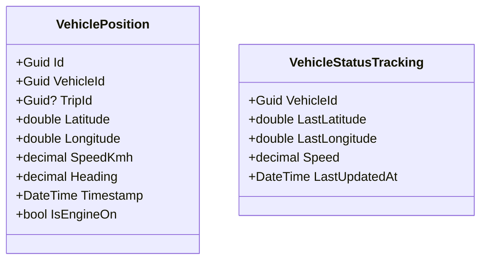

# Tracking & Location Domain — Per-Domain Document

**Context:** Tracking & Location | **Schema:** `trk` | **Classification:** 🟡 Supporting

---

## 2A. Domain Model

### Aggregate Root: `VehiclePosition`



### Business Rules

| # | กฎ | Exception |
|---|---|---|
| 1 | ข้อมูล GPS จะถูกทยอยส่งมาจำนวนมหาศาล (ทิ้งข้อมูลที่ Timestamp เก่ากว่าบัฟเฟอร์ ถ้า delay เกิน) | - |
| 2 | ข้อมูลที่ TripId = null หมายถึงวิ่งรถเปล่า (Off-duty) ลบได้เมื่อเกินกำหนดเวลา (Data Retention) | - |

---

## 2B. API Specification

| # | Method | URL | Summary | Auth |
|---|---|---|---|---|
| 1 | `POST` | `/api/tracking/positions` | ส่งพิกัด (Batch) จากมือถือหรือกล่อง GPS | Driver App, IoT |
| 2 | `GET` | `/api/tracking/vehicles` | ตำแหน่งล่าสุดของรถทั้งหมด (Live Map) | Admin, Planner, Dispatcher |
| 3 | `GET` | `/api/tracking/vehicles/{id}/history` | ย้อนหลัง (Route Playback) | Admin, Dispatcher |
| 4 | `GET` | `/api/tracking/orders/{orderId}/eta` | คำนวณ ETA สินค้า | Customer |

### Key DTOs

**POST /api/tracking/positions**
```json
{
  "vehicleId": "uuid",
  "tripId": "uuid",
  "positions": [
    { "lat": 13.72, "lng": 100.54, "speed": 60, "timestamp": "2026-03-29T10:00:00Z" }
  ]
}
```

**GET /api/tracking/vehicles**
```json
{
  "items": [
    {
      "vehicleId": "uuid",
      "plateNumber": "1กก-1234",
      "lat": 13.72,
      "lng": 100.54,
      "speed": 60,
      "lastUpdated": "2026-03-29T10:00:05Z"
    }
  ]
}
```

---

## 2C. Database Schema

```sql
CREATE SCHEMA IF NOT EXISTS trk;

-- ===== Tracking Positions (Time-Series Table) =====
CREATE TABLE trk."VehiclePositions" (
    "Id"                UUID PRIMARY KEY DEFAULT gen_random_uuid(),
    "VehicleId"         UUID NOT NULL,
    "TripId"            UUID,
    "Latitude"          DOUBLE PRECISION NOT NULL,
    "Longitude"         DOUBLE PRECISION NOT NULL,
    "SpeedKmh"          DECIMAL(5,2),
    "Heading"           DECIMAL(5,2),
    "IsEngineOn"        BOOLEAN,
    "Timestamp"         TIMESTAMPTZ NOT NULL
);

CREATE INDEX "IX_Positions_VehicleId_Timestamp" ON trk."VehiclePositions" ("VehicleId", "Timestamp" DESC);
CREATE INDEX "IX_Positions_TripId" ON trk."VehiclePositions" ("TripId");

-- ===== Latest Current Positions Cache =====
CREATE TABLE trk."CurrentVehicleStates" (
    "VehicleId"         UUID PRIMARY KEY,
    "Latitude"          DOUBLE PRECISION NOT NULL,
    "Longitude"         DOUBLE PRECISION NOT NULL,
    "SpeedKmh"          DECIMAL(5,2),
    "LastUpdatedAt"     TIMESTAMPTZ NOT NULL,
    "TenantId"          UUID NOT NULL
);
```

> [!TIP]
> **Data Retention:** ข้อมูลพิกัดใน `VehiclePositions` ให้เคลียร์ทิ้งทุก 90 วันเพื่อกัน DB เต็ม

---

## 2D. Event Specification

### Integration Events Published

**VehicleETAUpdatedIntegrationEvent**
```json
{
  "payload": {
    "tripId": "uuid",
    "stopSequence": 2,
    "orderId": "uuid",
    "estimatedArrivalTime": "2026-03-29T14:30:00Z"
  }
}
```
→ **Subscriber:** Execution (อัปเดต ETA ของ Shipment), Platform (แจ้งเตือนลูกค้า)

---

## 2E. Use Cases

### UC-TRK-01: Ingest GPS Stream

**Actor:** Driver App
**Main Flow:**
1. แอปมือถือคนขับเก็บค่า GPS ทุกๆ 10 วินาที และ Batch ส่งเข้า API ชุดละ 1 นาที (6 จุด)
2. ระบบบันทึกลง Timeseries DB และอัปเดตค่าล่าสุดในตาราง Cache `CurrentVehicleStates`
3. SignalR Hub ตรวจพบพิกัดใหม่ → Push ข้อมูลเข้าหน้าจอ Dispatch Board แบบ Real-time

### UC-TRK-02: Predict ETA

**Actor:** System / Customer
**Main Flow:**
1. ระบบรับพิกัดล่าสุด
2. เรียก 3rd Party Maps API (เช่น Google Maps / OSRM) เพื่อคำนวณระยะเวลาจากจุดล่าสุดไปยัง Stop ถัดไป
3. ระบบ Publish `VehicleETAUpdatedEvent` ถ้า ETA คลาดเคลื่อนจากเดิม > 15 นาที
