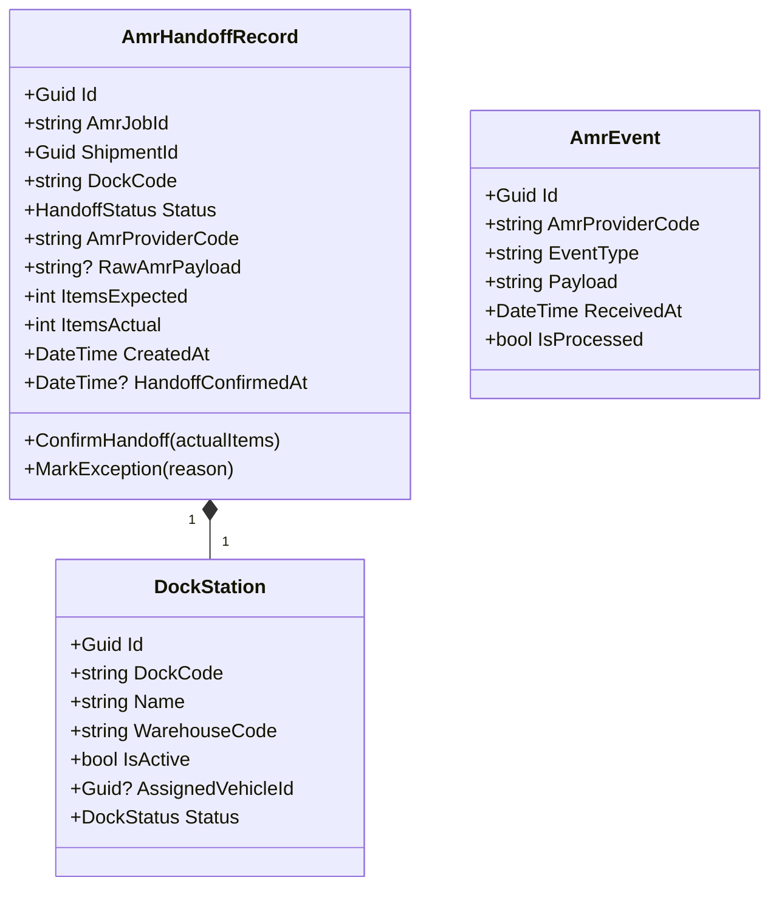
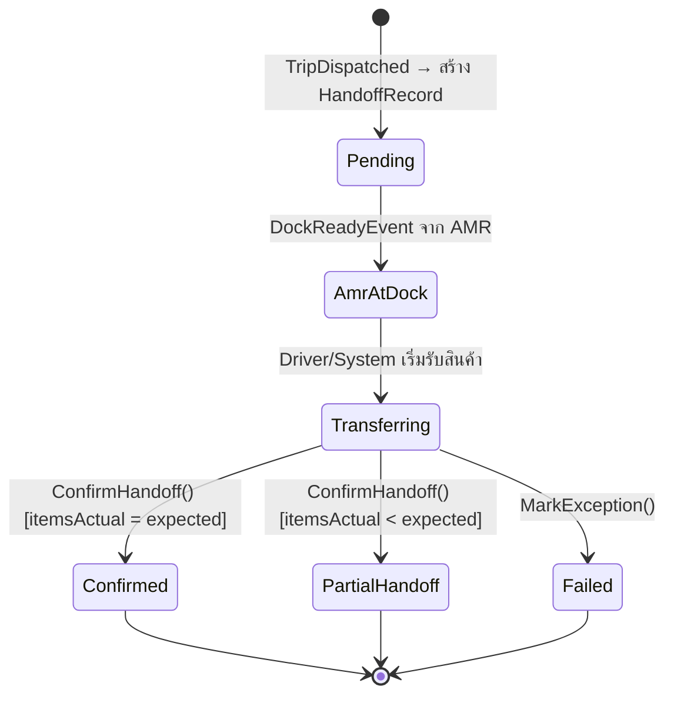

# AMR Integration Domain — Per-Domain Document

**Context:** Integration | **Schema:** `itg` | **Classification:** 🟢 Generic
**Phase:** 4 — Integration

---

## 2A. Domain Model

### Aggregate Root: `AmrHandoffRecord`



### Enums

```csharp
public enum HandoffStatus
{
    Pending,           // รอ AMR นำสินค้ามา
    AmrAtDock,         // AMR ถึง Dock แล้ว
    Transferring,      // กำลังโอนสินค้า
    Confirmed,         // ยืนยันรับสินค้าครบแล้ว
    PartialHandoff,    // รับบางส่วน
    Failed             // ล้มเหลว
}

public enum DockStatus
{
    Available,
    Occupied,
    Reserved
}
```

### Business Rules / Invariants

| # | กฎ | Exception |
|---|---|---|
| 1 | AmrJobId ต้องไม่ซ้ำต่อ AmrProviderCode | `DuplicateAmrJobException` |
| 2 | ItemsActual ≤ ItemsExpected (ถ้าเกินต้องมีการ Override โดย Admin) | `ItemCountExceededException` |
| 3 | ConfirmHandoff ได้เฉพาะเมื่อ Status = Transferring | `InvalidHandoffStateException` |
| 4 | Dock ที่ Occupied ต้องไม่รับ AMR รายใหม่จนกว่า Dock จะ Available | `DockOccupiedException` |

### State Diagram



---

## 2B. API Specification

### Endpoints

| # | Method | URL | Summary | Auth Roles |
|---|---|---|---|---|
| 1 | `POST` | `/api/integrations/amr/events` | รับ Event จาก AMR System | API Key (AMR System) |
| 2 | `GET` | `/api/integrations/amr/handoffs` | รายการ Handoff Records | Admin, Dispatcher |
| 3 | `GET` | `/api/integrations/amr/handoffs/{id}` | ดู Handoff Detail | Admin, Dispatcher, Driver |
| 4 | `PUT` | `/api/integrations/amr/handoffs/{id}/confirm` | Driver ยืนยันรับสินค้า | Driver, Dispatcher |
| 5 | `GET` | `/api/integrations/amr/docks` | รายการ Dock Stations + สถานะ | Admin, Dispatcher |
| 6 | `PUT` | `/api/integrations/amr/docks/{dockCode}/assign` | Assign รถเข้า Dock | Dispatcher |

### Request / Response DTOs

**POST /api/integrations/amr/events**
```json
// Headers
// X-AMR-API-Key: <api_key>
// X-AMR-Provider: "GEEK_PLUS"

// Request Body (AMR Event Payload — ผ่าน ACL)
{
  "event_type": "DOCK_READY",
  "job_id": "AMR-JOB-78910",
  "dock_id": "DOCK-A03",
  "items": [
    { "barcode": "ITM-001", "qty": 50 },
    { "barcode": "ITM-002", "qty": 100 }
  ],
  "timestamp": "2026-04-10T09:15:00Z"
}

// Response: 202 Accepted
{
  "received": true,
  "handoffId": "uuid"
}
```

**PUT /api/integrations/amr/handoffs/{id}/confirm**
```json
// Request
{
  "itemsActual": 148,
  "driverNote": "ขาดของ 2 ชิ้น รอแจ้ง Planner"
}

// Response: 200 OK
{
  "handoffId": "uuid",
  "status": "PartialHandoff",
  "itemsExpected": 150,
  "itemsActual": 148,
  "handoffConfirmedAt": "2026-04-10T09:30:00Z"
}
```

**GET /api/integrations/amr/docks**
```json
// Response: 200 OK
{
  "docks": [
    {
      "dockCode": "DOCK-A01",
      "name": "Dock A ช่อง 1",
      "warehouseCode": "WH-BKK",
      "status": "Available",
      "assignedVehiclePlate": null
    },
    {
      "dockCode": "DOCK-A03",
      "name": "Dock A ช่อง 3",
      "warehouseCode": "WH-BKK",
      "status": "Occupied",
      "assignedVehiclePlate": "1กข-1234"
    }
  ]
}
```

### Error Responses

| Status | เมื่อ | Body |
|---|---|---|
| 401 | API Key ไม่ถูกต้อง | `{ "title": "Unauthorized" }` |
| 404 | Handoff Record / Dock ไม่พบ | `{ "title": "Not Found" }` |
| 409 | AMR Job ID ซ้ำ | `{ "title": "Duplicate AMR Job" }` |
| 422 | ยืนยันไม่ได้เพราะสถานะไม่ถูกต้อง | `{ "title": "Invalid Handoff State" }` |

---

## 2C. Database Schema

```sql
-- Schema: itg (ร่วมกับ OMS Integration)

-- ===== AMR Handoff Records =====
CREATE TABLE itg."AmrHandoffRecords" (
    "Id"                    UUID PRIMARY KEY DEFAULT gen_random_uuid(),
    "AmrJobId"              VARCHAR(200) NOT NULL,
    "AmrProviderCode"       VARCHAR(50) NOT NULL,
    "ShipmentId"            UUID NOT NULL,
    "DockCode"              VARCHAR(50) NOT NULL,
    "Status"                VARCHAR(30) NOT NULL DEFAULT 'Pending',
    "RawAmrPayload"         TEXT,
    "ItemsExpected"         INT NOT NULL DEFAULT 0,
    "ItemsActual"           INT,
    "DriverNote"            VARCHAR(500),
    "CreatedAt"             TIMESTAMPTZ NOT NULL DEFAULT now(),
    "HandoffConfirmedAt"    TIMESTAMPTZ,
    "TenantId"              UUID NOT NULL,

    CONSTRAINT "UQ_AmrHandoff_JobId_Provider" UNIQUE ("AmrJobId", "AmrProviderCode")
);

CREATE INDEX "IX_AmrHandoff_ShipmentId" ON itg."AmrHandoffRecords" ("ShipmentId");
CREATE INDEX "IX_AmrHandoff_Status" ON itg."AmrHandoffRecords" ("Status");
CREATE INDEX "IX_AmrHandoff_DockCode" ON itg."AmrHandoffRecords" ("DockCode");
CREATE INDEX "IX_AmrHandoff_TenantId" ON itg."AmrHandoffRecords" ("TenantId");

-- ===== Dock Stations (Config) =====
CREATE TABLE itg."DockStations" (
    "Id"                UUID PRIMARY KEY DEFAULT gen_random_uuid(),
    "DockCode"          VARCHAR(50) NOT NULL UNIQUE,
    "Name"              VARCHAR(200) NOT NULL,
    "WarehouseCode"     VARCHAR(50) NOT NULL,
    "IsActive"          BOOLEAN NOT NULL DEFAULT true,
    "Status"            VARCHAR(20) NOT NULL DEFAULT 'Available',
    "AssignedVehicleId" UUID,
    "TenantId"          UUID NOT NULL
);

CREATE INDEX "IX_DockStations_WarehouseCode" ON itg."DockStations" ("WarehouseCode");

-- ===== AMR Raw Events Log =====
CREATE TABLE itg."AmrEventLogs" (
    "Id"                UUID PRIMARY KEY DEFAULT gen_random_uuid(),
    "AmrProviderCode"   VARCHAR(50) NOT NULL,
    "EventType"         VARCHAR(100) NOT NULL,
    "Payload"           TEXT NOT NULL,
    "IsProcessed"       BOOLEAN NOT NULL DEFAULT false,
    "ProcessedAt"       TIMESTAMPTZ,
    "LinkedHandoffId"   UUID REFERENCES itg."AmrHandoffRecords"("Id"),
    "ReceivedAt"        TIMESTAMPTZ NOT NULL DEFAULT now()
);

CREATE INDEX "IX_AmrEventLogs_IsProcessed" ON itg."AmrEventLogs" ("IsProcessed");
```

> [!TIP]
> `AmrEventLogs` ควร Purge ทุก 30 วัน เก็บไว้สำหรับ Debug เท่านั้น

---

## 2D. Event Specification

### Integration Events Consumed (รับจาก AMR)

**DockReadyIntegrationEvent** *(แปลงจาก AMR Event ผ่าน ACL)*
```json
{
  "eventId": "uuid",
  "eventType": "DockReadyIntegrationEvent",
  "timestamp": "2026-04-10T09:15:00Z",
  "payload": {
    "amrJobId": "AMR-JOB-78910",
    "amrProviderCode": "GEEK_PLUS",
    "dockCode": "DOCK-A03",
    "shipmentId": "uuid",
    "itemsReady": 150
  }
}
```
→ **Subscriber:** Execution (Shipment) — เปลี่ยนสถานะ Shipment รอรับของ

---

### Integration Events Published (ส่งออกไป AMR / ภายใน TMS)

**InventoryHandoffConfirmedIntegrationEvent**
```json
{
  "eventId": "uuid",
  "eventType": "InventoryHandoffConfirmedIntegrationEvent",
  "timestamp": "2026-04-10T09:30:00Z",
  "payload": {
    "handoffId": "uuid",
    "amrJobId": "AMR-JOB-78910",
    "shipmentId": "uuid",
    "dockCode": "DOCK-A03",
    "itemsExpected": 150,
    "itemsActual": 148,
    "status": "PartialHandoff"
  }
}
```
→ **Subscriber:** 
- Execution (Shipment) — บันทึกจำนวนสินค้าจริง
- AMR System (External) — ปล่อย Job / อัปเดตสถานะ

---

## 2E. Use Cases

### UC-AMR-01: Receive Dock Ready Signal from AMR

| | |
|---|---|
| **Actor** | AMR System (External) |
| **Preconditions** | Trip ถูก Dispatch แล้ว, มี ShipmentId ที่ mapping กับ AMR Job |

**Main Flow:**
1. AMR ส่ง HTTP POST Event `DOCK_READY` ไปที่ `/api/integrations/amr/events`
2. System ตรวจสอบ API Key
3. ACL แปลง AMR Event Format → TMS Format
4. บันทึกลง `AmrEventLogs`
5. หา HandoffRecord ที่ตรงกับ ShipmentId → เปลี่ยน Status = `AmrAtDock`
6. Publish `DockReadyIntegrationEvent`
7. Execution Module รับ Event → แจ้ง Driver App ว่าสินค้าพร้อมที่ Dock

**Alternative Flows:**
- **2a.** API Key ไม่ถูกต้อง → Return 401
- **5a.** ไม่พบ ShipmentId → บันทึก Log + แจ้ง Admin

---

### UC-AMR-02: Confirm Inventory Handoff

| | |
|---|---|
| **Actor** | Driver |
| **Preconditions** | HandoffRecord.Status = Transferring |

**Main Flow:**
1. Driver ถึง Dock → ตรวจสอบสินค้ากับ AMR
2. Driver กดยืนยันในแอป พร้อมระบุจำนวนจริง
3. System validate ItemsActual ≤ ItemsExpected
4. Status → `Confirmed` (ถ้าครบ) หรือ `PartialHandoff` (ถ้าขาด)
5. บันทึก HandoffConfirmedAt
6. Publish `InventoryHandoffConfirmedIntegrationEvent`
7. Execution Module รับ Event → เปลี่ยน Shipment Status = `PickedUp`
8. DockStation.Status → `Available`

**Alternative Flows:**
- **3a.** ItemsActual > ItemsExpected → Return 422, ต้องให้ Admin Override
- **4a.** PartialHandoff → Planner รับแจ้ง, สร้าง Remaining Order อัตโนมัติ

---

### UC-AMR-03: Monitor Dock Status (Live View)

| | |
|---|---|
| **Actor** | Dispatcher |
| **Preconditions** | - |

**Main Flow:**
1. Dispatcher เข้าหน้า Dock Overview
2. ระบบดึงสถานะ Dock ทั้งหมดแบบ Real-time
3. แสดงสถานะ: Available (เขียว) / Reserved (เหลือง) / Occupied (แดง)
4. แสดง AMR Jobs ที่กำลัง Process ต่อ Dock
5. Dispatcher สามารถ Assign รถเข้า Dock ล่วงหน้าได้
