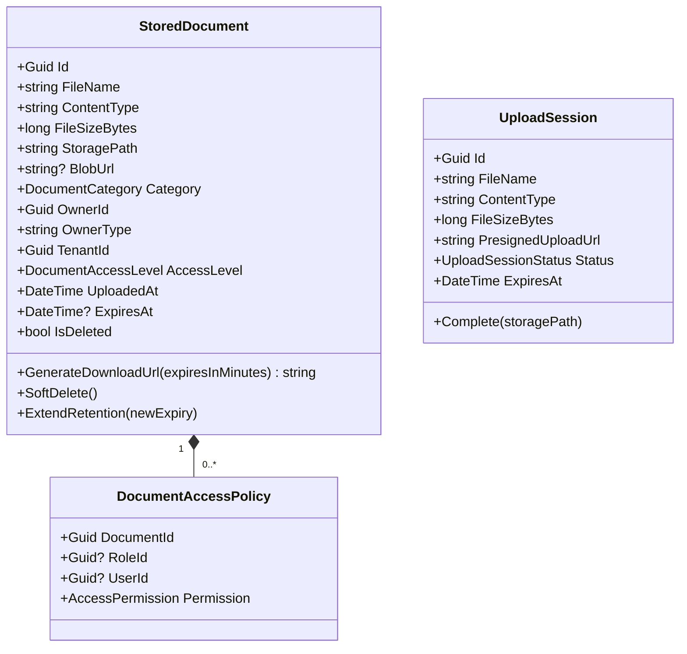

# Document Storage Domain — Per-Domain Document

**Context:** Platform | **Schema:** `doc` | **Classification:** 🟢 Generic
**Phase:** 4 — Integration

---

## 2A. Domain Model

### Aggregate Root: `StoredDocument`



### Enums

```csharp
public enum DocumentCategory
{
    ProofOfDelivery,    // POD — รูป + ลายเซ็น
    TripManifest,       // ใบงาน/Manifest
    VehicleDoc,         // ทะเบียน, ประกัน, พ.ร.บ.
    DriverLicense,      // ใบขับขี่
    Invoice,            // ไฟล์ Invoice PDF
    ImportFile,         // ไฟล์ Import Order (CSV/Excel)
    Other
}

public enum DocumentAccessLevel
{
    Private,            // เจ้าของเท่านั้น
    TenantInternal,     // ทุกคนใน Tenant เข้าถึงได้
    SpecificRoles       // กำหนดเอง per Role/User
}

public enum AccessPermission { Read, ReadWrite }

public enum UploadSessionStatus { Active, Completed, Expired }
```

### Business Rules / Invariants

| # | กฎ | Exception |
|---|---|---|
| 1 | File Size ต้องไม่เกิน 50 MB ต่อไฟล์ | `FileSizeExceededException` |
| 2 | ContentType ต้องอยู่ใน Allowlist (image/jpeg, image/png, application/pdf, text/csv, application/vnd.ms-excel, application/vnd.openxmlformats-officedocument.spreadsheetml.sheet) | `ContentTypeNotAllowedException` |
| 3 | UploadSession มีอายุ 15 นาที หลังจากนั้น Presigned URL หมดอายุ | `UploadSessionExpiredException` |
| 4 | BlobUrl (Download URL) มีอายุจำกัดตาม Category (POD = 7 วัน, Invoice = 5 ปี) | `DocumentExpiredException` |
| 5 | การลบเอกสารเป็น Soft Delete เสมอ — ห้ามลบจริงจากระบบภายใน 90 วัน | `DocumentRetentionPolicyException` |
| 6 | ผู้ใช้เข้าถึงได้เฉพาะเอกสารของ Tenant ตัวเองเท่านั้น | `CrossTenantAccessException` |

### Retention Policy

| Category | Retention Period | Auto-Delete |
|---|---|---|
| ProofOfDelivery | 5 ปี | ✅ |
| Invoice | 7 ปี (ตามกฎหมายบัญชี) | ✅ |
| TripManifest | 2 ปี | ✅ |
| VehicleDoc / DriverLicense | ตลอดอายุ (Manual delete) | ❌ |
| ImportFile | 90 วัน | ✅ |

---

## 2B. API Specification

### Endpoints

| # | Method | URL | Summary | Auth Roles |
|---|---|---|---|---|
| 1 | `POST` | `/api/documents/upload-session` | สร้าง Presigned Upload URL | All authenticated |
| 2 | `POST` | `/api/documents/upload-session/{sessionId}/complete` | ยืนยันว่า Upload เสร็จแล้ว | All authenticated |
| 3 | `GET` | `/api/documents/{id}` | ดูรายละเอียดเอกสาร + Metadata | All authenticated |
| 4 | `GET` | `/api/documents/{id}/download-url` | ขอ Temporary Download URL | All authenticated |
| 5 | `GET` | `/api/documents` | รายการเอกสาร (Filter by Category, Owner) | Admin, Finance, Dispatcher |
| 6 | `DELETE` | `/api/documents/{id}` | Soft Delete เอกสาร | Admin |
| 7 | `GET` | `/api/documents/owners/{ownerType}/{ownerId}` | เอกสารทั้งหมดของ Entity นั้น | All authenticated |

> [!IMPORTANT]
> ใช้ **Presigned URL pattern** — ไฟล์ไม่ผ่าน TMS Server โดยตรง
> Client อัปโหลดตรงไป Object Storage (S3 / Azure Blob) ผ่าน Presigned URL

### Request / Response DTOs

**POST /api/documents/upload-session**
```json
// Request
{
  "fileName": "pod_signature_20260410.jpg",
  "contentType": "image/jpeg",
  "fileSizeBytes": 245760,
  "category": "ProofOfDelivery",
  "ownerId": "uuid",          // เช่น ShipmentId
  "ownerType": "Shipment"
}

// Response: 201 Created
{
  "sessionId": "uuid",
  "presignedUploadUrl": "https://storage.example.com/tms-uploads/uuid?sig=xxx&expires=...",
  "uploadMethod": "PUT",
  "expiresAt": "2026-04-10T09:30:00Z",
  "headers": {
    "Content-Type": "image/jpeg",
    "x-amz-acl": "private"
  }
}
```

**POST /api/documents/upload-session/{sessionId}/complete**
```json
// Request
{
  "eTag": "abc123def456"    // จาก Object Storage response
}

// Response: 201 Created
{
  "documentId": "uuid",
  "fileName": "pod_signature_20260410.jpg",
  "category": "ProofOfDelivery",
  "fileSizeBytes": 245760,
  "uploadedAt": "2026-04-10T09:18:32Z"
}
```

**GET /api/documents/{id}/download-url**
```json
// Response: 200 OK
{
  "documentId": "uuid",
  "fileName": "pod_signature_20260410.jpg",
  "downloadUrl": "https://storage.example.com/tms-docs/uuid.jpg?sig=xxx&expires=...",
  "urlExpiresAt": "2026-04-10T10:18:32Z"   // URL มีอายุ 1 ชั่วโมง
}
```

**GET /api/documents/owners/Shipment/{shipmentId}**
```json
// Response: 200 OK
{
  "ownerId": "uuid",
  "ownerType": "Shipment",
  "documents": [
    {
      "id": "uuid",
      "fileName": "pod_signature_20260410.jpg",
      "category": "ProofOfDelivery",
      "contentType": "image/jpeg",
      "fileSizeBytes": 245760,
      "uploadedAt": "2026-04-10T09:18:32Z"
    },
    {
      "id": "uuid",
      "fileName": "pod_photo_front.jpg",
      "category": "ProofOfDelivery",
      "contentType": "image/jpeg",
      "fileSizeBytes": 512000,
      "uploadedAt": "2026-04-10T09:19:10Z"
    }
  ]
}
```

### Error Responses

| Status | เมื่อ | Body |
|---|---|---|
| 400 | ContentType ไม่อยู่ใน Allowlist | `{ "title": "Content Type Not Allowed" }` |
| 400 | FileSize เกิน 50 MB | `{ "title": "File Size Exceeded", "detail": "Max 50MB per file" }` |
| 404 | Document / Session ไม่พบ | `{ "title": "Not Found" }` |
| 410 | Upload Session หมดอายุ | `{ "title": "Upload Session Expired" }` |
| 403 | ไม่มีสิทธิ์เข้าถึงเอกสาร | `{ "title": "Access Denied" }` |

---

## 2C. Database Schema

```sql
-- Schema: doc (Document Storage)
CREATE SCHEMA IF NOT EXISTS doc;

-- ===== Stored Documents =====
CREATE TABLE doc."StoredDocuments" (
    "Id"                UUID PRIMARY KEY DEFAULT gen_random_uuid(),
    "FileName"          VARCHAR(500) NOT NULL,
    "ContentType"       VARCHAR(100) NOT NULL,
    "FileSizeBytes"     BIGINT NOT NULL,
    "StoragePath"       VARCHAR(1000) NOT NULL,
    "Category"          VARCHAR(50) NOT NULL,
    "OwnerId"           UUID NOT NULL,
    "OwnerType"         VARCHAR(100) NOT NULL,
    "AccessLevel"       VARCHAR(30) NOT NULL DEFAULT 'TenantInternal',
    "IsDeleted"         BOOLEAN NOT NULL DEFAULT false,
    "DeletedAt"         TIMESTAMPTZ,
    "ExpiresAt"         TIMESTAMPTZ,
    "UploadedAt"        TIMESTAMPTZ NOT NULL DEFAULT now(),
    "UploadedBy"        UUID NOT NULL,
    "TenantId"          UUID NOT NULL
);

CREATE INDEX "IX_Docs_OwnerId_OwnerType" ON doc."StoredDocuments" ("OwnerId", "OwnerType");
CREATE INDEX "IX_Docs_Category" ON doc."StoredDocuments" ("Category");
CREATE INDEX "IX_Docs_TenantId" ON doc."StoredDocuments" ("TenantId");
CREATE INDEX "IX_Docs_ExpiresAt" ON doc."StoredDocuments" ("ExpiresAt") WHERE "IsDeleted" = false;

-- ===== Document Access Policies =====
CREATE TABLE doc."DocumentAccessPolicies" (
    "Id"            UUID PRIMARY KEY DEFAULT gen_random_uuid(),
    "DocumentId"    UUID NOT NULL REFERENCES doc."StoredDocuments"("Id"),
    "RoleId"        UUID,
    "UserId"        UUID,
    "Permission"    VARCHAR(20) NOT NULL DEFAULT 'Read',
    CONSTRAINT "CHK_RoleOrUser" CHECK ("RoleId" IS NOT NULL OR "UserId" IS NOT NULL)
);

CREATE INDEX "IX_DocAccess_DocumentId" ON doc."DocumentAccessPolicies" ("DocumentId");

-- ===== Upload Sessions =====
CREATE TABLE doc."UploadSessions" (
    "Id"                    UUID PRIMARY KEY DEFAULT gen_random_uuid(),
    "FileName"              VARCHAR(500) NOT NULL,
    "ContentType"           VARCHAR(100) NOT NULL,
    "FileSizeBytes"         BIGINT NOT NULL,
    "Category"              VARCHAR(50) NOT NULL,
    "OwnerId"               UUID NOT NULL,
    "OwnerType"             VARCHAR(100) NOT NULL,
    "PresignedUploadUrl"    TEXT NOT NULL,
    "Status"                VARCHAR(20) NOT NULL DEFAULT 'Active',
    "LinkedDocumentId"      UUID REFERENCES doc."StoredDocuments"("Id"),
    "ExpiresAt"             TIMESTAMPTZ NOT NULL,
    "CreatedAt"             TIMESTAMPTZ NOT NULL DEFAULT now(),
    "CreatedBy"             UUID NOT NULL,
    "TenantId"              UUID NOT NULL
);

CREATE INDEX "IX_UploadSessions_Status" ON doc."UploadSessions" ("Status");
CREATE INDEX "IX_UploadSessions_ExpiresAt" ON doc."UploadSessions" ("ExpiresAt") WHERE "Status" = 'Active';
```

> [!IMPORTANT]
> `StoragePath` เก็บ S3 Object Key / Blob Path เท่านั้น ไม่เก็บ URL เพราะ URL มีการ Sign ใหม่ทุกครั้ง

---

## 2D. Event Specification

### Integration Events Published

**DocumentUploadedIntegrationEvent**
```json
{
  "eventId": "uuid",
  "eventType": "DocumentUploadedIntegrationEvent",
  "timestamp": "2026-04-10T09:18:32Z",
  "payload": {
    "documentId": "uuid",
    "category": "ProofOfDelivery",
    "ownerId": "uuid",
    "ownerType": "Shipment",
    "fileName": "pod_signature_20260410.jpg",
    "contentType": "image/jpeg"
  }
}
```
→ **Subscriber:**
- POD Domain (ถ้า Category = ProofOfDelivery) → ผูก Document กับ POD Record
- Notification (แจ้ง Back-office ว่ามี POD ใหม่รอตรวจสอบ)

**DocumentExpiredIntegrationEvent** *(จาก Background Job)*
```json
{
  "eventId": "uuid",
  "eventType": "DocumentExpiredIntegrationEvent",
  "timestamp": "2031-04-10T00:00:00Z",
  "payload": {
    "documentId": "uuid",
    "category": "ImportFile",
    "storagePath": "tms/tenantId/imports/uuid.csv"
  }
}
```
→ **Subscriber:** Document Storage Cleaner (ลบจาก Object Storage จริง)

---

## 2E. Use Cases

### UC-DOC-01: Upload POD Evidence (Photo / Signature)

| | |
|---|---|
| **Actor** | Driver (Mobile App) |
| **Preconditions** | Driver กำลัง Execute Shipment Stop |

**Main Flow:**
1. Driver ถ่ายรูป / เก็บลายเซ็นในแอป
2. แอปเรียก `POST /api/documents/upload-session` พร้อมข้อมูลไฟล์
3. TMS สร้าง UploadSession + ขอ Presigned URL จาก Object Storage
4. TMS Return Presigned URL ให้แอป
5. แอป PUT ไฟล์ไปที่ Object Storage โดยตรง (ไม่ผ่าน TMS Server)
6. แอปเรียก `POST /api/documents/upload-session/{id}/complete` พร้อม ETag
7. TMS สร้าง `StoredDocument` record
8. TMS Publish `DocumentUploadedIntegrationEvent`
9. POD Domain รับ Event → ผูก DocumentId เข้ากับ POD Record

**Alternative Flows:**
- **3a.** ContentType ไม่อยู่ใน Allowlist → Return 400
- **3b.** FileSize เกิน 50 MB → Return 400
- **5a.** Upload Timeout → แอป Retry ได้ถ้า Session ยังไม่ Expire
- **6a.** Session หมดอายุ → Return 410, แอปต้องขอ Session ใหม่

---

### UC-DOC-02: Generate POD PDF Document

| | |
|---|---|
| **Actor** | System (After POD Approved) |
| **Preconditions** | POD ได้รับการอนุมัติแล้ว, มีรูปและลายเซ็นครบ |

**Main Flow:**
1. POD Domain publish `PODApprovedIntegrationEvent`
2. Document Service รับ Event
3. ดึงรูป + ลายเซ็นจาก Object Storage (ผ่าน Presigned URL)
4. Render PDF Template พร้อม Shipment Info + รูป + ลายเซ็น + Timestamp + GPS
5. อัปโหลด PDF ไป Object Storage
6. สร้าง `StoredDocument` (Category = ProofOfDelivery, Owner = Shipment)
7. ส่ง Download URL กลับไปยัง POD Domain
8. Publish `PODDocumentGeneratedIntegrationEvent`

---

### UC-DOC-03: Retrieve Document for Customer

| | |
|---|---|
| **Actor** | Customer |
| **Preconditions** | Customer เป็นเจ้าของ Order ที่ผูกกับ Shipment นั้น |

**Main Flow:**
1. Customer เข้าหน้า Order Detail → กดดู POD
2. Frontend เรียก `GET /api/documents/{id}/download-url`
3. System ตรวจสอบว่า Customer มีสิทธิ์ (เจ้าของ Order)
4. System สร้าง Temporary Signed URL (อายุ 1 ชั่วโมง)
5. Return URL ให้ Frontend
6. Frontend เปิด URL → Browser ดาวน์โหลดจาก Object Storage โดยตรง

**Alternative Flows:**
- **3a.** Customer ไม่ใช่เจ้าของ → Return 403
- **3b.** Document หมดอายุ → Return 410

---

### UC-DOC-04: Auto-Delete Expired Documents

| | |
|---|---|
| **Actor** | System (Scheduled Background Job — ทุกคืน 02:00) |
| **Preconditions** | มีเอกสารที่ ExpiresAt ≤ วันนี้ |

**Main Flow:**
1. Background Job ค้นหา `StoredDocuments` ที่ IsDeleted = false และ ExpiresAt ≤ now()
2. สำหรับแต่ละเอกสาร:
   - Soft Delete ใน DB (IsDeleted = true, DeletedAt = now())
   - เพิ่มลงใน Hard Delete Queue (อีก 30 วัน ถึงจะลบจาก Storage จริง)
3. หลัง 30 วัน: ลบไฟล์จาก Object Storage จริง
4. บันทึก Audit Log การลบ

> [!TIP]
> **Grace Period 30 วัน** ก่อนลบจาก Storage จริง
> เผื่อกรณีที่ Expiry ถูกตั้งผิด → Admin ยังสามารถกู้คืนได้ภายใน 30 วัน
