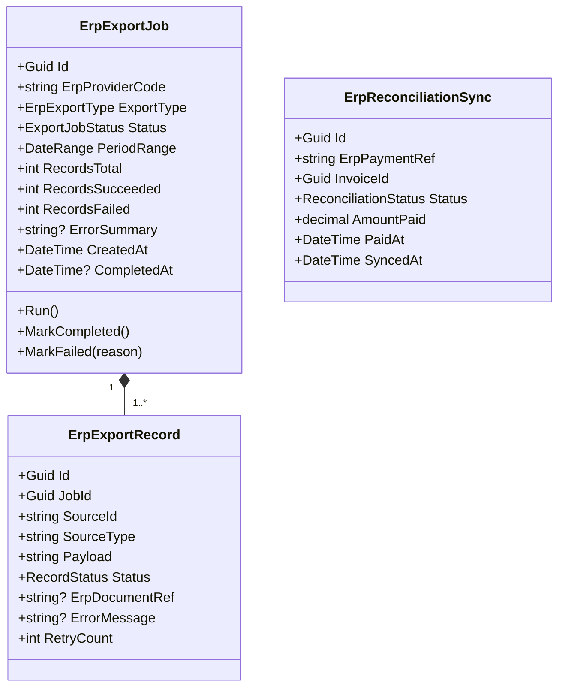
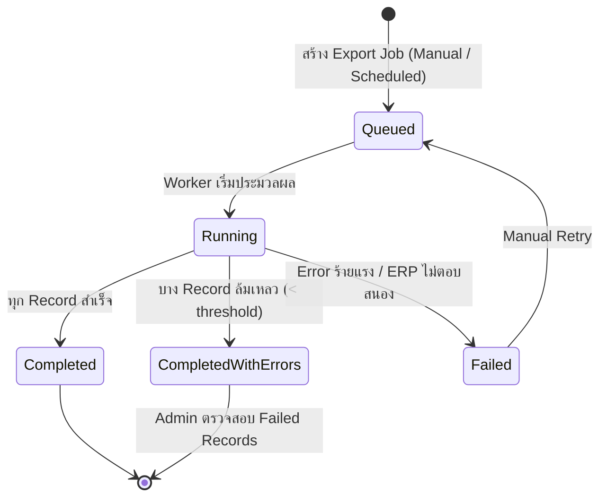

# ERP Integration Domain — Per-Domain Document

**Context:** Integration | **Schema:** `itg` | **Classification:** 🟢 Generic
**Phase:** 4 — Integration

---

## 2A. Domain Model

### Aggregate Root: `ErpExportJob`



### Enums

```csharp
public enum ErpExportType
{
    ArInvoice,    // ส่ง Invoice AR ไป ERP
    ApCost,       // ส่งต้นทุน/AP ไป ERP
    Reconciliation // รับสถานะชำระกลับจาก ERP
}

public enum ExportJobStatus
{
    Queued,
    Running,
    Completed,
    CompletedWithErrors,
    Failed
}

public enum RecordStatus
{
    Pending,
    Sent,
    Accepted,   // ERP รับแล้ว มี ErpDocumentRef
    Rejected,   // ERP ปฏิเสธ
    Failed
}

public enum ReconciliationStatus
{
    Pending,
    Matched,    // ตรงกับ Invoice ใน TMS
    Unmatched   // ไม่พบ Invoice ตรงกัน
}
```

### Business Rules / Invariants

| # | กฎ | Exception |
|---|---|---|
| 1 | Invoice สามารถ Export ได้เฉพาะ Status = Approved เท่านั้น | `InvoiceNotApprovedForExportException` |
| 2 | Invoice เดิมส่งซ้ำต้องส่ง Credit Note แทน ไม่ใช่ส่งใหม่ | `DuplicateInvoiceExportException` |
| 3 | Reconciliation ที่ Amount ไม่ตรงต้องสร้าง Alert ให้ Finance ตรวจสอบ | `AmountMismatchException` |
| 4 | Export Job แต่ละ Type ต้องไม่ทับซ้อน Period เดียวกัน (ป้องกัน Double Export) | `OverlappingExportPeriodException` |

### State Diagram (ErpExportJob)



---

## 2B. API Specification

### Endpoints

| # | Method | URL | Summary | Auth Roles |
|---|---|---|---|---|
| 1 | `POST` | `/api/integrations/erp/export/ar` | สร้าง AR Invoice Export Job | Admin, Finance |
| 2 | `POST` | `/api/integrations/erp/export/ap` | สร้าง AP Cost Export Job | Admin, Finance |
| 3 | `GET` | `/api/integrations/erp/export/jobs` | รายการ Export Jobs | Admin, Finance |
| 4 | `GET` | `/api/integrations/erp/export/jobs/{id}` | ดูรายละเอียด Job + Records | Admin, Finance |
| 5 | `POST` | `/api/integrations/erp/export/jobs/{id}/retry` | Retry Failed Records | Admin |
| 6 | `POST` | `/api/integrations/erp/reconciliation` | รับ Payment Status จาก ERP | API Key (ERP System) |
| 7 | `GET` | `/api/integrations/erp/reconciliation` | รายการ Reconciliation ที่ Unmatched | Admin, Finance |

### Request / Response DTOs

**POST /api/integrations/erp/export/ar**
```json
// Request
{
  "erpProviderCode": "SAP_S4",
  "periodFrom": "2026-03-01",
  "periodTo": "2026-03-31",
  "invoiceIds": null           // null = ส่งทั้งหมดใน Period, หรือระบุ Array of UUID
}

// Response: 202 Accepted
{
  "jobId": "uuid",
  "status": "Queued",
  "estimatedRecords": 247,
  "message": "Export job created. Processing in background."
}
```

**GET /api/integrations/erp/export/jobs/{id}**
```json
// Response: 200 OK
{
  "id": "uuid",
  "erpProviderCode": "SAP_S4",
  "exportType": "ArInvoice",
  "status": "CompletedWithErrors",
  "periodFrom": "2026-03-01",
  "periodTo": "2026-03-31",
  "recordsTotal": 247,
  "recordsSucceeded": 244,
  "recordsFailed": 3,
  "createdAt": "2026-04-01T00:00:00Z",
  "completedAt": "2026-04-01T00:05:32Z",
  "failedRecords": [
    {
      "id": "uuid",
      "sourceId": "uuid",
      "sourceType": "Invoice",
      "errorMessage": "ERP Customer Code not found: CUST-999",
      "retryCount": 1
    }
  ]
}
```

**POST /api/integrations/erp/reconciliation**
```json
// Headers: X-ERP-API-Key

// Request Body (ERP ส่งสถานะ Payment กลับมา)
{
  "payments": [
    {
      "erp_payment_ref": "PAY-2026-04-001",
      "tms_invoice_number": "INV-20260310-0045",
      "paid_amount": 125000.00,
      "currency": "THB",
      "paid_date": "2026-04-05"
    }
  ]
}

// Response: 200 OK
{
  "processed": 1,
  "matched": 1,
  "unmatched": 0
}
```

### Error Responses

| Status | เมื่อ | Body |
|---|---|---|
| 400 | Period ทับซ้อน | `{ "title": "Overlapping Export Period" }` |
| 404 | Job ไม่พบ | `{ "title": "Not Found" }` |
| 422 | Invoice ยังไม่ Approved | `{ "title": "Invoice Not Ready For Export" }` |

---

## 2C. Database Schema

```sql
-- Schema: itg (ร่วมกับ Integration Context)

-- ===== ERP Export Jobs =====
CREATE TABLE itg."ErpExportJobs" (
    "Id"                UUID PRIMARY KEY DEFAULT gen_random_uuid(),
    "ErpProviderCode"   VARCHAR(50) NOT NULL,
    "ExportType"        VARCHAR(30) NOT NULL,
    "Status"            VARCHAR(30) NOT NULL DEFAULT 'Queued',
    "PeriodFrom"        DATE NOT NULL,
    "PeriodTo"          DATE NOT NULL,
    "RecordsTotal"      INT NOT NULL DEFAULT 0,
    "RecordsSucceeded"  INT NOT NULL DEFAULT 0,
    "RecordsFailed"     INT NOT NULL DEFAULT 0,
    "ErrorSummary"      TEXT,
    "CreatedAt"         TIMESTAMPTZ NOT NULL DEFAULT now(),
    "CreatedBy"         UUID,
    "CompletedAt"       TIMESTAMPTZ,
    "TenantId"          UUID NOT NULL
);

CREATE INDEX "IX_ErpExportJobs_ExportType" ON itg."ErpExportJobs" ("ExportType");
CREATE INDEX "IX_ErpExportJobs_Status" ON itg."ErpExportJobs" ("Status");
CREATE INDEX "IX_ErpExportJobs_Period" ON itg."ErpExportJobs" ("PeriodFrom", "PeriodTo");

-- ===== ERP Export Records =====
CREATE TABLE itg."ErpExportRecords" (
    "Id"                UUID PRIMARY KEY DEFAULT gen_random_uuid(),
    "JobId"             UUID NOT NULL REFERENCES itg."ErpExportJobs"("Id"),
    "SourceId"          UUID NOT NULL,
    "SourceType"        VARCHAR(50) NOT NULL,
    "Payload"           TEXT NOT NULL,
    "Status"            VARCHAR(20) NOT NULL DEFAULT 'Pending',
    "ErpDocumentRef"    VARCHAR(200),
    "ErrorMessage"      TEXT,
    "RetryCount"        INT NOT NULL DEFAULT 0,
    "SentAt"            TIMESTAMPTZ,
    "AcceptedAt"        TIMESTAMPTZ
);

CREATE INDEX "IX_ErpExportRecords_JobId" ON itg."ErpExportRecords" ("JobId");
CREATE INDEX "IX_ErpExportRecords_SourceId" ON itg."ErpExportRecords" ("SourceId");
CREATE INDEX "IX_ErpExportRecords_Status" ON itg."ErpExportRecords" ("Status");

-- ===== ERP Reconciliation =====
CREATE TABLE itg."ErpReconciliations" (
    "Id"                UUID PRIMARY KEY DEFAULT gen_random_uuid(),
    "ErpPaymentRef"     VARCHAR(200) NOT NULL UNIQUE,
    "InvoiceId"         UUID,
    "InvoiceNumber"     VARCHAR(100) NOT NULL,
    "Status"            VARCHAR(20) NOT NULL DEFAULT 'Pending',
    "AmountPaid"        DECIMAL(15,2) NOT NULL,
    "Currency"          CHAR(3) NOT NULL DEFAULT 'THB',
    "PaidAt"            DATE NOT NULL,
    "SyncedAt"          TIMESTAMPTZ NOT NULL DEFAULT now(),
    "TenantId"          UUID NOT NULL
);

CREATE INDEX "IX_ErpReconciliation_Status" ON itg."ErpReconciliations" ("Status");
CREATE INDEX "IX_ErpReconciliation_InvoiceId" ON itg."ErpReconciliations" ("InvoiceId");
```

---

## 2D. Event Specification

### Integration Events Consumed (รับจาก Billing)

**InvoiceApprovedIntegrationEvent** *(จาก Billing Context)*
```json
{
  "eventId": "uuid",
  "eventType": "InvoiceApprovedIntegrationEvent",
  "timestamp": "2026-04-01T09:00:00Z",
  "payload": {
    "invoiceId": "uuid",
    "invoiceNumber": "INV-20260310-0045",
    "customerId": "uuid",
    "totalAmount": 125000.00,
    "currency": "THB",
    "billingPeriodFrom": "2026-03-01",
    "billingPeriodTo": "2026-03-31"
  }
}
```
→ **ผลลัพธ์:** Queue Invoice สำหรับ AR Export ใน Export Job ถัดไป

---

### Integration Events Published

**ErpInvoiceExportedIntegrationEvent**
```json
{
  "eventId": "uuid",
  "eventType": "ErpInvoiceExportedIntegrationEvent",
  "timestamp": "2026-04-01T00:03:15Z",
  "payload": {
    "exportRecordId": "uuid",
    "invoiceId": "uuid",
    "invoiceNumber": "INV-20260310-0045",
    "erp_document_ref": "SAP-FI-DOC-999123",
    "erp_provider": "SAP_S4"
  }
}
```
→ **Subscriber:** Billing (อัปเดต Invoice.ErpDocumentRef)

**PaymentReconciliationMatchedIntegrationEvent**
```json
{
  "eventId": "uuid",
  "eventType": "PaymentReconciliationMatchedIntegrationEvent",
  "timestamp": "2026-04-05T10:00:00Z",
  "payload": {
    "reconciliationId": "uuid",
    "invoiceId": "uuid",
    "invoiceNumber": "INV-20260310-0045",
    "amountPaid": 125000.00,
    "paidAt": "2026-04-05"
  }
}
```
→ **Subscriber:** Billing (เปลี่ยน Invoice.Status = Paid)

---

## 2E. Use Cases

### UC-ERP-01: Export AR Invoice to ERP

| | |
|---|---|
| **Actor** | Finance / Scheduled Job (Monthly) |
| **Preconditions** | Invoice.Status = Approved, ไม่มี Period ที่ทับซ้อน |

**Main Flow:**
1. Finance กำหนด Period (เช่น มีนาคม 2026) → กด Export AR
2. System validate ว่า Period นี้ยังไม่เคย Export สำเร็จ
3. System สร้าง `ErpExportJob` สถานะ = `Queued`
4. Return 202 พร้อม JobId
5. Background Worker ดึง Invoice ทั้งหมดใน Period ที่ Status = Approved
6. สำหรับแต่ละ Invoice: แปลงข้อมูลผ่าน ACL (TMS Format → ERP Format)
7. ส่ง HTTP Request ไป ERP API
8. ERP ตอบ 200 + Document Ref → บันทึก ErpDocumentRef, Status = `Accepted`
9. Publish `ErpInvoiceExportedIntegrationEvent`
10. เมื่อครบทุก Record → Job Status = `Completed` (หรือ `CompletedWithErrors`)

**Alternative Flows:**
- **2a.** Period ทับซ้อน → Return 400
- **8a.** ERP ตอบ Error → Status = `Rejected`, บันทึก ErrorMessage, ไม่ Retry อัตโนมัติ (ต้องให้ Finance ตรวจสอบ)
- **8b.** ERP หมดเวลา (Timeout) → Retry ด้วย Exponential Backoff สูงสุด 3 ครั้ง

---

### UC-ERP-02: Export AP Cost to ERP

| | |
|---|---|
| **Actor** | Finance / Scheduled Job |
| **Preconditions** | Trip.Status = Completed, ต้นทุนถูกคำนวณแล้ว |

**Main Flow:**
1. Finance สร้าง AP Export Job สำหรับ Period ที่ต้องการ
2. System ดึงข้อมูลต้นทุน (น้ำมัน + ทางด่วน + เบี้ยเลี้ยง + ซับคอนแทรค) ต่อ Trip
3. แปลงเป็น ERP AP Voucher Format
4. ส่งไป ERP AP Module
5. ERP บันทึก + ตอบ AP Document Ref
6. บันทึกผล

---

### UC-ERP-03: Reconcile Payment from ERP

| | |
|---|---|
| **Actor** | ERP System (External) / Finance |
| **Preconditions** | Invoice ถูก Export ไป ERP แล้ว |

**Main Flow:**
1. ERP ส่ง Payment Status ผ่าน Webhook หรือ Scheduled File Transfer
2. System รับ + ตรวจสอบ API Key
3. สำหรับแต่ละ Payment: ค้นหา Invoice ใน TMS ด้วย `InvoiceNumber`
4. ถ้าพบ → เปลี่ยนสถานะ Reconciliation = `Matched`
5. Publish `PaymentReconciliationMatchedIntegrationEvent`
6. Billing รับ Event → Invoice.Status = `Paid`

**Alternative Flows:**
- **3a.** ไม่พบ Invoice → สร้าง Reconciliation Record Status = `Unmatched`
- **3b.** Amount ไม่ตรง → สร้าง Alert ให้ Finance ตรวจสอบ, Status = `Unmatched`

---

### UC-ERP-04: View & Fix Unmatched Reconciliations

| | |
|---|---|
| **Actor** | Finance |
| **Preconditions** | มี Reconciliation Record ที่ Status = Unmatched |

**Main Flow:**
1. Finance เข้าหน้า Reconciliation รายการ Unmatched
2. Finance ตรวจสอบ ERP Payment Ref vs TMS Invoice Number
3. โอน Reconciliation ไปผูกกับ Invoice ที่ถูกต้อง (Manual Match)
4. Status → `Matched`
5. Trigger Payment update ไปยัง Billing
