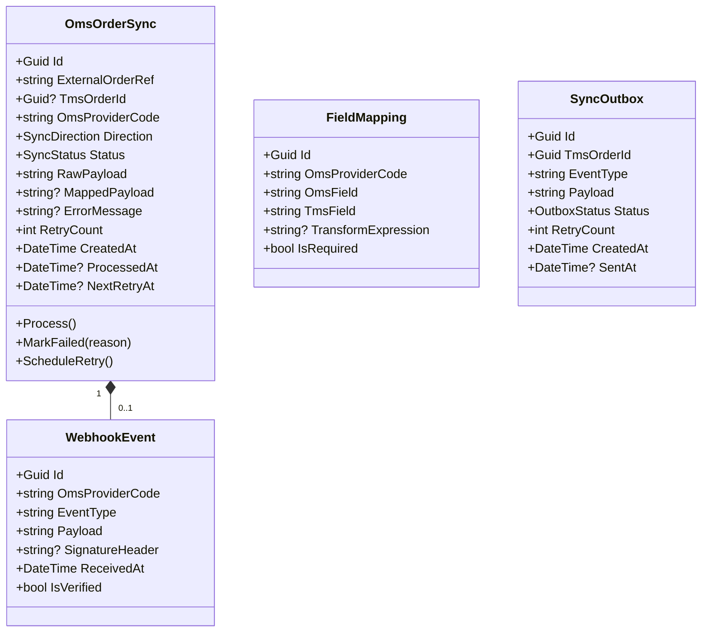
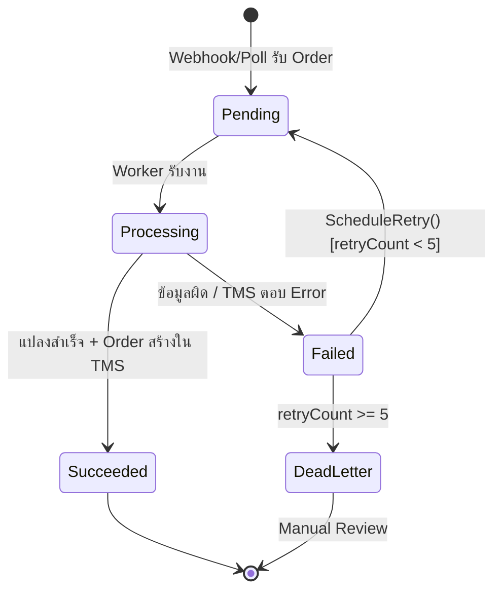

# OMS Integration Domain — Per-Domain Document

**Context:** Integration | **Schema:** `itg` | **Classification:** 🟢 Generic
**Phase:** 4 — Integration

---

## 2A. Domain Model

### Aggregate Root: `OmsOrderSync`



### Enums

```csharp
public enum SyncDirection { Inbound, Outbound }

public enum SyncStatus
{
    Pending,      // รอประมวลผล
    Processing,   // กำลังแปลงข้อมูล
    Succeeded,    // สำเร็จ
    Failed,       // ล้มเหลว
    DeadLetter    // เกิน Retry Limit
}

public enum OutboxStatus
{
    Pending,
    Sent,
    Failed
}
```

### Business Rules / Invariants

| # | กฎ | Exception |
|---|---|---|
| 1 | ExternalOrderRef ต้องไม่ซ้ำต่อ OmsProviderCode เดียวกัน | `DuplicateExternalOrderException` |
| 2 | RetryCount ≤ 5, เกินแล้วเปลี่ยนสถานะเป็น DeadLetter | `MaxRetryExceededException` |
| 3 | Webhook ที่ Signature ไม่ถูกต้องต้องถูก Reject ทันที | `InvalidWebhookSignatureException` |
| 4 | Field Mapping ที่ IsRequired = true ต้องมีค่า มิฉะนั้น Sync ล้มเหลว | `RequiredFieldMissingException` |
| 5 | Outbox Event ต้องไม่ส่งซ้ำ (Idempotency Key) | `DuplicateOutboxEventException` |

### State Diagram (OmsOrderSync)



---

## 2B. API Specification

### Endpoints

| # | Method | URL | Summary | Auth Roles |
|---|---|---|---|---|
| 1 | `POST` | `/api/integrations/oms/webhook/{providerCode}` | รับ Webhook จาก OMS | API Key (OMS System) |
| 2 | `GET` | `/api/integrations/oms/syncs` | รายการ Sync Logs (Paged) | Admin |
| 3 | `GET` | `/api/integrations/oms/syncs/{id}` | ดูรายละเอียด Sync Record | Admin |
| 4 | `POST` | `/api/integrations/oms/syncs/{id}/retry` | Retry ด้วยมือ (Dead Letter) | Admin |
| 5 | `GET` | `/api/integrations/oms/mappings` | ดูรายการ Field Mapping per Provider | Admin |
| 6 | `PUT` | `/api/integrations/oms/mappings/{providerCode}` | ตั้งค่า Field Mapping | Admin |
| 7 | `GET` | `/api/integrations/oms/providers` | รายการ OMS Provider ที่ configured | Admin |

### Request / Response DTOs

**POST /api/integrations/oms/webhook/{providerCode}**
```json
// Headers
// X-OMS-Signature: sha256=<hmac_signature>
// X-OMS-Provider: "ABC_WMS"

// Request Body (ตัวอย่าง OMS raw format — แปลงผ่าน ACL)
{
  "order_id": "EXT-ORDER-12345",
  "customer_code": "CUST-001",
  "warehouse_code": "WH-BKK",
  "items": [
    {
      "item_code": "SKU-001",
      "qty": 100,
      "gross_weight_kg": 250.0
    }
  ],
  "pickup_date": "20260410",
  "delivery_address": {
    "address1": "123 Sukhumvit",
    "city": "Bangkok",
    "postal_code": "10110"
  }
}

// Response: 202 Accepted (เสมอ — ประมวลผล Async)
{
  "syncId": "uuid",
  "status": "Pending",
  "message": "Webhook received. Processing asynchronously."
}
```

**GET /api/integrations/oms/syncs?page=1&pageSize=20&status=Failed**
```json
// Response: 200 OK
{
  "items": [
    {
      "id": "uuid",
      "externalOrderRef": "EXT-ORDER-12345",
      "omsProviderCode": "ABC_WMS",
      "direction": "Inbound",
      "status": "Failed",
      "errorMessage": "Required field 'pickupAddress.latitude' is missing",
      "retryCount": 3,
      "createdAt": "2026-04-10T08:00:00Z"
    }
  ],
  "page": 1,
  "pageSize": 20,
  "totalCount": 12
}
```

**PUT /api/integrations/oms/mappings/{providerCode}**
```json
// Request
{
  "mappings": [
    { "omsField": "order_id",             "tmsField": "externalRef",          "isRequired": true },
    { "omsField": "customer_code",        "tmsField": "customerId",           "isRequired": true },
    { "omsField": "items[].item_code",    "tmsField": "items[].sku",          "isRequired": false },
    { "omsField": "items[].qty",          "tmsField": "items[].quantity",     "isRequired": true },
    { "omsField": "items[].gross_weight_kg", "tmsField": "items[].weightKg", "isRequired": true },
    { "omsField": "pickup_date",          "tmsField": "pickupWindowFrom",     "isRequired": true,
      "transformExpression": "ParseDate('yyyyMMdd')" }
  ]
}

// Response: 200 OK
{
  "providerCode": "ABC_WMS",
  "mappingCount": 6,
  "updatedAt": "2026-04-06T08:00:00Z"
}
```

### Error Responses

| Status | เมื่อ | Body |
|---|---|---|
| 401 | API Key ไม่ถูกต้อง | `{ "title": "Unauthorized" }` |
| 400 | Webhook Signature ไม่ตรง | `{ "title": "Invalid Signature" }` |
| 404 | Sync Record ไม่พบ | `{ "title": "Not Found" }` |
| 409 | ExternalOrderRef ซ้ำ | `{ "title": "Duplicate External Order" }` |

---

## 2C. Database Schema

```sql
-- Schema: itg (Integration)
CREATE SCHEMA IF NOT EXISTS itg;

-- ===== OMS Sync Records =====
CREATE TABLE itg."OmsOrderSyncs" (
    "Id"                UUID PRIMARY KEY DEFAULT gen_random_uuid(),
    "ExternalOrderRef"  VARCHAR(200) NOT NULL,
    "OmsProviderCode"   VARCHAR(50) NOT NULL,
    "TmsOrderId"        UUID,
    "Direction"         VARCHAR(20) NOT NULL DEFAULT 'Inbound',
    "Status"            VARCHAR(20) NOT NULL DEFAULT 'Pending',
    "RawPayload"        TEXT NOT NULL,
    "MappedPayload"     TEXT,
    "ErrorMessage"      TEXT,
    "RetryCount"        INT NOT NULL DEFAULT 0,
    "NextRetryAt"       TIMESTAMPTZ,
    "CreatedAt"         TIMESTAMPTZ NOT NULL DEFAULT now(),
    "ProcessedAt"       TIMESTAMPTZ,
    "TenantId"          UUID NOT NULL,

    CONSTRAINT "UQ_OmsSync_ExtRef_Provider" UNIQUE ("ExternalOrderRef", "OmsProviderCode")
);

CREATE INDEX "IX_OmsOrderSyncs_Status" ON itg."OmsOrderSyncs" ("Status");
CREATE INDEX "IX_OmsOrderSyncs_Provider" ON itg."OmsOrderSyncs" ("OmsProviderCode");
CREATE INDEX "IX_OmsOrderSyncs_NextRetry" ON itg."OmsOrderSyncs" ("NextRetryAt") WHERE "Status" = 'Failed';
CREATE INDEX "IX_OmsOrderSyncs_TenantId" ON itg."OmsOrderSyncs" ("TenantId");

-- ===== Field Mappings (Config) =====
CREATE TABLE itg."OmsFieldMappings" (
    "Id"                    UUID PRIMARY KEY DEFAULT gen_random_uuid(),
    "OmsProviderCode"       VARCHAR(50) NOT NULL,
    "OmsField"              VARCHAR(200) NOT NULL,
    "TmsField"              VARCHAR(200) NOT NULL,
    "TransformExpression"   VARCHAR(500),
    "IsRequired"            BOOLEAN NOT NULL DEFAULT false,
    "UpdatedAt"             TIMESTAMPTZ NOT NULL DEFAULT now()
);

CREATE INDEX "IX_OmsFieldMappings_Provider" ON itg."OmsFieldMappings" ("OmsProviderCode");

-- ===== Outbox (Outbound Status Push to OMS) =====
CREATE TABLE itg."OmsOutboxEvents" (
    "Id"            UUID PRIMARY KEY DEFAULT gen_random_uuid(),
    "IdempotencyKey" VARCHAR(200) NOT NULL UNIQUE,
    "OmsProviderCode" VARCHAR(50) NOT NULL,
    "TmsOrderId"    UUID NOT NULL,
    "EventType"     VARCHAR(100) NOT NULL,
    "Payload"       TEXT NOT NULL,
    "Status"        VARCHAR(20) NOT NULL DEFAULT 'Pending',
    "RetryCount"    INT NOT NULL DEFAULT 0,
    "CreatedAt"     TIMESTAMPTZ NOT NULL DEFAULT now(),
    "SentAt"        TIMESTAMPTZ,
    "TenantId"      UUID NOT NULL
);

CREATE INDEX "IX_OmsOutbox_Status" ON itg."OmsOutboxEvents" ("Status");
CREATE INDEX "IX_OmsOutbox_TmsOrderId" ON itg."OmsOutboxEvents" ("TmsOrderId");

-- ===== Webhook Logs =====
CREATE TABLE itg."OmsWebhookLogs" (
    "Id"                UUID PRIMARY KEY DEFAULT gen_random_uuid(),
    "OmsProviderCode"   VARCHAR(50) NOT NULL,
    "ReceivedAt"        TIMESTAMPTZ NOT NULL DEFAULT now(),
    "HttpMethod"        VARCHAR(10) NOT NULL,
    "Headers"           TEXT,
    "RawBody"           TEXT,
    "IsVerified"        BOOLEAN NOT NULL DEFAULT false,
    "LinkedSyncId"      UUID REFERENCES itg."OmsOrderSyncs"("Id")
);
```

> [!TIP]
> `OmsWebhookLogs` เก็บไว้สำหรับ Debug เท่านั้น ควร Purge ทิ้งหลัง 30 วัน

---

## 2D. Event Specification

### Integration Events Consumed (รับจากภายนอก→TMS)

**OrderSyncedFromOmsIntegrationEvent** *(ส่งหลังแปลงสำเร็จแล้ว)*
```json
{
  "eventId": "uuid",
  "eventType": "OrderSyncedFromOmsIntegrationEvent",
  "timestamp": "2026-04-10T08:00:00Z",
  "payload": {
    "syncId": "uuid",
    "externalOrderRef": "EXT-ORDER-12345",
    "omsProviderCode": "ABC_WMS",
    "tmsOrderId": "uuid",
    "orderNumber": "ORD-20260410-0001"
  }
}
```
→ **Subscriber:** Order Management (ยืนยัน Order ที่สร้างจาก OMS)

---

### Integration Events Published (ส่งสถานะกลับ OMS)

**ShipmentStatusPushedToOmsEvent** *(Outbound — ผ่าน Outbox)*
```json
{
  "eventId": "uuid",
  "eventType": "ShipmentStatusPushedToOmsEvent",
  "timestamp": "2026-04-10T14:30:00Z",
  "payload": {
    "externalOrderRef": "EXT-ORDER-12345",
    "tmsOrderId": "uuid",
    "newStatus": "Delivered",
    "deliveredAt": "2026-04-10T14:25:00Z",
    "podUrl": "https://storage.example.com/pods/uuid.pdf"
  }
}
```
→ **Subscriber:** OMS System (External) — ดัน Status กลับผ่าน HTTP

**Events ที่ Trigger การส่ง Outbound:**
| TMS Event | → OMS Status |
|---|---|
| `ShipmentPickedUpIntegrationEvent` | `picked_up` |
| `ShipmentDeliveredIntegrationEvent` | `delivered` |
| `ShipmentExceptionIntegrationEvent` | `exception` |
| `OrderCancelledIntegrationEvent` | `cancelled` |

---

## 2E. Use Cases

### UC-OMS-01: Receive Inbound Order from OMS (Webhook)

| | |
|---|---|
| **Actor** | OMS External System |
| **Preconditions** | OMS Provider ถูก configured ใน TMS, Field Mapping ครบถ้วน |

**Main Flow:**
1. OMS ส่ง HTTP POST พร้อม HMAC Signature มาที่ `/api/integrations/oms/webhook/{providerCode}`
2. System ตรวจสอบ Signature (HMAC-SHA256 ด้วย Shared Secret)
3. System บันทึกลง `OmsWebhookLogs` (raw log)
4. System สร้าง `OmsOrderSync` record สถานะ = `Pending`
5. Return HTTP 202 Accepted ทันที
6. Background Worker หยิบ Record (Status = Pending) ไปประมวลผล
7. Worker แปลงข้อมูลผ่าน ACL ตาม Field Mapping ที่ configured
8. Worker เรียก Order Management Command เพื่อสร้าง `TransportOrder`
9. OmsOrderSync.Status → `Succeeded`, บันทึก TmsOrderId
10. Publish `OrderSyncedFromOmsIntegrationEvent`

**Alternative Flows:**
- **2a.** Signature ไม่ถูกต้อง → Return 400, ไม่บันทึก, บันทึก Security Log
- **7a.** Required Field ขาด → Status = `Failed`, บันทึก ErrorMessage
- **8a.** TMS Order สร้างไม่ได้ (Customer ไม่พบ) → Status = `Failed`, ScheduleRetry
- **9a.** Retry ครบ 5 ครั้ง → Status = `DeadLetter`, แจ้ง Admin

---

### UC-OMS-02: Push Shipment Status to OMS (Outbound)

| | |
|---|---|
| **Actor** | System (Event-driven) |
| **Preconditions** | Shipment มี ExternalOrderRef, OMS Provider ยังใช้งาน |

**Main Flow:**
1. Execution Context publish `ShipmentDeliveredIntegrationEvent`
2. OMS Integration Module รับ Event
3. ตรวจสอบว่า Order มี ExternalOrderRef (มาจาก OMS)
4. สร้าง `OmsOutboxEvent` พร้อม IdempotencyKey = `{tmsOrderId}:{eventType}`
5. Background Outbox Worker อ่าน Outbox → ส่ง HTTP POST ไปยัง OMS Callback URL
6. OMS ตอบ 200 → บันทึก SentAt, Status = `Sent`
7. OMS ตอบ Error → ScheduleRetry ด้วย Exponential Backoff

---

### UC-OMS-03: Configure Field Mapping

| | |
|---|---|
| **Actor** | Admin |
| **Preconditions** | มี OMS Provider Code ที่ต้องการตั้งค่า |

**Main Flow:**
1. Admin เข้าหน้า Integration Settings → เลือก OMS Provider
2. ดู Field ของ OMS (ซ้าย) และ TMS (ขวา)
3. Drag หรือ เลือก Mapping แต่ละ Field + กำหนด Transform Expression ถ้าจำเป็น
4. กด Save → System validate ว่า Required Fields ทุกตัวถูก Mapped
5. บันทึก Field Mappings ลง DB
6. System test ด้วย Sample Payload (ถ้ามี)

**Postconditions:** Field Mapping ใหม่ถูกใช้ทันทีสำหรับ Sync ที่เข้ามาหลังจากนั้น

---

### UC-OMS-04: Manual Retry Dead Letter

| | |
|---|---|
| **Actor** | Admin |
| **Preconditions** | OmsOrderSync.Status = DeadLetter |

**Main Flow:**
1. Admin เข้าหน้า Sync Logs → Filter Status = DeadLetter
2. Admin ตรวจสอบ ErrorMessage + RawPayload
3. ถ้าปัญหาแก้ไขแล้ว (เช่น เพิ่ม Customer ใน Master Data) → กด Retry
4. System Reset RetryCount = 0, Status = `Pending`
5. Worker หยิบไปประมวลผลใหม่
