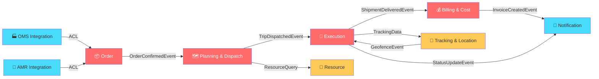

# TMS DDD Architecture Review: Domain Features & Capabilities

**สถานะ:** ✅ ออกแบบได้ดีในภาพรวม มีข้อเสนอแนะเชิงปรับปรุง

---

## สรุปภาพรวม

การแบ่ง 6 Bounded Contexts + 15 Domains สอดคล้องกับหลัก DDD ได้ดี มีความชัดเจนในการแยก Business Capability ออกจากกัน ข้อเสนอแนะด้านล่างจะช่วยให้การออกแบบแข็งแกร่งขึ้นอีก

---

## ✅ จุดที่ทำได้ดี

| # | สิ่งที่ทำถูกต้อง | เหตุผล |
|---|---|---|
| 1 | **Planning + Dispatch อยู่ Context เดียวกัน** | ทั้งสองเป็น Tightly Coupled — Route ต้องรู้ก่อนค่อย Dispatch |
| 2 | **Resource Context แยกจาก Execution** | Fleet/Driver เป็น Master Data ของทรัพยากร ไม่ใช่ Transactional Flow |
| 3 | **แยก OMS + AMR เป็น 2 Domains** | ดีกว่าเดิมที่รวมเป็น System Integration เดียว แต่ละ External System ควรมี ACL ของตัวเอง |
| 4 | **Geofencing แยกจาก Tracking** | ถูกต้อง — Geofencing เป็น Rule-based trigger, Tracking เป็น Data ingestion คนละ Lifecycle |

---

## ⚠️ ข้อเสนอแนะเชิงปรับปรุง

### 1. Execution & Tracking Context — ใหญ่เกินไป (4 Domains)

> [!WARNING]
> Context ที่มี 4 Domains เสี่ยงกลายเป็น "God Context" — แก้โค้ดส่วนหนึ่งแล้วกระทบอีกส่วน

**ปัญหา:** Shipment, Tracking, Geofencing, POD มี Lifecycle และ Rate of Change ต่างกันมาก
- **Tracking** = High-frequency data (GPS ทุก 5 วินาที) → Write-heavy
- **POD** = Low-frequency (เกิดแค่ตอนจบงาน) → Event-driven
- **Geofencing** = Rule engine → Configuration-heavy

**ทางเลือก:**

```
Option A: แยกเป็น 2 Contexts (แนะนำ)
├── Execution Context
│   ├── Shipment Management Domain
│   └── Proof of Delivery Domain       ← POD ผูกกับ Shipment
│
└── Tracking & Location Context  (ใหม่)
    ├── Tracking Domain                ← GPS, ETA
    └── Geofencing Domain              ← Zone triggers

Option B: คงไว้ 1 Context แต่แยก Subdomain ชัดเจน
└── Execution & Tracking Context
    ├── Core Subdomain: Shipment Management
    ├── Supporting Subdomain: POD
    ├── Supporting Subdomain: Tracking
    └── Generic Subdomain: Geofencing
```

**เหตุผล Option A ดีกว่า:**
- Tracking/Geofencing รับ GPS data ปริมาณมหาศาล ถ้าแยก Context ได้ = Scale database แยกได้
- ถ้าในอนาคตแยกเป็น Microservice → Tracking เป็นตัวแรกที่ต้องแยกออกเพราะ Load สูงสุด

---

### 2. Foundation & Infrastructure Context — เป็น "Catch-all" (6 Domains)

> [!IMPORTANT]
> ใน DDD, Bounded Context ที่มีมากกว่า 3-4 Domains มักเป็นสัญญาณว่ายังแบ่งไม่ละเอียดพอ

**ปัญหา:** Domain 6 ตัวนี้มีธรรมชาติต่างกันมาก:

| Domain | ประเภท | ธรรมชาติ |
|---|---|---|
| Analytics & Reporting | Supporting | Read-only, CQRS Query side |
| Master Data | Generic | CRUD, ข้อมูลเปลี่ยนน้อย |
| IAM | Generic | ควรใช้ 3rd-party (Keycloak/Auth0) |
| OMS Integration | Generic | ACL + Adapter pattern |
| AMR Integration | Generic | ACL + Adapter pattern |
| Notification | Generic | Infrastructure concern |

**ข้อเสนอ: แยกเป็น 2-3 กลุ่ม**

```
├── Integration Context (ใหม่)
│   ├── OMS System Domain (ACL)
│   └── AMR System Domain (ACL)
│
├── Platform Context (ใหม่)
│   ├── IAM Domain
│   ├── Notification Domain
│   └── Master Data Domain
│
└── Analytics Context (ใหม่ หรือคงเป็น Module แยก)
    └── Analytics & Reporting Domain
```

**เหตุผล:**
- **Integration** = ติดต่อระบบภายนอก ต้อง handle retry/circuit-breaker → แยก concern ชัด
- **Platform** = ของที่ทุก Context ใช้ร่วมกัน (cross-cutting)
- **Analytics** = ดึงข้อมูลจากทุก Context → อาจต้องการ Read Replica แยก

---

### 3. Order Context มีแค่ 1 Domain — พิจารณาเพิ่ม Contract/Customer

**คำถาม:** ลูกค้า (Customer) และสัญญาบริการ (Contract/SLA) จะอยู่ที่ไหน?

```
ถ้า Order Context จัดการแค่ "คำสั่งขนส่ง" → ใครเป็นเจ้าของ Customer Profile?
```

**ทางเลือก:**
- **ถ้า Customer มาจาก OMS** → ไม่ต้องมี Domain ใหม่ (OMS Integration ทำ ACL แปลงเข้ามา)
- **ถ้า TMS จัดการ Customer เอง** → ควรเพิ่ม `Customer Management Domain` ใน Order Context หรือ Master Data

---

### 4. Billing & Cost Context — พิจารณาแยก Tariff Engine

**Tariff Engine** (สูตรคิดราคา) กับ **Invoicing** (ออกบิล) มี Lifecycle ต่างกัน:

| ส่วน | ลักษณะ | เปลี่ยนบ่อย? |
|---|---|---|
| Tariff Engine | Rule/Formula → Configuration | บ่อย (ปรับราคาตามฤดูกาล) |
| AR Invoicing | Transaction → ออกบิล | ตาม Cycle (รายเดือน) |
| AP Settlement | Transaction → จ่ายเงิน | ตาม Cycle |

**ข้อเสนอ (ไม่บังคับ):**
```
Billing & Cost Context
├── Tariff Management Domain    ← แยกสูตรราคาออกมา
└── Invoice & Settlement Domain ← รวม AR + AP
```

จะช่วยให้ทีม Business แก้ไขสูตรราคาได้โดยไม่กระทบ Invoice workflow

---

### 5. Domain Classification (Core / Supporting / Generic)

ใน DDD, ควรระบุประเภท Domain เพื่อจัดลำดับความสำคัญในการลงทุนพัฒนา:

| ประเภท | Domain | ความหมาย |
|---|---|---|
| 🔴 **Core** | Order Management | แข่งขันทางธุรกิจ ต้องลงทุนสร้างเอง |
| 🔴 **Core** | Route Planning | จุดขายหลัก — Optimization |
| 🔴 **Core** | Dispatch Management | Critical workflow |
| 🔴 **Core** | Shipment Management | หัวใจ Execution |
| 🔴 **Core** | Billing & Cost | รายได้ของบริษัท |
| 🟡 **Supporting** | Tracking | สำคัญแต่ซื้อ/ใช้ของสำเร็จรูปได้ |
| 🟡 **Supporting** | Geofencing | สำคัญแต่เป็น Rule engine |
| 🟡 **Supporting** | POD | สำคัญแต่เป็น Evidence collection |
| 🟡 **Supporting** | Fleet Management | บริหารทรัพย์สิน |
| 🟡 **Supporting** | Driver Management | บริหารคนขับ |
| 🟡 **Supporting** | Analytics & Reporting | อ่านข้อมูลอย่างเดียว |
| 🟢 **Generic** | IAM | ใช้ Keycloak/Auth0 ได้เลย อย่าสร้างเอง |
| 🟢 **Generic** | Master Data | CRUD พื้นฐาน |
| 🟢 **Generic** | Notification | ใช้ Library/Service สำเร็จรูป |
| 🟢 **Generic** | OMS/AMR Integration | Adapter pattern |

> [!TIP]
> **Core Domain** = ลงทุนเขียน Unit Test + Domain Model เต็มรูปแบบ
> **Supporting** = ใช้ CRUD + Simple Domain Model ก็พอ
> **Generic** = ใช้ Library/3rd-party + Thin wrapper

---

## 🔍 Context Map — ความสัมพันธ์ระหว่าง Contexts



---

## 📋 Checklist ตรวจสอบ DDD Principles

| หลักการ | สถานะ | หมายเหตุ |
|---|---|---|
| แต่ละ Context มี Ubiquitous Language ของตัวเอง | ✅ | Order ≠ Shipment ≠ Trip (ใช้คำต่างกัน) |
| ไม่มี Database JOIN ข้าม Context | ✅ | ใช้ Schema-per-Module |
| สื่อสารข้าม Context ผ่าน Event เท่านั้น | ✅ | Integration Events |
| แต่ละ Domain มี Aggregate Root ชัดเจน | ⚠️ | ยังไม่เห็นการกำหนด Aggregate Root |
| Domain Classification (Core/Supporting/Generic) | ⚠️ | ยังไม่ได้ระบุ → ดูตารางด้านบน |
| Context Map แสดงความสัมพันธ์ | ⚠️ | ยังไม่มี → ดู diagram ด้านบน |
| Anti-corruption Layer สำหรับ External System | ✅ | OMS + AMR แยก Domain |

---

## 🎯 สรุปข้อเสนอแนะเรียงลำดับความสำคัญ

| ลำดับ | ข้อเสนอ | ผลกระทบ | ความยากในการแก้ |
|---|---|---|---|
| 1 | แยก Tracking + Geofencing เป็น Context ใหม่ | สูง (Scalability) | ต่ำ |
| 2 | แยก Foundation ออกเป็น Integration / Platform / Analytics | ปานกลาง (Clarity) | ต่ำ |
| 3 | กำหนด Domain Classification (Core/Supporting/Generic) | สูง (จัดลำดับการพัฒนา) | ต่ำ |
| 4 | พิจารณา Customer Management Domain | ปานกลาง | ขึ้นกับ Business |
| 5 | แยก Tariff Engine ออกจาก Invoicing | ต่ำ-ปานกลาง | ต่ำ |
