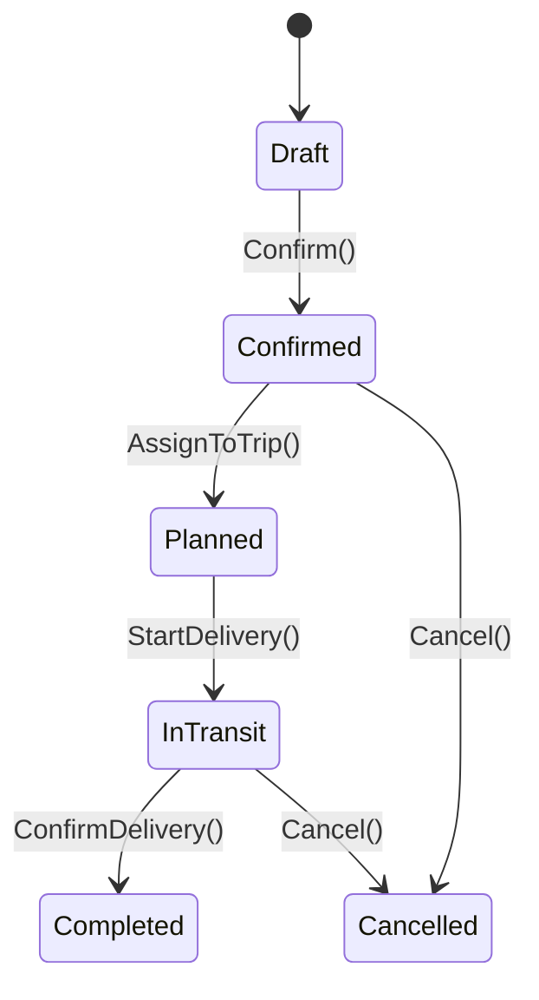
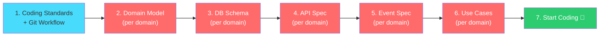

# TMS Developer Documentation Checklist

เอกสารที่ Software Developer ต้องสร้างสำหรับโปรเจกต์ TMS แบ่งเป็น 4 ระดับ

---

## ระดับ 1: Project-Level Documents (ทั้งโปรเจกต์)

*สร้างครั้งเดียว อัปเดตเมื่อ Architecture เปลี่ยน*

| # | เอกสาร | คำอธิบาย | Format | สถานะ |
|---|---|---|---|---|
| 1 | **Technical Design Document (TDD)** | หลักการออกแบบ, Tech Stack, Architecture Principles, Security | Markdown | ✅ มีแล้ว |
| 2 | **Domain Features & Capabilities** | รายชื่อ Context/Domain/Feature ทั้งหมด + Event Catalog | Markdown | ✅ มีแล้ว (v3) |
| 3 | **Context Map** | แผนภาพความสัมพันธ์ระหว่าง Bounded Contexts | Mermaid | ✅ มีแล้ว (v3) |
| 4 | **Folder Structure** | โครงสร้าง Solution/Project + Naming Conventions | Markdown | ✅ มีแล้ว |
| 5 | **Coding Standards** | กฎการเขียนโค้ด, Naming, Error Handling, Logging | Markdown | ❌ ยังไม่มี |
| 6 | **Development Setup Guide** | วิธี Clone, ติดตั้ง, รัน, ทดสอบ แบบ Step-by-step | Markdown | ❌ ยังไม่มี |
| 7 | **Database Migration Strategy** | วิธีจัดการ Schema Migration (EF Core Migrations) | Markdown | ❌ ยังไม่มี |
| 8 | **User Roles & RBAC Matrix** | ตาราง Role × Permission ทุก Endpoint | Markdown | ✅ มีแล้ว |

---

## ระดับ 2: Per-Domain Documents (ต่อ Domain — สำคัญที่สุด)

*สร้างก่อนเขียนโค้ดแต่ละ Domain — เป็น "แบบพิมพ์เขียว" ของ Developer*

> [!IMPORTANT]
> ทุก Domain ต้องมีเอกสาร 5 ชิ้นนี้ครบก่อนเริ่ม Coding

### 2A. Domain Model Specification

```
📄 {DomainName}_domain_model.md
```

| ส่วน | รายละเอียดที่ต้องระบุ |
|---|---|
| **Aggregate Root** | Entity หลักของ Domain — เช่น `TransportOrder`, `Trip`, `Shipment` |
| **Entities** | Entity ย่อยภายใน Aggregate — เช่น `OrderItem`, `Stop`, `ShipmentItem` |
| **Value Objects** | ค่าที่ไม่มี Identity — เช่น `Address`, `Weight`, `GeoCoordinate`, `Money` |
| **Domain Rules / Invariants** | กฎธุรกิจ — เช่น "น้ำหนักรวมต้องไม่เกิน Max Payload ของรถ" |
| **State Diagram** | Mermaid State Machine ของ Aggregate Root |

ตัวอย่าง State Diagram:


---

### 2B. API Specification

```
📄 {DomainName}_api_spec.md
```

| ส่วน | รายละเอียดที่ต้องระบุ |
|---|---|
| **Endpoints** | Method, URL, Summary — เช่น `POST /api/orders`, `GET /api/orders/{id}` |
| **Request DTO** | JSON Schema ของ Request Body, Query Params |
| **Response DTO** | JSON Schema ของ Response Body + Status Codes |
| **Authorization** | Roles ที่เข้าถึงได้ — เช่น `[Admin, Planner]` |
| **Validation Rules** | กฎตรวจสอบ Input — เช่น `weight > 0`, `pickupDate > now` |

ตัวอย่าง:
```
POST /api/orders
├── Auth: [Admin, Planner, Customer]
├── Request: CreateOrderRequest { customerId, items[], pickupAddress, dropoffAddress, timeWindow }
├── Response: 201 Created → OrderResponse { id, status, createdAt }
├── Errors: 400 (Validation), 404 (Customer not found), 409 (Duplicate)
```

---

### 2C. Database Schema

```
📄 {DomainName}_db_schema.md
```

| ส่วน | รายละเอียดที่ต้องระบุ |
|---|---|
| **Schema Name** | เช่น `[ord]`, `[pln]`, `[exe]` |
| **Tables** | ชื่อตาราง, Columns, Data Types, Constraints |
| **Indexes** | Index ที่ต้องสร้าง — เพื่อ Query Performance |
| **Relationships** | FK ภายใน Schema เดียวกันเท่านั้น (ห้ามข้าม Schema) |

ตัวอย่าง:
```sql
-- Schema: [ord]
CREATE TABLE [ord].[TransportOrders] (
    Id              UNIQUEIDENTIFIER PRIMARY KEY,
    OrderNumber     NVARCHAR(50)     NOT NULL UNIQUE,
    CustomerId      UNIQUEIDENTIFIER NOT NULL,
    Status          NVARCHAR(20)     NOT NULL DEFAULT 'Draft',
    TotalWeight     DECIMAL(10,2),
    CreatedAt       DATETIMEOFFSET   NOT NULL,
    INDEX IX_Orders_Status (Status),
    INDEX IX_Orders_Customer (CustomerId)
);
```

---

### 2D. Event Specification

```
📄 {DomainName}_events.md
```

| ส่วน | รายละเอียดที่ต้องระบุ |
|---|---|
| **Domain Events** | Event ภายใน Domain — เช่น `OrderStatusChanged` |
| **Integration Events** | Event ข้าม Context — เช่น `OrderConfirmedEvent` |
| **Event Payload** | JSON Schema ของ Event Data |
| **Subscribers** | ใครรับ Event นี้ไปทำอะไร |

ตัวอย่าง:
```json
{
  "eventType": "OrderConfirmedEvent",
  "version": "1.0",
  "payload": {
    "orderId": "uuid",
    "orderNumber": "ORD-20260328-001",
    "customerId": "uuid",
    "totalWeight": 1500.00,
    "pickupAddress": { "lat": 13.75, "lng": 100.50 },
    "dropoffAddress": { "lat": 14.00, "lng": 100.48 },
    "timeWindow": { "from": "2026-03-28T08:00", "to": "2026-03-28T12:00" }
  }
}
```

---

### 2E. Use Cases / User Stories

```
📄 {DomainName}_use_cases.md
```

| ส่วน | รายละเอียดที่ต้องระบุ |
|---|---|
| **Use Case Name** | ชื่อ — เช่น "Create Transport Order" |
| **Actor** | ใครทำ — เช่น Planner, Driver, System |
| **Preconditions** | เงื่อนไขก่อนทำ — เช่น "ลูกค้าต้องมีอยู่ใน Master Data" |
| **Main Flow** | ขั้นตอนหลัก (Happy Path) |
| **Alternative Flows** | กรณีพิเศษ (Partial Delivery, Exception) |
| **Postconditions** | ผลลัพธ์ — เช่น "Order ถูกสร้าง + OrderConfirmedEvent ถูกส่ง" |

---

## ระดับ 3: Development Standards (คู่มือ Developer)

*สร้างครั้งเดียว ใช้ทั้งทีม*

| # | เอกสาร | เนื้อหา |
|---|---|---|
| 1 | **Coding Conventions** | Naming (PascalCase/camelCase), File Structure, DI Registration Pattern |
| 2 | **Error Handling Guide** | Exception Hierarchy, Custom Error Codes, Logging Format, Problem Details (RFC 7807) |
| 3 | **Testing Strategy** | Unit Test → Integration Test → E2E Test, Coverage Target, ชื่อ Test Method Pattern |
| 4 | **Git Workflow** | Branch Strategy (GitFlow/Trunk), Commit Message Format, PR Review Process |
| 5 | **CQRS & MediatR Guide** | วิธีสร้าง Command/Query/Handler, Pipeline Behaviors (Validation, Logging) |
| 6 | **Event Publishing Guide** | วิธีส่ง Domain Event vs Integration Event, Outbox Pattern, Idempotency |

---

## ระดับ 4: Operational Documents

*สร้างก่อน Go-Live*

| # | เอกสาร | เนื้อหา |
|---|---|---|
| 1 | **Deployment Guide** | CI/CD Pipeline, Docker Config, Environment Variables |
| 2 | **Monitoring & Alerting** | Health Check Endpoints, Log Aggregation, Alert Rules |
| 3 | **Runbook** | วิธีแก้ปัญหาที่เจอบ่อย — DB Full, Message Queue Stuck, Service Down |
| 4 | **API Documentation** | Swagger/OpenAPI — auto-generate จากโค้ด |

---

## 📋 สรุปจำนวนเอกสาร

| ระดับ | จำนวน | หมายเหตุ |
|---|---|---|
| Project-Level | 8 ชิ้น | สร้างครั้งเดียว (มีแล้ว 4, ขาด 3) |
| Per-Domain (× 19 Domains) | **95 ชิ้น** | ⚡ ส่วนที่เยอะที่สุด (5 ชิ้น × 19 Domains) |
| Development Standards | 6 ชิ้น | สร้างครั้งเดียว ใช้ทั้งทีม |
| Operational | 4 ชิ้น | สร้างก่อน Go-Live |
| **รวม** | **~113 ชิ้น** | |

> [!TIP]
> **อย่าสร้างทุกอันพร้อมกัน** — สร้างตาม Phase ที่กำลังพัฒนา
> Phase 1 (MVP) สร้างเอกสาร Per-Domain ให้ 7 Domains ก่อน = 35 ชิ้น

---

## 🎯 ลำดับการสร้างเอกสารที่แนะนำ



> [!IMPORTANT]
> **Domain Model → DB Schema → API Spec → Event Spec** คือลำดับที่ถูกต้อง
> เพราะ Domain Model เป็นตัวกำหนดทุกอย่าง (DDD Principle: Domain เป็นศูนย์กลาง)
