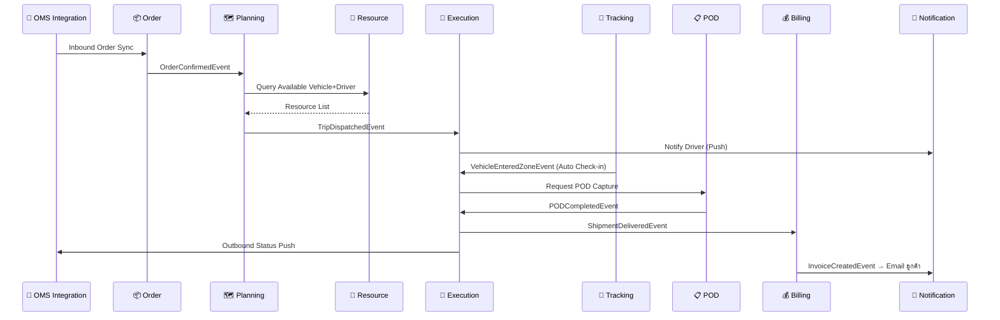

# TMS Architecture: Domain Features & Capabilities (v2)

รายละเอียดฟีเจอร์ระดับ Epic ของ **16 Domains** ใน **9 Bounded Contexts**

---

## 📦 1. Order Context

### 1.1 Order Management Domain `Core`
*รับผิดชอบวงจรชีวิตของคำสั่งขนส่ง (Transport Order)*

| Feature | รายละเอียด |
|---|---|
| **Order Creation & Ingestion** | สร้างออเดอร์ผ่าน Web Portal (Manual) หรือรับจาก OMS/AMR ผ่าน Integration Event |
| **Order Validation Engine** | ตรวจสอบความถูกต้อง — น้ำหนัก, ปริมาตร CBM, ประเภทสินค้าอันตราย (DG Class), วันที่รับ-ส่ง |
| **SLA & Time Window** | กำหนดกรอบเวลา Pickup / Drop-off Window, ระดับ Priority (Normal, Express, Same-day) |
| **Order State Machine** | สถานะ: `Draft → Confirmed → Assigned → In-Transit → Completed → Cancelled` |
| **Address Management** | บริหารสถานที่รับ-ส่ง — Address Parser, Geocoding (Lat/Lng), Address Book ลูกค้าประจำ |
| **Order Splitting / Merging** | แยกออเดอร์ใหญ่เป็นหลาย Shipment หรือรวมออเดอร์เล็กที่ปลายทางเดียวกัน |

**Key Events Published:**
- `OrderConfirmedEvent` → Planning Context รับไปจัดคิวรถ
- `OrderCancelledEvent` → ยกเลิก Trip ที่เกี่ยวข้อง

---

## 🗺️ 2. Planning & Dispatch Context

### 2.1 Route Planning Domain `Core`
*คำนวณความคุ้มค่าและหาเส้นทางที่เหมาะสมที่สุด*

| Feature | รายละเอียด |
|---|---|
| **Load Consolidation** | รวมกรุ๊ปออเดอร์ย่อยหลายเจ้าเป็น 1 Trip ตามเงื่อนไข (ปลายทางใกล้กัน, ประเภทสินค้าเข้ากันได้) |
| **Route Optimization Engine** | แนะนำเส้นทาง Multi-drop Routing เรียงลำดับจุดจอดเพื่อประหยัดระยะทาง/เวลา |
| **Capacity Constraints Check** | ป้องกัน Overweight / Over-volume — คำนวณ Weight Utilization % และ Volume Utilization % |
| **Trip Creation & Planning** | สร้าง Trip พร้อมกำหนด Sequence ของ Stop (Pickup → Drop-off → Return) |
| **Distance & Duration Estimation** | คำนวณระยะทางและเวลาคาดการณ์ระหว่าง Stop ผ่าน Map API |

### 2.2 Dispatch Management Domain `Core`
*จับคู่ทรัพยากรและสั่งการ*

| Feature | รายละเอียด |
|---|---|
| **Resource Assignment** | จับคู่ Trip กับ "รถ" + "คนขับ" ที่เหมาะสม — ดึงข้อมูล Availability จาก Resource Context |
| **Auto-suggest Assignment** | ระบบแนะนำรถ/คนขับที่เหมาะสมตามประเภทรถ, ใบอนุญาต, ตำแหน่งปัจจุบัน |
| **Trip Dispatching** | กดปล่อยงาน → ส่ง Manifest/Job Info ไปแอปมือถือคนขับ |
| **Trip Lifecycle Management** | สถานะ: `Created → Assigned → Dispatched → In-Progress → Completed → Cancelled` |
| **Re-assignment & Swap** | เปลี่ยนรถ/คนขับกลางทาง กรณีรถเสียหรือคนขับไม่สะดวก |
| **Dispatch Dashboard** | หน้าจอ Planner แสดง Gantt Chart / Timeline ภาพรวมเที่ยววิ่งทั้งหมดในวัน |

**Key Events Published:**
- `TripDispatchedEvent` → Execution Context สร้าง Shipment + แจ้งคนขับ
- `TripCancelledEvent` → ยกเลิก Shipment ที่เกี่ยวข้อง

---

## 🚛 3. Execution Context

### 3.1 Shipment Management Domain `Core`
*ควบคุมสถานะของพัสดุ/สินค้าบนเที่ยววิ่ง*

| Feature | รายละเอียด |
|---|---|
| **Shipment State Machine** | สถานะฝั่งกายภาพ: `Pending → Picked-up → In-Transit → Arrived → Delivered → Returned` |
| **Stop Execution Workflow** | ลำดับการทำงานที่แต่ละจุดจอด: เช็คอิน → โหลด/ลงสินค้า → ยืนยัน → เช็คเอาท์ |
| **Exception Handling** | จัดการปัญหาหน้างาน — สินค้าเสียหาย, ลูกค้าปฏิเสธ, ที่อยู่ผิด, สินค้าไม่ครบ |
| **Barcode / QR Scanning** | สแกนยืนยันการนำสินค้าขึ้น-ลงรถ, โอนถ่ายสินค้าระหว่าง Hub |
| **Partial Delivery** | รองรับการส่งบางส่วน (Partial) พร้อมบันทึกจำนวนที่ส่งจริง vs คงค้าง |
| **Return / Reject Management** | กระบวนการตีของกลับ — บันทึกเหตุผล, สร้าง Return Shipment อัตโนมัติ |

**Key Events Published:**
- `ShipmentDeliveredEvent` → Billing Context คำนวณค่าขนส่ง
- `ShipmentExceptionEvent` → Notification แจ้ง Planner / ลูกค้า

### 3.2 Proof of Delivery (POD) Domain `Supporting`
*เก็บหลักฐานการส่งมอบเพื่อปิดงาน*

| Feature | รายละเอียด |
|---|---|
| **e-Signature Capture** | ลูกค้าเซ็นชื่อรับสินค้าผ่านหน้าจอมือถือคนขับ |
| **Photo Evidence Upload** | ถ่ายรูปสภาพสินค้า, หน้าบ้าน, ป้ายทะเบียน — พร้อมบีบอัดไฟล์อัตโนมัติ |
| **Timestamp & Geotagging** | ฝังเวลา + พิกัด GPS ลงในรูปภาพและเอกสาร POD ป้องกันการทุจริต |
| **POD Document Generation** | สร้างเอกสาร POD (PDF) อัตโนมัติ — รวมลายเซ็น + รูป + ข้อมูล Shipment |
| **POD Validation & Approval** | Back-office ตรวจสอบและอนุมัติ POD ก่อนปิดงาน |

---

## 📡 4. Tracking & Location Context

### 4.1 Tracking Domain `Supporting`
*ติดตามยานพาหนะและพัสดุแบบ Real-time*

| Feature | รายละเอียด |
|---|---|
| **Real-time GPS Ingestion** | รับพิกัด GPS จากกล่องดำรถยนต์ (OBD/GPS Tracker) หรือมือถือคนขับ ทุก 5-30 วินาที |
| **ETA Calculation** | คำนวณ Estimated Time of Arrival แบบ Dynamic — อัปเดตตามสภาพจราจรจริง |
| **Live Map View** | แผนที่แสดงตำแหน่งรถทั้งหมดแบบ Real-time สำหรับ Planner / Admin |
| **Historical Route Playback** | ย้อนดูเส้นทางวิ่ง — จุดจอดแวะพัก, ความเร็ว, การออกนอกเส้นทาง |
| **Speed & Idle Monitoring** | ตรวจจับการขับเร็วเกิน, จอดนิ่งนานผิดปกติ (Idle > X นาที) |
| **Customer Tracking Link** | สร้าง URL ให้ลูกค้าติดตามสถานะพัสดุแบบ Self-service (คล้าย Grab/Lalamove) |

### 4.2 Geofencing Domain `Supporting`
*สร้างขอบเขตพิกัดเพื่อทำ Trigger อัตโนมัติ*

| Feature | รายละเอียด |
|---|---|
| **Zone Creation (Polygon/Radius)** | วาดเขตรัศมีรอบคลังสินค้า, บ้านลูกค้า, จุดพักรถ — รองรับทั้ง Circle และ Polygon |
| **Entry / Exit Event Trigger** | ส่ง Event อัตโนมัติเมื่อรถเข้า (Entry) หรือออก (Exit) จากโซนที่กำหนด |
| **Dwell Time Monitoring** | วัดเวลาที่รถอยู่ในโซน — ตรวจจับจอดนานเกินกำหนดที่หน้าโรงงาน |
| **Restricted Zone Alert** | แจ้งเตือนเมื่อรถเข้าเขตห้าม (เช่น เขตชั้นใน กทม. ช่วงเวลาห้ามรถบรรทุก) |
| **Auto Check-in / Check-out** | ระบบ Check-in/out อัตโนมัติเมื่อรถถึงจุดหมาย — ลดการกดปุ่มด้วยมือ |

**Key Events Published:**
- `VehicleEnteredZoneEvent` → Execution Context อัปเดต Shipment Status (Arrived)
- `VehicleExitedZoneEvent` → Tracking คำนวณ ETA จุดถัดไป

---

## 🔧 5. Resource Context

### 5.1 Fleet Management Domain `Supporting`
*จัดการทรัพย์สินยานพาหนะ*

| Feature | รายละเอียด |
|---|---|
| **Vehicle Registry** | จัดเก็บข้อมูลรถ — ประเภท (4ล้อ/6ล้อ/10ล้อ/หัวลาก), ทะเบียน, ขนาดกระบะ, น้ำหนักบรรทุกสูงสุด |
| **Vehicle Status & Availability** | สถานะ: `Available → Assigned → In-Use → In-Repair → Decommissioned` |
| **Maintenance Schedule** | แจ้งเตือนซ่อมบำรุงตามระยะ กม. หรือรอบเดือน — เชื่อมกับ Odometer |
| **Insurance & Tax Expiry** | แจ้งเตือนต่อ พ.ร.บ., ภาษีป้ายทะเบียน, ประกันภัย ล่วงหน้า 30/60/90 วัน |
| **Fuel Consumption Tracking** | บันทึกการเติมน้ำมัน, คำนวณอัตราสิ้นเปลือง (กม./ลิตร) เทียบกับมาตรฐานรถ |
| **Vehicle Type Configuration** | กำหนด Spec รถแต่ละประเภท — Payload, Volume, อุณหภูมิ (ห้องเย็น), อุปกรณ์พิเศษ |

### 5.2 Driver Management Domain `Supporting`
*จัดการข้อมูลพนักงานขับรถ*

| Feature | รายละเอียด |
|---|---|
| **Driver Profile & Documents** | ประวัติคนขับ, สำเนาใบขับขี่, ประเภทใบอนุญาต (ท.1/ท.2/ท.3/ท.4) |
| **Driver Status & Availability** | สถานะ: `Available → On-Duty → Off-Duty → On-Leave → Suspended` |
| **Hours of Service (HOS)** | บันทึกชั่วโมงทำงาน — ป้องกันละเมิดกฎหมายแรงงาน (ขับต่อเนื่อง > 4 ชม.) |
| **License Expiry Alert** | แจ้งเตือนใบขับขี่หมดอายุ — บล็อกไม่ให้ Assign งานถ้าหมดอายุ |
| **Performance & Rating** | คะแนนการขับขี่ — ตรงเวลา, ความเร็ว, ข้อร้องเรียนลูกค้า, อุบัติเหตุ |
| **Driver-Vehicle Assignment Rules** | กฎจับคู่ — คนขับใบ ท.2 ขับได้แค่ 6 ล้อ, ต้องมี ADR License ถ้าขนสินค้าอันตราย |

---

## 💰 6. Billing & Cost Context

### 6.1 Billing & Cost Domain `Core`
*จัดการรายได้ (AR) และรายจ่าย (AP) ที่เกี่ยวกับขนส่ง*

| Feature | รายละเอียด |
|---|---|
| **Tariff Engine** | เครื่องยนต์คำนวณค่าระวาง — รองรับหลายสูตร: ตาม กม., ตามน้ำหนัก, เหมาโซน, ขั้นบันได |
| **Tariff Configuration** | UI สำหรับตั้งค่าอัตราราคา — แยกตามลูกค้า, ประเภทสินค้า, เส้นทาง, ช่วงเวลา (Peak/Off-peak) |
| **AR Invoicing** | ออกบิลเรียกเก็บลูกค้า — สรุปยอดรายเที่ยว/รายเดือน, แนบ POD |
| **AP Settlement** | คำนวณเบี้ยเลี้ยงคนขับ, ค่าจ้างซับคอนแทรค (รถร่วม), ค่าน้ำมัน |
| **Cost Calculation** | คำนวณต้นทุนต่อเที่ยว — ค่าน้ำมัน + ค่าทางด่วน + เบี้ยเลี้ยง + ค่าเสื่อม |
| **Surcharge & Penalty** | คิดค่าธรรมเนียมเพิ่มเติม — ค่ารอคิวเกิน (Detention), ค่า Re-delivery |
| **Revenue vs Cost Report** | เปรียบเทียบรายได้ vs ต้นทุน ต่อเที่ยว/ลูกค้า/เส้นทาง → กำไร/ขาดทุน |

---

## 🔌 7. Integration Context

### 7.1 OMS System Domain `Generic`
*เชื่อมต่อกับ Order Management System ของลูกค้า*

| Feature | รายละเอียด |
|---|---|
| **Anti-Corruption Layer (ACL)** | แปลงข้อมูล JSON/XML จาก OMS → TMS Order Model ผ่าน Adapter Pattern |
| **Inbound Order Sync** | รับออเดอร์จาก OMS อัตโนมัติ — Webhook / Scheduled Polling / File Upload (CSV/Excel) |
| **Outbound Status Push** | ดัน Status Update (Picked-up, Delivered) กลับไป OMS แบบ Real-time |
| **Data Mapping Configuration** | UI ตั้งค่า Field Mapping ระหว่าง OMS ↔ TMS โดยไม่ต้องแก้โค้ด |
| **Error Handling & Retry** | Retry ด้วย Exponential Backoff, Dead Letter Queue สำหรับข้อมูลที่แปลงล้มเหลว |

### 7.2 AMR System Domain `Generic`
*เชื่อมต่อกับระบบ AMR (Automated Mobile Robot) ในคลังสินค้า*

| Feature | รายละเอียด |
|---|---|
| **Anti-Corruption Layer (ACL)** | แปลงข้อมูลจาก AMR Protocol → TMS Event Model |
| **Loading Dock Coordination** | รับสัญญาณจาก AMR ว่าสินค้าพร้อมโหลดขึ้นรถที่ Dock ไหน |
| **Inventory Handoff Event** | รับ Event ยืนยันการโอนถ่ายสินค้าจาก AMR → รถขนส่ง |
| **AMR Status Monitoring** | แสดงสถานะ AMR ที่เกี่ยวข้องกับ Shipment (กำลังหยิบ, หยิบเสร็จ, วางที่ Dock) |

---

## 🏗️ 8. Platform Context

### 8.1 IAM Domain `Generic`
*จัดการตัวตนและสิทธิ์การเข้าถึง*

| Feature | รายละเอียด |
|---|---|
| **Authentication / SSO** | Login ด้วย Username/Password, OTP, SSO ผ่าน Corporate Directory |
| **Role-Based Access Control** | กำหนดสิทธิ์: Admin, Planner, Dispatcher, Driver, Customer, Finance |
| **Permission Matrix** | ระบุ Permission ระดับ Action — `order:create`, `trip:dispatch`, `report:view` |
| **Multi-tenancy Support** | รองรับหลายบริษัทในระบบเดียว — แยกข้อมูลตาม Tenant |
| **API Key Management** | ออก API Key สำหรับ External System (OMS/AMR) เชื่อมต่อ |
| **Audit Log** | บันทึก Who/What/When ทุก Action สำคัญ — Login, สร้างออเดอร์, อนุมัติบิล |

### 8.2 Notification Domain `Generic`
*ศูนย์กลางการแจ้งเตือนทุกช่องทาง*

| Feature | รายละเอียด |
|---|---|
| **Omnichannel Messaging** | ส่งข้อความผ่าน SMS, Email, Push Notification, Line OA |
| **Template Management** | จัดการรูปแบบข้อความ — ใช้ Placeholder เช่น `{CustomerName}`, `{TrackingNo}`, `{ETA}` |
| **Notification Rules Engine** | กำหนดกฏว่า Event ไหน → แจ้งใคร → ผ่านช่องทางไหน |
| **Delivery Status & Retry** | ติดตามสถานะการส่ง (Sent/Failed) พร้อม Retry อัตโนมัติ |
| **Notification Preferences** | ผู้ใช้ตั้งค่าช่องทางที่ต้องการรับแจ้งเตือน |

### 8.3 Master Data Domain `Generic`
*ฐานข้อมูลกลางที่ใช้อ้างอิงทั้งองค์กร*

| Feature | รายละเอียด |
|---|---|
| **Customer Master** | ข้อมูลลูกค้า — ชื่อบริษัท, ที่อยู่, ผู้ติดต่อ, เงื่อนไขการชำระเงิน |
| **Location / Address Book** | คลังที่อยู่ — Geocoded, จัดกลุ่มเป็น Zone/Region |
| **Spatial Reference Data** | ฐานข้อมูลจังหวัด, อำเภอ, ตำบล, รหัสไปรษณีย์ |
| **Vehicle Type Catalog** | ประเภทรถมาตรฐาน — Spec, Payload, Volume (ใช้อ้างอิงใน Fleet + Planning) |
| **Reason Code Dictionary** | รหัสเหตุผลมาตรฐาน — เหตุผลตีกลับ, เหตุผลยกเลิก, ประเภท Exception |
| **Holiday & Calendar** | วันหยุดนักขัตฤกษ์, วันหยุดบริษัท — ใช้คำนวณ SLA / ETA |

---

## 📊 9. Analytics Context

### 9.1 Analytics & Reporting Domain `Supporting`
*วิเคราะห์ข้อมูลและรายงานสำหรับผู้บริหาร*

| Feature | รายละเอียด |
|---|---|
| **Operational Dashboard** | กราฟ Real-time — รถวิ่งกี่คัน, ส่งสำเร็จกี่งาน, งานค้างกี่งาน |
| **KPI Metrics** | On-Time Delivery %, Vehicle Utilization %, Cost per Delivery, Average Lead Time |
| **Custom Report Builder** | สร้างรายงานแบบ Drag & Drop — Filter ตามวันที่, ลูกค้า, เส้นทาง, คนขับ |
| **Scheduled Reports** | ตั้งเวลาส่งรายงานอัตโนมัติ — Daily Summary ทุกเช้า, Monthly Invoice Report |
| **Data Export** | Export เป็น Excel / CSV / PDF สำหรับส่งต่อผู้บริหาร |
| **Trend Analysis** | วิเคราะห์แนวโน้ม — ปริมาณออเดอร์รายเดือน, ต้นทุนขนส่งรายไตรมาส |
| **SLA Compliance Report** | รายงานการปฏิบัติตาม SLA — ส่งตรงเวลากี่ %, เกิน Time Window กี่งาน |

---

## 🔗 สรุป Event Flow ข้าม Context

---

## 📊 สรุปจำนวน Features

| Context | Domain | ประเภท | จำนวน Features |
|---|---|---|---|
| Order | Order Management | Core | 6 |
| Planning & Dispatch | Route Planning | Core | 5 |
| Planning & Dispatch | Dispatch Management | Core | 6 |
| Execution | Shipment Management | Core | 6 |
| Execution | Proof of Delivery | Supporting | 5 |
| Tracking & Location | Tracking | Supporting | 6 |
| Tracking & Location | Geofencing | Supporting | 5 |
| Resource | Fleet Management | Supporting | 6 |
| Resource | Driver Management | Supporting | 6 |
| Billing & Cost | Billing & Cost | Core | 7 |
| Integration | OMS System | Generic | 5 |
| Integration | AMR System | Generic | 4 |
| Platform | IAM | Generic | 6 |
| Platform | Notification | Generic | 5 |
| Platform | Master Data | Generic | 6 |
| Analytics | Analytics & Reporting | Supporting | 7 |
| | | **รวม** | **95 Features** |
